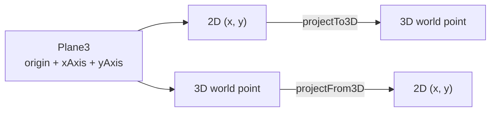

# Plane Module

> **System** ▸ [Overview](../../00-overview.md) ▸ [CAD Modeler](../../10-cad-modeler.md) ▸ [Datums & Planes](../datums-planes.md) ▸ **plane.ts**
> Related: [datum.md](./datum.md) · [document.md](./document.md) · [preview.md](./preview.md) · [datums-planes.md](../datums-planes.md)

---

## Requirements

Requirements for this module are governed by the sketching and datum groups. See [Datums & Planes](../datums-planes.md) and [Sketching](../sketching.md).

---

## Succinct description

`plane.ts` is a two-function utility for projecting 2D sketch coordinates into 3D world space and back, given a `Plane3` basis.

## How it works — for everyone (non-technical)

A sketch lives on a flat surface described by an origin point and two perpendicular directions (the "basis"). When the user clicks in the 2D sketch editor, those 2D coordinates need to be translated into the 3D world before the viewer can render them — and when a 3D topology vertex is projected onto the sketch plane, its 3D position must be expressed as a 2D location so the constraint solver can work with it. This module does both translations.

## How it works — in detail (technical)

The `Plane3` type (defined in `types.ts`) carries `{ origin, xAxis, yAxis, normal }` — all `[number, number, number]` vectors. `xAxis` and `yAxis` are the two in-plane unit directions; `normal = xAxis × yAxis` is perpendicular to the plane.

### `projectTo3D(plane, x2d, y2d) → [number, number, number]`

```
world = plane.origin + x2d * plane.xAxis + y2d * plane.yAxis
```

Used everywhere a 2D sketch point needs a 3D location: the preview mesh builder (`preview.ts`), the sketch overlay renderer, ray-plane intersection in the 3D viewer, and path extraction in `extractPathSamples` (`preview.ts`).

### `projectFrom3D(plane, world) → { x, y }`

```
rel = world - plane.origin
x = dot(rel, plane.xAxis)
y = dot(rel, plane.yAxis)
```

Used in `document.ts` (`projectTopologyToCandidates`) to project 3D topology vertices and edges onto a new sketch's plane so they become reference candidates for snapping.



Both functions are pure and dependency-free. The module imports only the `Plane3` type.

## Key files

- `frontend/src/app/cad/lib/plane.ts` — `projectTo3D`, `projectFrom3D`
- `frontend/src/app/cad/lib/types.ts` — `Plane3` type definition
