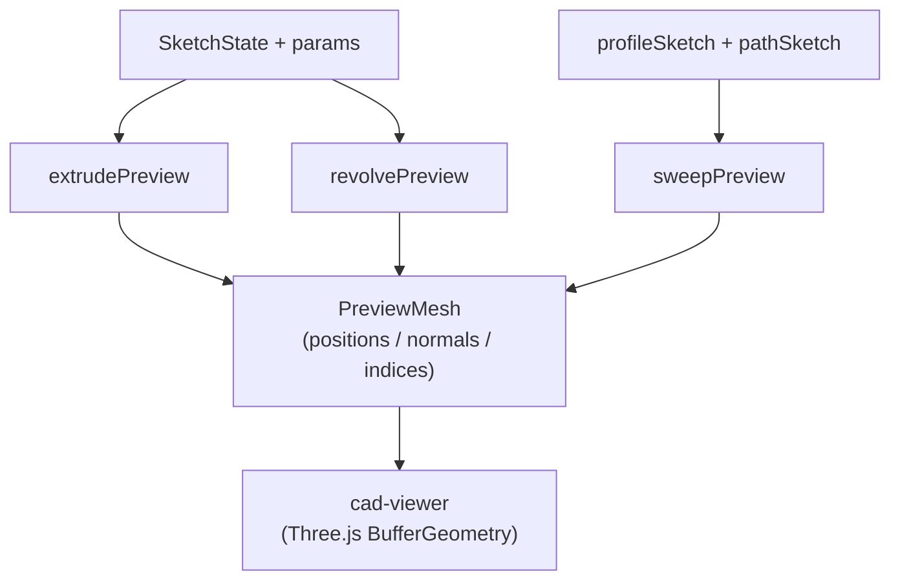

# Preview Module

> **System** ▸ [Overview](../../00-overview.md) ▸ [CAD Modeler](../../10-cad-modeler.md) ▸ [Extrude / Revolve / Sweep](../extrude-revolve-sweep.md) ▸ **preview.ts**
> Related: [featureTree.md](./featureTree.md) · [plane.md](./plane.md) · [extrude-revolve-sweep.md](../extrude-revolve-sweep.md)

---

## Requirements

| REQ | Status | Summary |
|-----|--------|---------|
| 629 | unapproved | Rubber-band 3D preview while a drawing tool is active |
| 549 | unapproved | Extrude feature takes a sketch and a distance, produces a solid |
| 618 | unapproved | Extrude feature carries an optional flipped boolean |

Requirements for this module are also governed by the extrude/revolve/sweep group. See [Extrude / Revolve / Sweep](../extrude-revolve-sweep.md).

---

## Succinct description

`preview.ts` builds translucent triangle meshes for in-progress Extrude, Cut Extrude, Revolve, and Sweep features so the viewer can display a real-time preview before the user commits the operation to the feature tree.

## How it works — for everyone (non-technical)

When you drag the "Distance" slider for a new extrude, the 3D viewer immediately shows a ghost shape growing or shrinking — no waiting for the geometry kernel. This module builds that ghost shape entirely in the browser from the sketch's outline and the current sidebar parameters. For a cut, the ghost is the volume being removed (shown in red), not the resulting hole, so the intent is obvious. For a revolve it sweeps the profile around the axis by the current angle. For a sweep it carries the profile along the chosen path. All of this is "preview only" geometry — cheaper than the real kernel output and slightly less accurate for curved bodies, but fast enough for interactive feedback.

## How it works — in detail (technical)

The module has no server dependency. It imports `Three.js` for `ShapeUtils.triangulateShape` (ear-clipping with hole support) and vector types.

### `extrudePreview(p: ExtrudePreviewParams) → PreviewMesh | null`

1. Calls `extractRegions` (`profile.ts`) on the sketch state to get `ProfileRegion[]` (outer + hole loops).
2. Resolves the signed start offset from `p.startCondition` (or `startOffsetOverride`).
3. Builds `[from, to]` extent pairs per direction. `midPlane` symmetrises around `startOffset`; `throughAll` uses a large visual fallback (`1e4`).
4. For each extent pair × each selected region, calls `addRegionPrism`:
   - Tessellates outer and hole loops at chord `0.5` (`tessellateProfileLoop`).
   - Ear-clips the 2D polygon via `THREE.ShapeUtils.triangulateShape`.
   - Emits top and bottom caps (mirrored winding for bottom), then side-wall quads (`addSideWalls`). Side walls are un-shared flat-shaded quads so the silhouette is clean.
5. Returns `{ positions: Float32Array, normals: Float32Array, indices: Uint32Array }`.

### `revolvePreview(p: RevolvePreviewParams) → PreviewMesh | null`

1. Resolves the axis from the sketch (`resolveAxisPoints` looks up `LineEntity` by id).
2. Projects axis endpoints to 3D via `projectTo3D`.
3. Builds `slices = max(8, ceil(angle / 5°))` rotation slices of the profile.
4. Connects adjacent slices with per-quad flat-shaded lateral surface.
5. Emits start/end caps for partial revolves (< 360°) via ear-clipping.
6. Uses Rodrigues' rotation formula (`rotateAroundAxis`) for all rotation operations.

### `sweepPreview(p: SweepPreviewParams) → PreviewMesh | null`

1. Extracts path samples from the path sketch via `extractPathSamples`:
   - Single circle → `{ points: [...tessellated], closed: true }`.
   - Line + arc chain → walks adjacency (degree ≤ 2), tessellates arcs at chord `0.5`, returns in chain order.
2. Builds per-sample transport frames via `buildTransportFrames` (parallel-transport / minimum-rotation method): the initial frame uses the profile plane's xAxis/yAxis; each subsequent frame rotates the previous by the axis of `tPrev × tCurr`.
3. Emits lateral surface quads (profile vertex i, sample s) to (i+1, s+1). Open paths get endcaps.

### `PreviewMesh` interface

```ts
interface PreviewMesh {
  positions: Float32Array;  // flat [x,y,z ...]
  normals:   Float32Array;  // flat [nx,ny,nz ...]
  indices:   Uint32Array;   // triangle vertex indices
}
```

The viewer wraps these arrays in a `THREE.BufferGeometry` and applies a translucent material (colour chosen by the caller: green for additive, red for subtractive).



## Key files

- `frontend/src/app/cad/lib/preview.ts` — `extrudePreview`, `revolvePreview`, `sweepPreview`, `PreviewMesh`, `ExtrudePreviewParams`, `RevolvePreviewParams`, `SweepPreviewParams`
- `frontend/src/app/cad/lib/profile.ts` — `extractRegions`, `tessellateProfileLoop`, `ProfileRegion`
- `frontend/src/app/cad/lib/plane.ts` — `projectTo3D`
- `frontend/src/app/cad/lib/tessellator.ts` — `tessellateArc`, `tessellateCircle`
