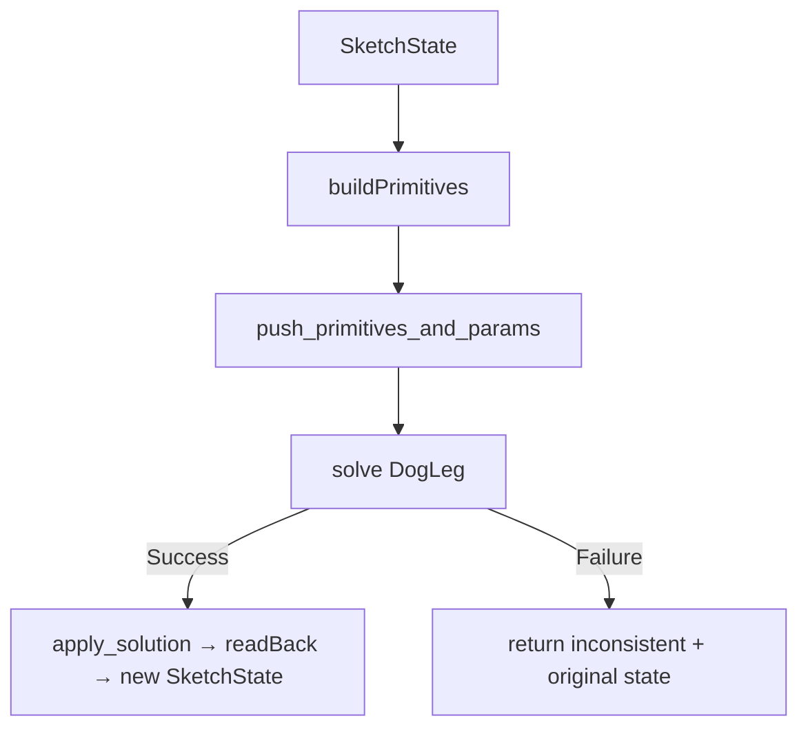

# Solver

> **System** ▸ [Overview](../../00-overview.md) ▸ [CAD Modeler](../../10-cad-modeler.md) ▸ [Sketching](../sketching.md) ▸ **solver**
> Related: [Sketching](../sketching.md) · [Constraints](../constraints.md) · [store](./store.md) · [determinacy](./determinacy.md)

---

## Requirements

| REQ | Status | Summary |
|-----|--------|---------|
| 558 | unapproved | Newton-Raphson solver via @salusoft89/planegcs WASM, replacing iterative projection |
| 524 | unapproved | Constraint types: coincident, fixed, horizontal, vertical, distance, point-on-line |
| 525 | unapproved | Re-solve sketch within 50 ms of any input event |
| 526 | unapproved | Reject inconsistent constraints and preserve prior state |

### REQ 558 — PlaneGCS-backed solver

- **Description:** The CAD module shall solve sketch constraint systems using a Newton-Raphson 2D geometric constraint solver based on the @salusoft89/planegcs WASM library, replacing the prior iterative projection solver.
- **Rationale:** Iterative projection cannot reliably converge on mixed-constraint systems involving tangency, perpendicularity, equality, and dimensions. PlaneGCS is the production solver shipped with FreeCAD, exposes analytical Jacobians, and is already a project dependency.
- **Verification:** vitest unit tests in `frontend/src/app/cad/lib/solver.spec.ts` cover every supported constraint type, construction-point pinning, fully-constrained rectangle (DOF=0), and conflict rejection.
- **Validation:** Sketches with realistic constraint combinations reach DOF=0 in a single solve step.

---

## Succinct description

`solver.ts` translates a `SketchState` into PlaneGCS primitives, runs the Newton-Raphson solver, and reads the converged coordinates back into the state. It is the single point of contact between the sketch data model and the WASM constraint engine.

---

## How it works — for everyone (non-technical)

Think of the constraint solver like a very fast physics engine for 2D shapes. You tell it rules — "this line must be horizontal", "these two points must coincide", "this circle must have radius 25 mm" — and it figures out exactly where everything has to be to satisfy all those rules simultaneously. It runs every time you drag a point or add a constraint, finishing fast enough that the geometry appears to track your mouse in real time. If you add a rule that contradicts an existing one (like telling a line to be both 10 mm long and 20 mm long), it simply refuses that rule and leaves the sketch unchanged.

---

## How it works — in detail (technical)

### WASM lifecycle

`make_gcs_wrapper` is called once (lazily) and the resolved `GcsWrapper` is cached in a module-level `wrapperPromise`. The wrapper exposes `clear_data()`, `push_primitives_and_params()`, `solve()`, `apply_solution()`, and a `sketch_index` for reading back solved values. In Node/vitest the WASM file is located by Emscripten's default loader; in the browser it is asset-mapped to `/assets/planegcs/planegcs.wasm` via `angular.json`.

### Translation pipeline (`buildPrimitives`)

1. Every `PointEntity` becomes a PlaneGCS `point` primitive. Points targeted by a `fixed` constraint and the synthetic `ORIGIN_POINT_ID` are emitted as `{ fixed: true }`.
2. `LineEntity` → `line` primitive (references its `startId`/`endId` points by id).
3. `CircleEntity` → `circle` primitive. An optional `circle_radius` pin is emitted when `pinAllRadii: true` (used during drag to prevent radius drift).
4. `ArcEntity` → `arc` primitive plus a mandatory `arcrules-<id>` constraint. Without `arc_rules`, the center, endpoints, angles, and radius drift independently during solve.
5. Each `SketchConstraint` is dispatched through `translateConstraint`, which returns an array of `SketchPrimitive` values:
   - Simple types (`horizontal`, `vertical`, `parallel`, `perpendicular`) map 1-to-1.
   - `coincident` dispatches on target entity kinds: `p2p_coincident`, `point_on_line_pl`, `point_on_circle`, `point_on_arc`, `point_on_ellipse`.
   - `tangent` dispatches on the entity-kind pair via `tangentPrimitive` (6 variants: `tangent_lc`, `tangent_la`, `tangent_le`, `tangent_cc`, `tangent_aa`, `tangent_ca`).
   - `equal` dispatches via `equalPrimitive` (4 variants by line/circle/arc combination).
   - `midpoint`, `symmetric`, `concentric`, `coradial`, `collinear` are each synthesized from two PlaneGCS primitives using `${constraint.id}-suffix` IDs to avoid clashes.
   - Dimensional constraints (`distance`, `radius`, `diameter`, `angle`, `horizontal-distance`, `vertical-distance`, `point-line-distance`, `arc-length`, `chord-distance`) emit their matching PlaneGCS driven/dimensional primitive. Constraints marked `driven: true` are skipped.
   - `on-edge` (Convert Entities link) pins projected anchor points rather than emitting a PlaneGCS primitive.

### Solve options

`solveSketch(state, options?)` accepts a `SolveOptions`:

- `movablePoints: Set<string>` — extra-pins every point NOT in this set before solving. Used to prevent unrelated geometry from jumping when a new constraint is added.
- `pinAllRadii: boolean` — adds `circle_radius`/`arc_radius` locks to prevent drag from resizing curves.

The two-pass `solveSketchAfterAdd` function wraps `solveSketch`: first pass uses `movablePoints` scoped to the new constraint's targets; if that fails it retries without the restriction.

### Read-back

After a successful solve (`SolveStatus.Success` or `SolveStatus.Converged`), `apply_solution()` is called and `readBack` maps solved coordinates back to the state: point `x`/`y` from `point` primitives, `radius` from `circle`/`arc` primitives. Lines have no separate storage — their geometry is fully described by their endpoint points.

### Inconsistency

When `solve()` returns any status other than `Success`/`Converged`, the solver returns `{ status: 'inconsistent', state: originalState, dof }` — the caller (store/editor) discards the constraint and shows a notification (REQ 526/532).

---

## Key files

- `frontend/src/app/cad/lib/solver.ts` — all solver logic
- `frontend/src/app/cad/vendor/planegcs/` — vendored PlaneGCS WASM
- `frontend/src/app/cad/lib/solver.spec.ts` — unit tests
