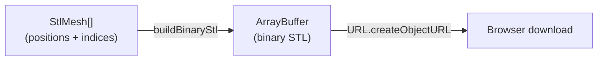

# STL Export Module

> **System** ▸ [Overview](../../00-overview.md) ▸ [CAD Modeler](../../10-cad-modeler.md) ▸ [Extrude / Revolve / Sweep](../extrude-revolve-sweep.md) ▸ **stlExport.ts**
> Related: [preview.md](./preview.md) · [extrude-revolve-sweep.md](../extrude-revolve-sweep.md)

---

## Requirements

| REQ | Status | Summary |
|-----|--------|---------|
| 719 | unapproved | Development release shall produce downloadable STL and STEP files |
| 723 | unapproved | STL export uses the OCCT kernel exportStl operation; STEP uses exportStep |

### REQ 719 — Downloadable STL on release
- **Description:** A development release shall produce downloadable STL and STEP files reproduced from the frozen release geometry.
- **Rationale:** Fabrication and 3D printing workflows expect industry-standard files; the release is the natural trigger for producing them since it fixes the geometry.
- **Verification:** After a dev release, `GET /:id/export/stl` returns a valid binary STL file. Covered by `backend/tests/__tests__/vcs/cad-release-workflow.test.js`.
- **Validation:** A designer can click "Download STL" after releasing and import the file into a slicer or CAM tool without errors.

---

## Succinct description

`stlExport.ts` serializes one or more tessellated body meshes into a binary STL `ArrayBuffer` entirely in the browser, without a kernel round-trip.

## How it works — for everyone (non-technical)

STL is the lingua franca of 3D printing and CNC. When a part is released, the browser already has all the triangle data for the body meshes — the viewer is rendering them. Rather than asking the server or the Rust kernel to re-compute the geometry, this module packages those triangles directly into the binary STL format. The result is a file the user can download and hand straight to a slicer.

## How it works — in detail (technical)

### `StlMesh` interface

```ts
interface StlMesh {
  positions: ArrayLike<number>;  // flat [x,y,z, x,y,z, ...]
  indices: ArrayLike<number>;    // triangle vertex indices into positions/3
}
```

Matches the mesh format produced by the geometry kernel's tessellation step and stored in `ModelGeometry.faces[*].positions` / `.indices`.

### `buildBinaryStl(meshes: StlMesh[]) → ArrayBuffer`

Binary STL layout (per spec):

```
offset 0    : 80-byte header (ASCII tag, must NOT start with "solid")
offset 80   : uint32 triangle count
offset 84   : N × 50-byte facet records
  each facet: float32[3] normal, float32[3×3] vertices, uint16 attribute byte count
```

Implementation:

1. Pre-counts total triangles by summing `floor(indices.length / 3)` across all meshes.
2. Allocates `80 + 4 + triCount × 50` bytes.
3. Writes the ASCII header `'Letwinventory CAD binary STL'` (≤ 80 chars, does not start with "solid").
4. For each triangle: computes the face normal from `(b−a) × (c−a)` normalised; writes normal + three vertices as little-endian `float32`; writes `uint16 = 0` for the attribute byte count.
5. Degenerate triangles (cross-product length < `1e-12`) are skipped and not counted.
6. If any degenerates were skipped, slices the buffer to `80 + 4 + written × 50` so the embedded triangle count matches the actual data.

The header is written at the start; the final triangle count is written at offset 80 only after the pass completes (so the true `written` count — not the pre-computed `triCount` — is stored).



Note: REQ 723 specifies that the *authoritative* STL for released geometry uses the OCCT kernel's `exportStl` operation on the server side (so frozen BRep geometry is serialised with full precision). This client-side module is used for the quick-download path from already-tessellated viewport data — the server endpoint at `GET /:id/export/stl` takes precedence for released revisions.

## Key files

- `frontend/src/app/cad/lib/stlExport.ts` — `buildBinaryStl`, `StlMesh`
- `frontend/src/app/cad/lib/stlExport.spec.ts` — unit tests
- `cad-kernel/src/ops/shape_io.rs` — kernel-side `exportStl` (server path for frozen releases)
