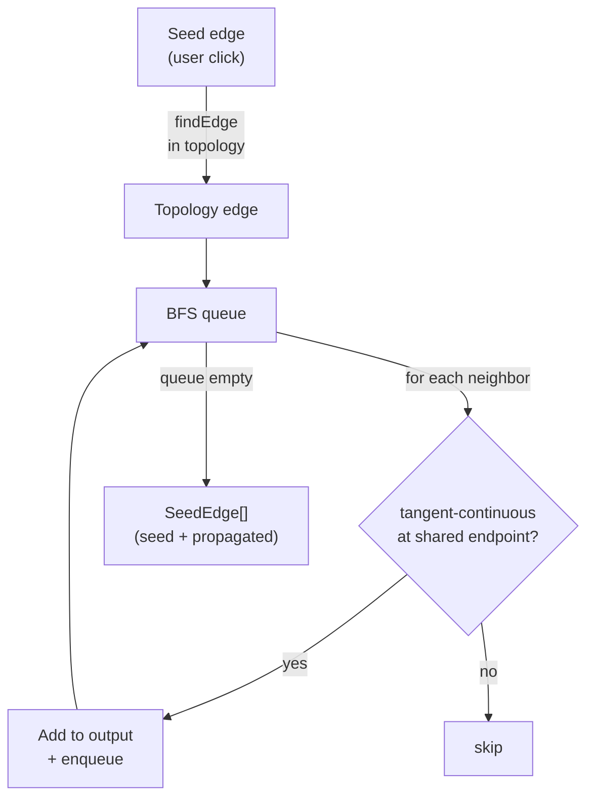

# Tangent Propagation Module

> **System** ▸ [Overview](../../00-overview.md) ▸ [CAD Modeler](../../10-cad-modeler.md) ▸ [Fillet / Chamfer / Shell / Pattern](../fillet-chamfer-shell-pattern.md) ▸ **tangentPropagation.ts**
> Related: [measure.md](./measure.md) · [featureTree.md](./featureTree.md) · [fillet-chamfer-shell-pattern.md](../fillet-chamfer-shell-pattern.md)

---

## Requirements

| REQ | Status | Summary |
|-----|--------|---------|
| 646 | unapproved | Tangent Propagation toggle in Fillet / Chamfer sidebars |

### REQ 646 — Tangent Propagation
- **Description:** The Fillet and Chamfer sidebars shall provide a Tangent Propagation toggle (default ON). When ON, picking an edge shall automatically include all edges tangent-continuous with the picked edge at a shared endpoint, until the tangent chain terminates. When OFF, only the explicitly picked edge is included.
- **Rationale:** A hole rim is four tangent-continuous arcs; without tangent propagation the user has to pick all four separately. One click that propagates is the SolidWorks-standard workflow.
- **Verification:** `frontend/src/app/cad/lib/tangentPropagation.spec.ts` tests that picking one arc on a rectangle/circle set of edges includes the expected set of connected tangent edges.
- **Validation:** A designer clicks one edge of a circular hole rim and all four arcs are added to the fillet set automatically.

---

## Succinct description

`tangentPropagation.ts` exports a single BFS walk — `propagateTangentEdges` — that, given a seed edge and the model topology, returns the seed plus every edge that is tangent-continuous with an already-included edge at a shared endpoint.

## How it works — for everyone (non-technical)

When you fillet a circular hole, the hole's rim is made up of four arc segments joined end-to-end. If the fillet dialog has "Tangent Propagation" on, clicking any one of those arcs automatically grabs all four. This module does that gathering: it starts at the clicked edge and walks along connected edges, collecting each one that flows smoothly (no sharp corner) into the previous.

## How it works — in detail (technical)

### `propagateTangentEdges(seed, topology) → SeedEdge[]`

Input:
- `seed: SeedEdge` — `{ edgeId, start, end }` as reported by the viewer click.
- `topology: ModelTopology` — the tessellated topology of the current body.

Output: `SeedEdge[]` — the seed plus all tangent-connected neighbors. The seed's `edgeId` scope prefix (e.g. `"f2/"`) is preserved on all returned entries so the backend's body-scoped face matcher still works.

### Algorithm (BFS)

1. **Find seed in topology.** Tries `e.id === stripScope(seed.edgeId)`, then falls back to endpoint proximity match (tolerance `1e-3` world units) for regen-drifted coordinates.
2. **Extract scope prefix** from the seed's `edgeId` so propagated edges can be re-scoped.
3. **BFS loop:** for each unvisited edge in `topology.edges`, test whether it shares an endpoint with an already-included edge (within `ENDPOINT_TOL = 1e-3`) and whether its outgoing tangent direction is tangent-continuous with the included edge's outgoing direction at that shared endpoint.
4. **Tangent test:** `|dot(curTan, otherTan)| > TANGENT_DOT_THRESHOLD` where `TANGENT_DOT_THRESHOLD = 0.9962` (cos 5°). Absolute value is used because edge orientations may be antiparallel at a shared endpoint.
5. **Tangent direction:** computed from the first/last polyline segment for curved edges (`polyline.length >= 2`), or from the chord for straight edges.

### `SeedEdge` interface

```ts
interface SeedEdge {
  edgeId: string;
  start: [number, number, number];
  end:   [number, number, number];
}
```



## Key files

- `frontend/src/app/cad/lib/tangentPropagation.ts` — `propagateTangentEdges`, `SeedEdge`
- `frontend/src/app/cad/lib/tangentPropagation.spec.ts` — unit tests
- `frontend/src/app/cad/lib/types.ts` — `ModelTopology`
