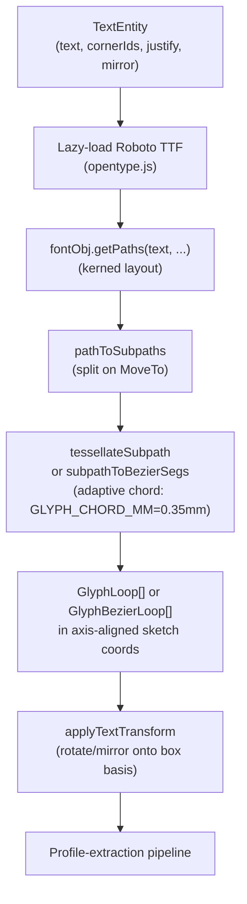

# textGlyphs.ts

> **System** ▸ [Overview](../../00-overview.md) ▸ [CAD Modeler](../../10-cad-modeler.md) ▸ [Sketching](../sketching.md) ▸ **textGlyphs.ts**
> Related: [singleLineFont.ts](./singleLineFont.md) · [Sketching group page](../sketching.md) · [Profiles and arrangement](../profiles-arrangement.md)

---

## Requirements

Governed by [Sketching](../sketching.md). REQ 602 covers the sketch text tool; this module is the tessellation engine that turns a `TextEntity` into closed profiles suitable for extrusion.

---

## Succinct description

`textGlyphs.ts` lazily loads the bundled Roboto Regular TTF via `opentype.js`, parses glyph outlines, tessellates Bézier curves into closed polyline loops (or extracts them as analytic Bézier segments), and exposes these as sketch-coordinate profiles ready for the extrude pipeline. It is the frontend half of a frontend/backend pair — the backend mirror `cadTextGlyphs.js` must produce byte-for-byte identical output.

---

## How it works — for everyone (non-technical)

To extrude text into a 3D solid, the system needs to know the exact outline of each letter as a closed shape. This module downloads the Roboto font once in the background, reads the letter shapes from it, converts the smooth curves into straight-line segments (or keeps them as smooth curves for better quality), and hands those outlines to the 3D engine. Letters like "O" produce two outlines — outer and inner — so the result is correctly hollow.

---

## How it works — in detail (technical)

### Lazy font loading

The font is fetched once from `assets/fonts/Roboto-Regular.ttf`. `loadFont()` stores a single `fontPromise`; subsequent calls share the same promise. Once parsed by `opentype.js`, the `Font` object is cached in a module-level `font` variable. `onFontReady(cb)` registers a callback fired immediately if already loaded or queued otherwise — used by the sketch overlay to re-render text on first load.

`tryGlyphLoopsForText` / `tryGlyphBezierLoops` are synchronous accessors that trigger a load and return `null` until the font is available. `glyphLoopsForText` is the async variant for caller paths that can await (e.g. the extrude pipeline on commit).

### Exported types

- `GlyphLoop` — `Array<{ x: number; y: number }>` — a closed polyline (first == last point) in sketch coords.
- `GlyphBezierSeg` — `{ points: Array<{ x: number; y: number }> }` — one Bézier segment (2 points = line, 3 = quadratic, 4 = cubic).
- `GlyphBezierLoop` — `GlyphBezierSeg[]` — one closed contour as ordered Bézier segments.
- `TextResolver` — `(raw: string) => string` — placeholder expander for `#{var}` substitution.

### Key exported functions

| Function | Output | When to use |
|----------|--------|-------------|
| `tryGlyphLoopsForText(...)` | `GlyphLoop[] \| null` | Sync; returns null until font loads |
| `glyphLoopsForText(...)` | `Promise<GlyphLoop[]>` | Async; waits for font |
| `loopsFromTextEntity(state, e, resolve?)` | `GlyphLoop[]` | Sync wrapper reading from a `TextEntity` |
| `loopsFromTextEntityAsync(state, e, resolve?)` | `Promise<GlyphLoop[]>` | Async wrapper for commit path |
| `tryGlyphBezierLoops(...)` | `GlyphBezierLoop[] \| null` | Sync; Bézier segments instead of polylines |
| `bezierLoopsFromTextEntity(state, e, resolve?)` | `GlyphBezierLoop[]` | Sync Bézier wrapper from `TextEntity` |
| `applyTextTransform(loops, bl, br, tl, w, h, mirror)` | `GlyphLoop[]` | Rotate/mirror polyline loops onto box basis |
| `makeVarResolver(vars)` | `TextResolver` | Build a `#{name}` placeholder expander |
| `onFontReady(cb)` | `void` | Register a font-loaded callback |

### Tessellation pipeline

**Scaling:** `scale = capHeightMm / capHeightOf(font)` where `capHeightOf` reads the OS/2 `sCapHeight` value (falling back to `ascender`). This maps the font's uppercase height to the box height exactly — avoiding the visible top-margin left by mapping the full ascender to the box height.

**Alignment / overflow:** `fontObj.getAdvanceWidth` gives the total kerned advance in font units; multiplied by `scale` → mm. Left/center/right offset from `boxWidthMm`. Glyphs whose pen position exceeds `boxWidthMm` are clipped.

**Adaptive segmentation:** Bézier curves are sampled by control-polygon length in mm against `GLYPH_CHORD_MM = 0.35`. Segment count is clamped `[GLYPH_MIN_SEGS=2, GLYPH_MAX_SEGS=16]`. This keeps face counts low on small text and curves smooth on large text.

**Y-axis:** `opentype.js` paths emit positive-down y; sketch coords are positive-up, so glyph y is negated.

### `#{var}` placeholder resolution

`makeVarResolver(vars)` produces a `TextResolver` that expands `#{name}` tokens from a string map (e.g. `partNumber`, `revision`, equation variable names). `loopsFromTextEntity` and `loopsFromTextEntityAsync` accept an optional resolver (defaulting to identity). The viewer preview and the extrude path both call the same resolver so the displayed text and the extruded geometry always match.

### Frontend/backend sync contract

`textGlyphs.ts` and `backend/services/cadTextGlyphs.js` **must produce byte-for-byte identical loops** — same Roboto TTF, same `opentype.js` version, same scale/kerning/segment counts. The `textGlyphs.spec.ts` / `cad-text-glyphs.test.js` pair pins a sample string on both sides as a drift guard. Any change to tessellation constants, scaling, or alignment logic must be mirrored in the backend file.

---

## Key files

- `frontend/src/app/cad/lib/textGlyphs.ts` — this module
- `frontend/src/app/cad/lib/textGlyphs.spec.ts` — unit tests (frontend half of drift guard)
- `frontend/src/app/cad/lib/singleLineFont.ts` — open-stroke sibling for engraving text
- `backend/services/cadTextGlyphs.js` — backend mirror (must stay in sync)
- `frontend/src/assets/fonts/Roboto-Regular.ttf` — the bundled font
