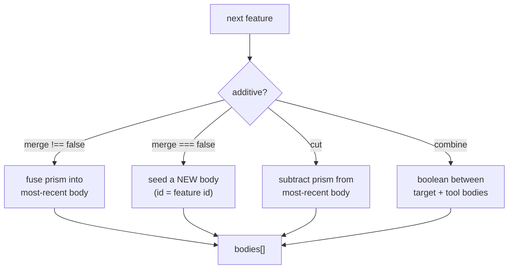

# Multi-Body Parts

> **System** ▸ [Overview](../00-overview.md) ▸ [CAD Modeler](../10-cad-modeler.md) ▸ **Multi-body**
> Related: [Extrude / Revolve / Sweep](./extrude-revolve-sweep.md) · [Fillet / Chamfer / Shell / Pattern](./fillet-chamfer-shell-pattern.md) · [Kernel operations](../kernel/operations.md) · [Modeler overview](./00-overview.md)

---

## Requirements

| REQ | Status | Summary |
|-----|--------|---------|
| 621 | unapproved | Sketches with multiple independent / nested closed loops |
| 662 | unapproved | Combine feature: boolean op between two or more existing bodies |
| 666 | unapproved | Mirror Body feature: reflect bodies across a plane |
| 667 | unapproved | Move/Copy Body feature: rigid-body transform of bodies |

### REQ 662 — Combine feature

- **Description:** The CAD editor shall provide a Combine feature that performs a boolean operation (add / subtract / common) between two or more existing bodies in a multi-body part.
- **Rationale:** Multi-body modeling builds independent solids first, then combines them — the canonical SolidWorks workflow for complex parts.
- **Verification:** Combine feature/regen tests confirm add/subtract/common produce the expected result body and consume the tool bodies.
- **Validation:** A user builds two overlapping blocks as separate bodies and combines them into one.

### REQ 621 — Multiple loops / disjoint islands

- **Description:** Sketches may contain multiple independent closed loops (e.g. a separate circle and triangle, or two disjoint shapes); each becomes its own region/body as appropriate.
- **Rationale:** A single sketch can define several disjoint solids; the extruder must produce a body per disjoint region rather than failing.
- **Verification:** `profile.spec.ts` / regen tests confirm disjoint regions extrude into separate bodies.
- **Validation:** A user extrudes a sketch of two separate shapes and gets two bodies.

### REQ 667 — Move/Copy Body

- **Description:** The CAD editor shall provide a Move/Copy Body feature that applies a rigid-body transform (optional translate + optional rotate) to one or more existing bodies.
- **Rationale:** Positioning and duplicating bodies within a part is needed before combining or patterning them.
- **Verification:** Move/Copy regen tests confirm the transform is applied and `copy` controls keep-vs-replace.
- **Validation:** A user copies a boss and offsets it by 30 mm.

---

## Succinct description

A part can hold several independent solids. The `merge` toggle on additive features decides whether a new feature fuses into the running body or seeds a new one; Combine performs explicit booleans between bodies; Mirror Body and Move/Copy Body transform whole bodies. The backend tracks an array of bodies through a cumulative-shape pipeline.

---

## How it works — for everyone (non-technical)

Most parts are one solid lump, but some are easier to build as several separate lumps that you later join, subtract, or intersect. The "Merge result" switch on each feature decides whether what you just made joins the existing solid or stands alone as a new one. The **Combine** tool then lets you union them, cut one out of another, or keep only the overlap. **Mirror Body** makes a flipped copy across a plane; **Move/Copy Body** slides or duplicates a whole solid.

A Bodies panel lists every solid in the part so you can see, hide, and act on each one independently.

---

## How it works — in detail (technical)

### The cumulative-body pipeline

`backend/services/cadRegenService.js` tracks `bodies` — an array where each entry is one solid (`{ id, brep, paramHash, faces, topology }`). A body's `id` is the id of the first feature that created it (stable across regens). For each feature it dispatches by `feature.type`, skipping `suppressed`/`hidden`/rolled-back features:

Additive features with `merge !== false` fuse into the most-recent body; `merge === false` seeds a new body. Cut features subtract from the most-recent body. Disjoint regions of a single sketch (REQ 621) can't fuse into one connected body, so they fan out into separate bodies. The composition is built on the kernel `buildBoolean` op (Fuse / Cut / Common) and the boolean result is decomposed into independent solids (`TopAbs_SOLID` walk) so the part tracks multi-body state SolidWorks-style.

### Combine (REQ 662)

`CombineFeature` (in `types.ts`) has `operation` (`add` / `subtract` / `common`), a `targetBodyId` (survives and keeps its id), and `toolBodyIds` (folded in order `((target op tool0) op tool1) …`; the tool bodies are **consumed** and disappear from the roster). When a subtract splits the target into disjoint pieces, each becomes its own body via the same fan-out the patterns use.

### Mirror Body / Move/Copy Body (REQ 666/667)

`MirrorBodyFeature` reflects `bodyIds` across a `planeSnapshot`; `keepOriginals` (default true) decides whether the source stays and a mirrored copy is added or the source BReps are replaced in place. `MoveCopyBodyFeature` applies an optional `translate` + optional `rotate` (about an `axisRef`/`axisSnapshot`) to `bodyIds`; `copy` decides keep-vs-replace. Both resolve to kernel transforms in the cumulative pipeline.

### Bodies panel and merge toggle

The editor exposes the per-feature "Merge result" toggle (on `ExtrudeFeature.merge`, `RevolveFeature.merge`, `SweepFeature.merge`, …; missing == true) and a Bodies panel listing each solid for show/hide and body-level actions. See [Extrude / Revolve / Sweep](./extrude-revolve-sweep.md) and [Fillet / Chamfer / Shell / Pattern](./fillet-chamfer-shell-pattern.md).

---

## Key files

- `backend/services/cadRegenService.js` — the cumulative-body pipeline (`bodies[]`, merge/seed/cut/combine dispatch)
- `frontend/src/app/cad/lib/types.ts` — `CombineFeature`, `MirrorBodyFeature`, `MoveCopyBodyFeature`, the `merge` fields
- `cad-kernel/src/ops/boolean.rs` — the Fuse / Cut / Common op + solid decomposition (see [kernel/operations](../kernel/operations.md))
