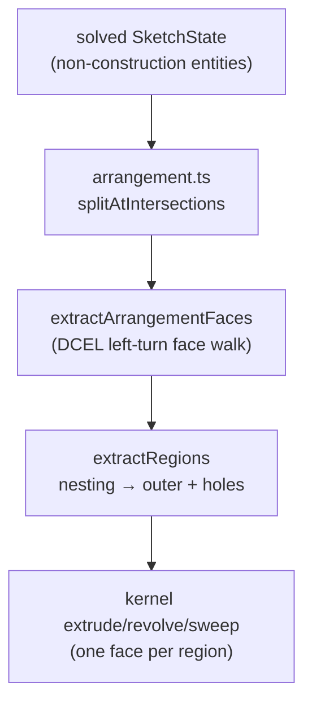

# Profiles and Arrangement

> **System** ▸ [Overview](../00-overview.md) ▸ [CAD Modeler](../10-cad-modeler.md) ▸ **Profiles and arrangement**
> Related: [Sketching](./sketching.md) · [Extrude / Revolve / Sweep](./extrude-revolve-sweep.md) · [Multi-body](./multi-body.md) · [Modeler overview](./00-overview.md)

---

## Requirements

| REQ | Status | Summary |
|-----|--------|---------|
| 548 | unapproved | Extract a single closed loop of connected line segments from a sketch |
| 612 | unapproved | Single non-construction circle → a valid extrude profile |
| 617 | unapproved | Typed `ProfileLoop` preserving curve identity (line / arc / circle) |
| 621 | unapproved | Multiple independent closed loops; nested loops as outer + holes |

### REQ 617 — Typed ProfileLoop

- **Description:** The profile-extraction algorithm shall produce a typed `ProfileLoop` preserving curve identity — each edge is either a line, an arc, or a circle, carrying its analytic definition rather than a tessellated polyline.
- **Rationale:** The kernel can build one face per analytic edge (an arc face, a circular face) instead of one face per tessellated chord, producing cleaner BReps and stable face naming.
- **Verification:** `profile.spec.ts` asserts extracted loops carry typed `line`/`arc`/`circle` edges for mixed sketches.
- **Validation:** An extruded arc produces a single curved side face, not a fan of flat strips.

### REQ 621 — Multiple loops and holes

- **Description:** Sketches may contain multiple independent closed loops (e.g. a separate circle and triangle) or nested loops, which the module partitions into planar regions of one outer loop with zero or more inner-loop holes.
- **Rationale:** Real profiles have holes and disjoint islands; the extruder needs each region's outer boundary plus its holes to build a correct face.
- **Verification:** `profile.spec.ts` asserts nested concentric circles yield an inner disk region and an annulus region.
- **Validation:** A user extrudes a washer (two concentric circles) and gets a ring, and can pick the inner disk, outer disk, or annulus.

### REQ 548 — Closed-loop extraction

- **Description:** Given a sketch, the CAD module shall extract a single closed loop of connected line segments from the sketch's non-construction geometry.
- **Rationale:** A solid extrude requires a closed boundary; open chains cannot be extruded.
- **Verification:** `profile.spec.ts` walks a square's four lines into one closed loop and rejects an open chain.
- **Validation:** A user closes a rectangle and the extrude becomes available.

---

## Succinct description

Profile extraction turns a solved sketch into one or more typed closed loops (`ProfileLoop` of analytic `line`/`arc`/`circle`/`bezier` edges), partitions them into regions of outer-loop-plus-holes by nesting, and feeds those to the extrude kernel. The frontend (`profile.ts`) and backend (`cadProfile.js`) run the same algorithm.

---

## How it works — for everyone (non-technical)

Before a sketch can become a solid, the system has to find its actual outline — which lines and curves join up into a closed shape, which closed shapes are holes inside other shapes, and which are separate islands. A washer sketch (two circles, one inside the other) becomes "outer disk with a round hole". A logo with several letters becomes several separate shapes, each with its own inner pockets.

It does this by walking the sketch like following a maze wall: start on an edge, always turn the same way, and you trace out one closed loop. Curves are kept as real curves all the way through, so an extruded circle has one smooth round wall instead of a faceted one.

---

## How it works — in detail (technical)

### Typed loops (REQ 617)

`profile.ts` defines `ProfileEdge` = `LineProfileEdge | ArcProfileEdge | CircleProfileEdge | BezierProfileEdge`, and `ProfileLoop = ProfileEdge[]`. Each edge carries its analytic definition (a line's endpoints, an arc's center/radius/angles/ccw, a circle's center/radius, a Bézier's control points). `tessellateProfileLoop` produces a flat polyline only when a consumer needs one (containment tests, the pure-JS cap path), using `tessellator.ts`. A single circle is one self-closing edge (REQ 612); a polygon is N walked line edges.

### Loop walking and regions

- `arrangement.ts` → `splitAtIntersections` cuts every non-construction curve at each intersection with another curve, inserting new points; `extractArrangementFaces` runs a DCEL half-edge face walker (sort half-edges by tangent angle at each shared vertex, always turn left). This makes "circle cut by a line" resolve into two half-disk regions even when endpoints don't touch the circle.
- `extractClosedLoops` (REQ 548) walks the connected non-construction geometry into closed `ProfileLoop`s.
- `extractRegions` partitions loops into `ProfileRegion` (`{ outer, holes }`) by nesting: two concentric circles yield the inner disk (no holes) and the annulus (outer with the inner loop as a hole); three nested loops yield three regions. `topLevelRegionIndices` returns just the outermost regions (each already carrying its direct holes) for text glyphs and disjoint islands.

A feature's `regionIndices` (on `ExtrudeFeature`, `RevolveFeature`, etc.) selects which regions it consumes (missing == `[0]`).

### Point canonicalization

Because the sketch editor draws each segment with fresh endpoint ids and links snapped clicks via `coincident` constraints (rather than reusing ids), the backend `cadProfile.js` runs `canonicalizePoints` first: a union-find that merges point ids that are either `coincident`-constrained or within a 1e-4 spatial tolerance, so a four-line square reads as four shared vertices instead of eight degree-1 endpoints. Without it the walker would reject the square as an open chain.

### Frontend / backend parity

`profile.ts` (TypeScript) runs the algorithm in the browser to drive the `canExtrude` affordance and previews; `backend/services/cadProfile.js` (CJS) runs the identical algorithm on the saved `sketchDoc` during server-side regeneration. The two are kept in lockstep (the test suite asserts matching output). The backend trusts the resolved Cartesian coordinates the client already solved — server-side PlaneGCS re-solving is a separate work item.

### Picking

Profile extraction is unrelated to interactive picking: `picking.ts` hit-tests sketch entities parametrically (closest-point-on-curve), independent of any tessellation. See [Sketching](./sketching.md).

---

## Key files

- `frontend/src/app/cad/lib/profile.ts` — typed loop + region extraction (REQ 617, 621, 548, 612)
- `frontend/src/app/cad/lib/arrangement.ts` — intersection splitting + DCEL face walker
- `frontend/src/app/cad/lib/tessellator.ts` — chord-height polyline conversion (consumed by extraction)
- `frontend/src/app/cad/lib/picking.ts` — parametric entity picker
- `backend/services/cadProfile.js` — server-side region extraction + `canonicalizePoints`
