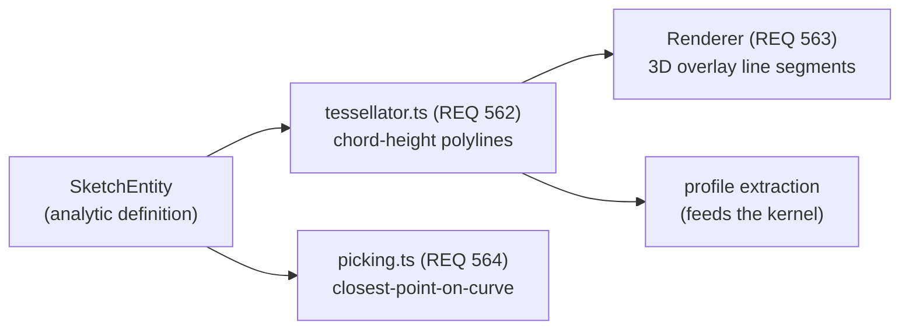

# Sketching

> **System** ▸ [Overview](../00-overview.md) ▸ [CAD Modeler](../10-cad-modeler.md) ▸ **Sketching**
> Related: [Constraints](./constraints.md) · [Profiles and arrangement](./profiles-arrangement.md) · [Datums and planes](./datums-planes.md) · [Modeler overview](./00-overview.md)

---

## Requirements

| REQ | Status | Summary |
|-----|--------|---------|
| 521 | unapproved | 2D sketching environment: place primitives, apply constraints, view parametric geometry |
| 522 | unapproved | Create a sketch point at a user-specified 2D location |
| 523 | unapproved | Create a sketch line segment between two endpoints |
| 559 | unapproved | Represent every primitive as a discriminated-union SketchEntity |
| 560 | unapproved | Optional `construction` flag on every entity |
| 561 | unapproved | Constraint targets as entity references `{ entityId, sub? }` |
| 562 | unapproved | Chord-height tessellation of curved entities into polylines |
| 563 | unapproved | Renderer draws curves analytically (not from tessellation) |
| 564 | unapproved | Picker hit-tests curves against their parametric definition |
| 565 | unapproved | Migrate legacy `{ points, lines, constraints }` docs on load |
| 528 | unapproved | The CAD module shall render the selected sketch primitive with a visual style that is di |
| 529 | unapproved | While a selected sketch primitive has at least one degree of freedom, the CAD module sha |
| 538 | unapproved | The CAD module shall maintain at most one active sketch at any time, and when the user e |
| 540 | unapproved | When the user invokes the create-sketch action while a host that already carries a sketc |
| 544 | unapproved | The CAD module shall prevent the user from dragging, moving, or deleting a reference pri |
| 613 | unapproved | While the sketcher Select tool is active, the user shall be able to press and drag the p |
| 632 | unapproved | While the sketcher is active and one or more sketch entities are selected, pressing Dele |
| 633 | unapproved | Pressing Esc while the sketcher is active shall cancel any in-flight tool gesture (place |
| 566–581 | unapproved | Circle / arc / rectangle / polygon / ellipse / slot tools |
| 598–606 | unapproved | Spline / parabola / text / picture / equation-curve tools + pierce/curvature constraints |

### REQ 521 — 2D sketching environment

- **Description:** The CAD module shall provide a 2D sketching environment in which the user can place geometric primitives, apply constraints between primitives, and view the resulting parametric geometry.
- **Rationale:** 2D sketches are the primary input to parametric features (extrudes, revolves, sweeps); without sketching, no parametric solid modeling is possible.
- **Verification:** End-to-end "New Sketch enters sketch mode with the toolbar visible" plus unit coverage of the sketch state model in `store.spec.ts` and `document.spec.ts`.
- **Validation:** A user familiar with parametric CAD recognizes the environment as functionally equivalent to the sketch mode of mainstream tools.

### REQ 559 — Discriminated-union SketchEntity

- **Description:** The CAD module shall represent every sketch primitive — point, line, circle, arc, ellipse, elliptical arc, spline, conic — as a discriminated-union `SketchEntity` with a `kind` tag, replacing the prior schema's separate points and lines arrays.
- **Rationale:** A unified entity type makes constraints, picking, rendering, persistence, and tessellation work uniformly across analytic and free-form geometry, instead of branching per primitive in every consumer.
- **Verification:** Consumer tests operate on tagged-union values: `store.spec.ts`, `solver.spec.ts`, `profile.spec.ts`, `migration.spec.ts`, `document.spec.ts`; additional kinds exercised by `tessellator.spec.ts` and `picking.spec.ts`.
- **Validation:** Adding a new primitive type requires extending the union and adding cases, not introducing a parallel array.

### REQ 560 — Construction flag

- **Description:** Every `SketchEntity` shall carry an optional `construction` boolean flag. Entities with `construction=true` participate in constraint solving but are excluded from profile extraction.
- **Rationale:** Reference geometry (centerlines, layout points, dimension drivers) must shape the sketch without becoming part of the extruded outline.
- **Verification:** `profile.spec.ts` confirms construction entities are filtered from extracted loops; `solver.spec.ts` confirms they still solve.
- **Validation:** A user draws a centerline that guides geometry but does not appear in the resulting solid.

---

## Succinct description

A sketch is a flat list of tagged-union `SketchEntity` values plus a constraint list, drawn on a host plane and edited with SolidWorks-style tools. Curves are tessellated to fine polylines for rendering in the 3D overlay; picking hits the analytic curve definition independently, so pick accuracy is decoupled from chord tolerance.

---

## How it works — for everyone (non-technical)

Think of a sketch as a piece of graph paper taped to a flat surface of your part. You pick a tool — point, line, circle, arc, rectangle, slot, spline, text — and click to draw. Every shape you draw is remembered as a small record of "what kind it is and where its corners are". Some shapes are *construction* shapes: guides that help you lay things out but that never become real material when you push the sketch into 3D.

Circles and arcs are always drawn as true round curves, no matter how far you zoom in — they never look like a chain of tiny straight lines. The system only converts curves into little straight segments behind the scenes when it needs to hand the outline to the 3D engine.

---

## How it works — in detail (technical)

### The entity model

`frontend/src/app/cad/lib/types.ts` defines the tagged union. `SketchEntityBase` carries `id` and optional `construction`. Variants: `PointEntity` (`x`, `y`), `LineEntity` (`startId`/`endId`), `CircleEntity` (`centerId`, `radius`), `ArcEntity` (center + start + end + `radius` + `ccw`), `EllipseEntity`, `EllipticalArcEntity`, `SplineEntity` (`controlPointIds`, `degree`), `ConicEntity` (parabola/hyperbola via `pointIds`), `TextEntity` (4 corner points forming a dimensionable box), `PictureEntity`, `EquationCurveEntity` (`xExpr`/`yExpr` over `[tMin, tMax]`), `IntersectionCurveEntity`, and `SplineOnSurfaceEntity`. A `SketchState` is `{ entities, constraints }`.

Lines, circles, and arcs reference their support points by id (e.g. a circle's center is a real `PointEntity`), so dragging a shared point moves every dependent entity. Helpers `pointsOf`, `linesOf`, `findEntity`, `findPoint`, `findLine` filter and look up by id.

### Mutations and the origin

`store.ts` performs pure, immutable mutations: `addPoint`, `addLine`, `addCircle`, `addCircleByPoint`, `addEllipseByPoints`, `addParabolaByPoints`, `addEquationCurve`, and the cascade-aware delete. Every sketch carries a synthetic origin point (`ORIGIN_POINT_ID = 'origin'`) at (0,0) that is `construction: true` and cannot be moved — it exists so the user can reference the sketch origin in constraints. `emptySketchState()` seeds it; `ensureOriginPoint()` backfills it on legacy load.

### The tools

`cad-sketch-editor.component.ts` is toolbar-only (the SVG canvas was removed — see REQ 616). Its `PRIMITIVE_TOOLS`, `CIRCLE_TOOLS`, `SHAPE_TOOLS`, `EDIT_TOOLS`, and `TRANSFORM_TOOLS` arrays declare the full tool set: point, line, centerline, midpoint-line, spline, style-spline; circle, perimeter circle, center arc, 3-point circle, 3-point arc, tangent arc, ellipse, partial ellipse, parabola, equation curve; rectangle (corner/center/rounded/3-point), parallelogram, polygon, slots (straight, center-point, 3-point arc, center-point arc), text, picture; and editing tools trim, extend, fillet, chamfer, split, jog. These cover REQ 522/523 (point/line) and REQ 566–581 / 598–604 (the curve, polygon, slot, spline, conic, text, picture, equation tools). Pointer events arrive from the 3D viewer as 2D plane coordinates (REQ 616) and the tool commit logic builds entities via `store.ts`.

### Curve rendering vs tessellation vs picking

Three separate concerns, deliberately decoupled:

- **Renderer (REQ 563):** curves are tessellated to fine polylines (`DEFAULT_CHORD_TOLERANCE = 0.05`) and drawn as Three.js line segments in the 3D sketch overlay — visually smooth at any practical zoom level.
- **Tessellator (`tessellator.ts`, REQ 562):** converts curves to polylines bounded by a chord height ε. For a circle of radius r, `segmentsForCircle` computes `n = ⌈π / acos(1 − ε/r)⌉`, clamped to ≥ 3; `segmentsForArc` scales by sweep. `DEFAULT_CHORD_TOLERANCE = 0.05`. Output feeds both the 3D renderer and profile extraction.
- **Picker (`picking.ts`, REQ 564):** hit-tests each entity against its parametric definition (`distanceToPoint`, `distanceToLine`, `distanceToCircle`, …), so a coarsely-tessellated circle still picks at its analytic boundary. A `PICK_RANK` map prefers points over curves over text over pictures when several are near the cursor.

### Legacy migration (REQ 565)

`migration.ts` upgrades persisted documents in memory on load — no DB step. `isLegacySketchState` detects the old `{ points, lines, constraints }` flat schema; `migrateSketchState` converts it to entities, backfills the origin point, rewrites removed constraint types (`point-on-line` / `point-on-curve` → `coincident`), and synthesizes `on-edge` constraints for entities that carried the old `projectedFrom` field. See [Units, IDs, migration](./units-ids-migration.md).

---

## Key files

- `frontend/src/app/cad/lib/types.ts` — the `SketchEntity` tagged union, constraints, sketch document types
- `frontend/src/app/cad/lib/store.ts` — immutable sketch mutations + the origin point
- `frontend/src/app/cad/lib/tessellator.ts` — chord-height curve tessellation (REQ 562)
- `frontend/src/app/cad/lib/picking.ts` — parametric closest-point picker (REQ 564)
- `frontend/src/app/cad/lib/inference.ts` — snap/constraint inference while drawing
- `frontend/src/app/cad/lib/sketchEditOps.ts` — trim/extend/fillet/offset and other edit operations
- `frontend/src/app/cad/lib/migration.ts` — legacy-schema upgrade on load (REQ 565)
- `frontend/src/app/components/cad/cad-sketch-editor/cad-sketch-editor.component.ts` — the toolbar + tool gesture state
