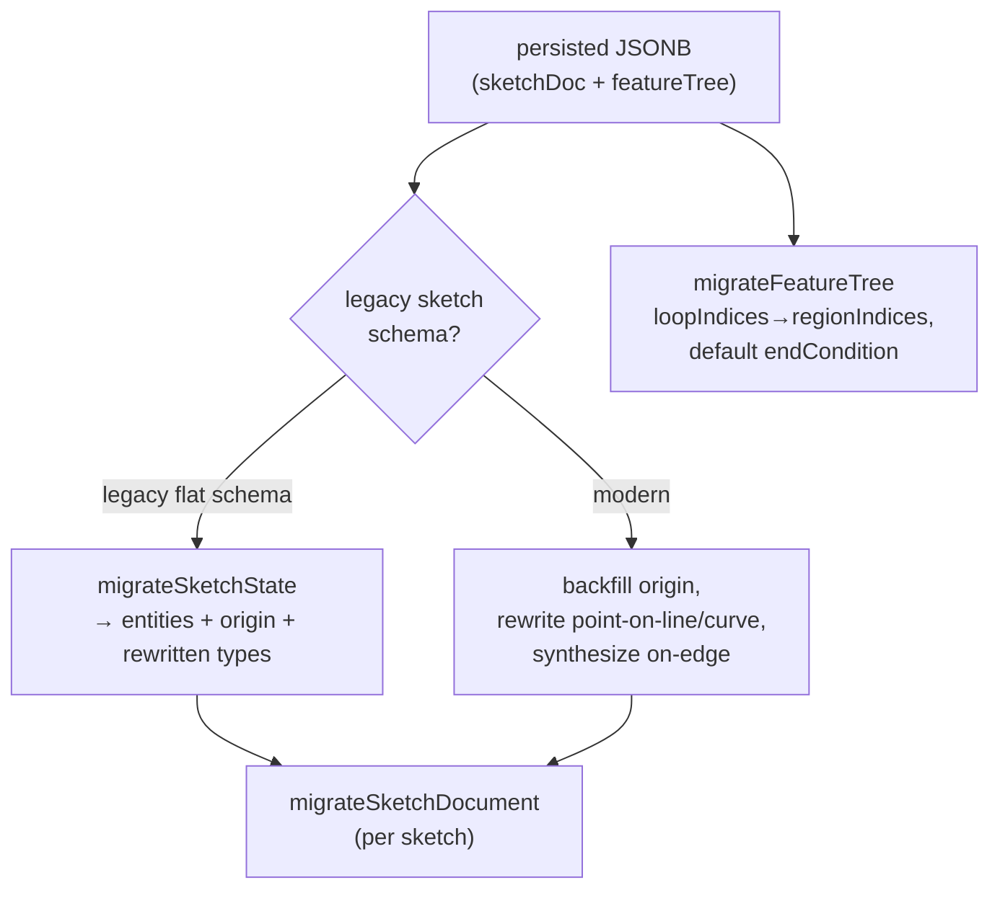

# Units, IDs, and Migration

> **System** ▸ [Overview](../00-overview.md) ▸ [CAD Modeler](../10-cad-modeler.md) ▸ **Units / IDs / migration**
> Related: [Sketching](./sketching.md) · [Feature tree](./feature-tree.md) · [VCS](../30-vcs.md) · [Modeler overview](./00-overview.md)

---

## Requirements

| REQ | Status | Summary |
|-----|--------|---------|
| 565 | unapproved | Migrate legacy `{ points, lines, constraints }` sketch docs on load |
| 742 | unapproved | Globally-unique (random) feature and sketch ids, not sequential |

### REQ 742 — Globally-unique IDs

- **Description:** New CAD feature and sketch identifiers shall be globally unique (random), not sequential per document. Sequential ids collide across branches (two branches off the same point assign the same next number to different features), which a feature-level merge would conflate. The origin feature (`f1`) remains a fixed shared seed; only added features and sketches get unique ids.
- **Rationale:** Globally-unique ids guarantee a feature added on one branch can never share an id with a feature added on another, so cross-branch merge/reconcile identifies features unambiguously.
- **Verification:** `frontend/src/app/cad/lib/ids.ts` (`newFeatureId`/`newSketchId`) used by `addFeature`, sketch creation, and the editor's feature-creation handlers; `featureTree.spec.ts` / `document.spec.ts` / `store.spec.ts` pass with non-literal id assertions.
- **Validation:** Two branches that each add a feature end up with distinct feature ids; merging keeps them separate.

### REQ 565 — Schema migration on load

- **Description:** When the CAD module loads a sketch document persisted under the prior `{ points, lines, constraints }` flat schema, it shall migrate it in memory to the current `SketchEntity` model.
- **Rationale:** Existing persisted documents must keep loading without a database migration step; consumers should only ever see the modern schema.
- **Verification:** `migration.spec.ts` round-trips legacy documents and asserts the upgraded entity/constraint shapes.
- **Validation:** A sketch saved under the old schema opens correctly in the current editor.

---

## Succinct description

Three small but load-bearing concerns: unit parsing/formatting against a millimeter canonical store (`units.ts`), globally-unique random ids for features and sketches (`ids.ts`), and in-memory upgrade of legacy persisted documents to the current schema (`migration.ts`) — no database migration step.

---

## How it works — for everyone (non-technical)

**Units:** everything is stored internally in millimeters, but you can type and read dimensions in mm, microns, or inches — the system converts both ways and remembers per-dimension unit choices. **IDs:** every feature and sketch gets a random name tag instead of a counter, so two people working on different copies of the same part can never accidentally give two different features the same name — which keeps merging their work straight. **Migration:** old parts saved in an earlier file format are quietly upgraded to the current format the moment you open them, so nothing ever needs to be re-saved by hand.

---

## How it works — in detail (technical)

### Units (`units.ts`)

The canonical store is **millimeters** — every coordinate and constraint value is mm. `Unit` is `'mm' | 'um' | 'in'` with `TO_MM = { mm: 1, um: 0.001, in: 25.4 }`. `fromMm`/`toMm` convert; `parseUserValue(raw, defaultUnit)` parses `"10"`, `"10mm"`, `"0.5in"`, `"0.5\""`, `"200 µm"` into `{ valueMm, unit }` (bare numbers fall back to the model default); `formatWithUnit` / `formatNumber` / `unitSymbol` render. A constraint stores `value` in mm always, with an optional per-dimension `unit` override; the model's `FeatureTree.defaultUnit` is the fallback display unit.

### IDs (`ids.ts`, REQ 742)

`uid(prefix)` builds `prefix + randomSuffix()` where `randomSuffix` uses `crypto.getRandomValues` (falling back to `Math.random`) for a 9-char base-36 tail. `newFeatureId()` → `f…`, `newSketchId()` → `s…`. `featureTree.addFeature` and sketch creation use these. The origin feature keeps the fixed literal id `f1` (it is the same feature in every document and must not be randomized). Random ids replace the old sequential `f<nextFeatureSeq>` / `s<nextSketchSeq>` scheme, which collided across branches and would let a feature-level merge conflate two distinct features. (`nextFeatureSeq`/`nextSketchSeq` still advance as legacy counters that some UI gating reads.)

### Migration (`migration.ts`, REQ 565)

Migration runs **in memory on load** — there is no DB migration step. `isLegacySketchState` detects the old flat schema; `migrateSketchState` converts `points`/`lines` to `SketchEntity` values, backfills the synthetic origin point, rewrites removed constraint types (`point-on-line` / `point-on-curve` → `coincident`), and synthesizes `on-edge` constraints for entities that still carry the old `projectedFrom` field (stripping the field). `migrateSketchDocument` applies it per sketch. `migrateFeatureTree` is a read-side compatibility shim for extrudes: it copies legacy `loopIndices` → `regionIndices` and defaults a missing `endCondition` to `{ kind: 'blind' }`. All functions are idempotent.

Note: this is the *schema* migration of a working document. Migrating existing CAD models into the content-addressed VCS object store is a separate concern handled by the VCS layer — see [VCS](../30-vcs.md).

---

## Key files

- `frontend/src/app/cad/lib/units.ts` — unit parse/format against a mm canonical store
- `frontend/src/app/cad/lib/ids.ts` — globally-unique random feature/sketch ids (REQ 742)
- `frontend/src/app/cad/lib/migration.ts` — in-memory legacy-schema upgrade (REQ 565)
