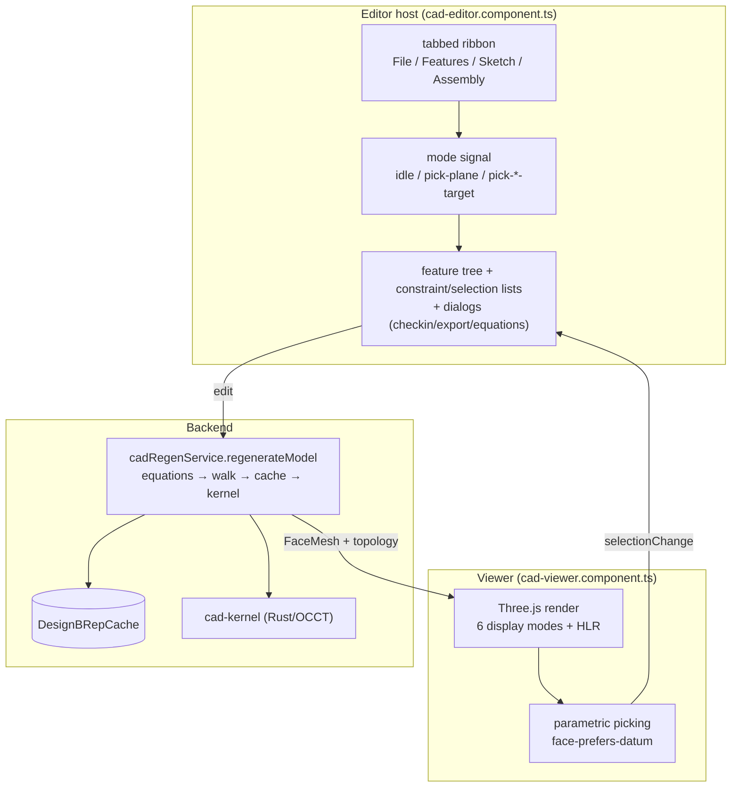

# CAD Runtime — Overview

> **System** ▸ [Overview](../00-overview.md) ▸ [CAD Modeler](../10-cad-modeler.md) ▸ **CAD Runtime**
> In this group: [Regeneration pipeline](./regen-pipeline.md) · [Viewer rendering](./viewer-rendering.md) · [Editor UI](./editor-ui.md)
> Related: [Kernel](../20-kernel.md) · [VCS](../30-vcs.md) · [Feature tree](../cad-modeler/feature-tree.md)

---

## Requirements

The CAD runtime is the live machinery that turns a stored part document into pixels the user can inspect and edit. Its defining requirements span the regeneration backend, the 3D viewer, and the editor host.

| REQ | Status | Summary |
|-----|--------|---------|
| 513 | unapproved | Render the model's solid geometry in a 3D view |
| 517 | unapproved | Stable per-face identifiers for the solid's session lifetime |
| 545 | unapproved | Ordered feature list producing the model's 3D geometry |
| 547 | unapproved | Any feature change re-evaluates the tree and updates the scene |
| 616 | unapproved | Tabbed ribbon editor with 3D-always sketching |
| 620 | unapproved | Six 3D viewer display modes |
| 638 | unapproved | Resolve equations before dispatch; hash cache keys over resolved values |
| 691 | unapproved | Editor shows lock/dirty state + commit history |

### REQ 547 — The regeneration heartbeat

- **Description:** When a feature is added, removed, or has any of its parameters modified, the CAD module shall sequentially re-evaluate every feature in the tree in order and shall update the rendered scene to reflect the resulting geometry.
- **Rationale:** Parametric modeling requires that downstream geometry stay consistent with the feature tree at all times.
- **Verification:** Exercised by `frontend/e2e/cad/cad-editor.spec.ts > 'Extruding a closed profile produces a solid'`.
- **Validation:** A user editing a feature parameter sees the model update without manual refresh.

---

## Succinct description

The CAD runtime is the three-part loop behind every editing session: a backend **regeneration pipeline** that rebuilds geometry from the stored feature tree, a Three.js **viewer** that renders and lets the user pick that geometry, and the **editor host** (the tabbed ribbon, panels, and dialogs) that the user drives.

---

## How it works — for everyone (non-technical)

Three things cooperate every time you work on a part.

1. **Regeneration** is the backend "follow the recipe" step — it reads the list of design steps and produces the actual 3D shape, reusing previously computed results wherever the inputs haven't changed so it stays fast.

2. **The viewer** is the window onto that shape: it draws it, lets you spin/pan/zoom, highlights what's under your cursor, and shows the helper geometry (reference planes, sketches).

3. **The editor** is everything around the view — the tabbed toolbar, the list of design steps, the property panels, and the save/version controls. It's the cockpit you operate.

Together they form a loop: you act in the editor, the backend regenerates the geometry, and the viewer shows you the result.

---

## How it works — in detail (technical)

The three pages in this group cover one slice of that loop each:

| Page | Lives in | Covers |
|------|----------|--------|
| [Regeneration pipeline](./regen-pipeline.md) | `backend/services/cadRegenService.js` & friends | equation resolution, the feature walk, profile extraction, the content-keyed BRep cache, kernel dispatch, cumulative bodies, body-scoped naming, regen streaming |
| [Viewer rendering](./viewer-rendering.md) | `frontend/src/app/components/cad/cad-viewer/cad-viewer.component.ts` | scene/camera, six display modes + hidden-line removal, hover/select coloring, datum labels, the section plane, parametric picking, default-view + 90° rotation, WebGL recovery |
| [Editor UI](./editor-ui.md) | `frontend/src/app/components/cad/cad-editor/cad-editor.component.ts` | the tabbed ribbon, the `mode` signal, side panels, and the check-in/export/equations dialogs plus the VCS/workflow footer |

The boundary between them is clean: the editor owns *intent* (what the user is doing), the regeneration pipeline owns *geometry* (turning the document into meshes), and the viewer owns *presentation* (drawing and picking). Geometry flows backend → viewer as tessellated `FaceMesh` arrays; intent flows viewer → editor as selection/pick events; document edits flow editor → backend to trigger the next regeneration.

---

## Key files

- `backend/services/cadRegenService.js` — the regeneration orchestrator
- `frontend/src/app/components/cad/cad-viewer/cad-viewer.component.ts` — the Three.js viewer
- `frontend/src/app/components/cad/cad-editor/cad-editor.component.ts` — the editor host (ribbon + panels + dialogs)
