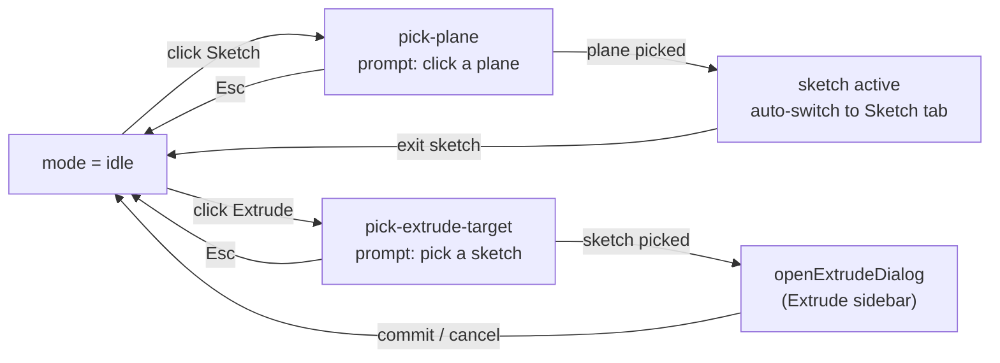

# Editor UI

> **System** ▸ [Overview](../00-overview.md) ▸ [CAD Modeler](../10-cad-modeler.md) ▸ **Editor UI**
> Related: [cad-runtime overview](./00-overview.md) · [Viewer rendering](./viewer-rendering.md) · [Regeneration pipeline](./regen-pipeline.md) · [Equations](../cad-modeler/equations.md)

---

## Requirements

| REQ | Status | Summary |
|-----|--------|---------|
| 616 | unapproved | Tabbed ribbon toolbar (File/Sketch/Features/Assembly); 3D-always sketching via `[hidden]` tabs |
| 640 | unapproved | Equations panel listing globals / feature / sketch equations with live validation |
| 691 | unapproved | Editor shows lock holder + dirty state; check-in/checkout/release lock controls; commit-history panel |
| 707 | unapproved | Editor shows the workflow state and the transition actions available to the current user |

### REQ 616 — Tabbed ribbon + 3D-always sketching

- **Description:** The top of the CAD editor shall present a tabbed toolbar (ribbon) similar to SolidWorks and OnShape, with at minimum a Features tab and a Sketch tab. The active tab shall track the editor context (auto-switch to Sketch when a sketch is active, to Features when none is). While a sketch is active the viewport stays in perspective/3D — sketch entities render as a 2D overlay on the host plane, and picking/dragging operate via ray-plane intersection.
- **Rationale:** SolidWorks and OnShape users expect tabs plus a persistent 3D context — switching to compare sketch placement against existing 3D geometry is the central modeling gesture.
- **Verification:** Tab content swaps via `[hidden]` (state preserved across tab switches); auto-switch wired via an effect on `activeSketchId` transitions, with manual click as override. Sketch picking via the viewer's `toSketchCoords`.
- **Validation:** A user can sketch on a face of an existing body while still seeing surrounding 3D geometry; tab switching exposes both feature and sketch tools without losing context.

### REQ 691 — Version-control state in the editor

- **Description:** The CAD editor shall display the current lock holder and dirty state, provide actions to check in (with a message) and to check out or release the lock, and present the model's commit history in place of the prior revision-based history view.
- **Rationale:** Users need to see and operate the version-control state directly in the editor; the commit log replaces the obsolete revision-letter history.
- **Verification:** Editor footer shows dirty + foreign-lock badges; ribbon File tab shows Check out / Check in / Undo checkout; a commit-history panel toggles open. Implemented in `cad-editor.component.ts` (+ `cad-model.service`).
- **Validation:** An engineer can check out, edit, check in with a message, and review the full commit history from the editor.

### REQ 707 — Workflow state and transitions

- **Description:** The CAD editor shall display the current workflow state and offer the transition actions that are available to the current user from that state.
- **Rationale:** Users need to see and drive the review workflow directly in the editor.
- **Verification:** Editor footer shows the workflow-state badge; the File tab shows only the permitted transition buttons for the current state.
- **Validation:** An engineer can submit, approve, or reject a model from the editor according to their permissions.

---

## Succinct description

`cad-editor.component.ts` is the single editor host (it runs both CAD and assembly modes). It presents a SolidWorks-style tabbed ribbon (File / Features / Sketch / Assembly), drives an explicit `mode` signal that tracks what the editor is waiting for (idle vs picking a plane vs picking an extrude target), hosts the side panels (feature tree, constraint/selection lists, tool PropertyManager panels), and opens dialogs for check-in, export, and equations.

---

## How it works — for everyone (non-technical)

The editor is the whole workspace around the 3D view. Across the top is a ribbon of tabs — like the tabs in a word processor. **File** holds the save/version controls (check out, check in, history, release). **Features** holds the 3D shape tools (sketch, extrude, revolve, fillet…). **Sketch** holds the 2D drawing tools and constraints. **Assembly** appears when you're putting parts together.

The editor always knows what it's waiting for. Click "Extrude" and it switches into a "pick a sketch" state, prompts you, and opens a small side panel to collect the details. Press Escape and it goes back to idle. Start editing a sketch and the ribbon flips to the Sketch tab automatically — but if you click a tab yourself, it respects your choice.

Down the left is the feature tree (the list of every step that built the part) and, depending on what you're doing, a panel of properties or a list of the edges and faces you've picked. Along the bottom is a status strip showing whether your work is saved, who has it checked out, and where it sits in the review-and-release process.

---

## How it works — in detail (technical)

The host is `frontend/src/app/components/cad/cad-editor/cad-editor.component.ts` — a large standalone component. Surrounding panel and dialog components live in sibling directories under `frontend/src/app/components/cad/`.

### The tabbed ribbon (REQ 616)

`activeTab` is a signal of `'file' | 'features' | 'sketch' | 'assembly'`, defaulting to `'features'`. The ribbon renders four tab buttons; each ribbon pane is shown via `[hidden]="activeTab() !== '<tab>'"` rather than `*ngIf`. Using `[hidden]` is deliberate: switching tabs does **not** recreate the panes, so a half-finished tool gesture (a placed arc center awaiting its second click) survives a tab switch.

- **File pane** — version-control + release: Check out, branch picker, Check in, Undo checkout, History, Compare, the workflow transition buttons (only on `main`), Release (draft branch), Merge (behind-main), Production (approved + released), New branch, and STEP/STL download.
- **Features pane** — the 3D feature tools: Sketch, Extrude / Cut Extrude (split button with a chevron), Revolve, Sweep, Loft, fillet/chamfer/shell/pattern/datum/hole/combine/mirror-body/move-copy, plus the Σ Equations button. Most buttons disable when `readonly()` or while a sketch is active (`activeSketchId() !== null`).
- **Sketch pane** — the 2D tools and the constraint buttons (hosted by `cad-sketch-editor`, now toolbar-only).
- **Assembly pane** — assembly-mode tools.

`setActiveTab(t)` is the manual override. The **auto-switch** is an `effect` watching `activeSketchId()`: when it transitions (compared against `prevActiveSketchId`) the tab flips to `sketch` (sketch became active) or `features` (sketch closed). Steady-state edits to a sketch's contents don't re-fire, so a user-initiated tab choice sticks. Assembly mode owns its own tab and short-circuits the effect.

### The mode signal

`mode = signal<EditorMode>('idle')` is the single source of truth for what the editor is waiting for. `EditorMode` is `'idle' | 'pick-plane' | 'pick-extrude-target' | 'pick-cut-extrude-target' | 'pick-revolve-target' | 'pick-cut-revolve-target' | 'pick-sweep-target' | 'pick-cut-sweep-target'`. `setMode(m)` sets it (and clears `pendingExtrude` on return to idle). Clicking a feature-tool button puts the editor into the matching `pick-*` mode, which prompts the user (e.g. "Click a datum plane in the viewer") and routes the next viewer/tree click to the right handler; Esc cancels back to idle. The feature-tree panel's `selectableSketches` input is driven by the pick modes so it knows when a sketch row click should resolve a target.

### Side panels

The left column swaps content based on context:

- **Feature tree** (`app-cad-feature-tree-panel`, shown when not in assembly mode) — the ordered feature list + sketches + bodies, with selection, visibility toggles, rollback bar, and context-menu actions wired through outputs (`sketchSelected`, `actionRequested`, `featureSelect`, `bodyVisibilityToggled`, `rollbackChanged`, …).
- **Constraint list** (`app-cad-constraint-list`, shown only while a sketch is active) — the active sketch's constraints + entities, with remove / edit / select. It is hidden while a tool PropertyManager panel (Mirror / Fillet / Chamfer) or the sketch-entity-properties panel occupies the same column.
- **Selection lists** (`cad-selection-list`) — a reusable pick-row list reused across every tool sidebar that collects geometry picks: fillet/chamfer edge lists, the Measure tool's Point/Edge/Plane slots, datum-construction references, etc.
- **Sketch entity properties** — an inline panel for editing a selected text / picture / equation-curve entity, occupying the constraint-list column while open.

### Dialogs

The editor opens MatDialogs via the injected `MatDialog`:

- **Equations panel (REQ 640)** — `openEquationsPanel()` opens `CadEquationsPanelComponent` with the model's `equations()` doc and the built-in part variables (`partName`, `partNumber`, `partRevision`, `manufacturerPN`, sourced from `textVariables()` and shown read-only). The panel lists globals / feature / sketch equations, supports inline edit / add / delete with live validation, and writes back through an `onChange` callback that sets `equations` and saves. When the part isn't checked out (`readonly()`), the panel opens view-only.
- **Check-in (REQ 691)** — `onCheckin()` opens `CadCheckinDialogComponent` to collect the commit message, then issues the check-in through `cad-model.service`.
- **Export** — `CadExportDialogComponent` is opened for STL and STEP, passed the body list and export variables (`_exportVars()`); `resolveExportName` derives the default filename.
- **Extrude** — note the extrude *dialog* was superseded by an inline **Extrude sidebar**: `openExtrudeDialog(sketchId, mode)` validates the sketch profile via `extractRegions`, then opens the sidebar by resetting the extrude signals (`extrudeDistance`, `extrudeFlipped`, `extrudeMerge`, `extrudeEndKind`, …); the OK button reads them back on commit. (The `extrude-dialog` component directory remains for the legacy modal variant.)

### Footer: version-control + workflow state (REQ 691, 707)

The `.editor-footer` strip carries the live VCS and workflow status:

- A **workflow-state badge** (`app-category-badge`, `data-testid="workflow-badge"`) shows `workflow()!.state`, colored by state (`approved` → success, `in_review` → info, else warning) — REQ 707.
- A **dirty indicator** (`.vcs-dirty`, shown when `isDirty()`) and lock-holder/foreign-lock state surface the working-copy status — REQ 691.
- The **workflow transition buttons** render in the File ribbon pane from `workflow()?.actions` (only on `main`), so only the transitions permitted to the current user from the current state appear (REQ 707). Release / Production / Merge buttons are gated by `canWrite()` / `canApprove()`, `onMainBranch()`, dirty/`behindMain` state, and base-commit presence, with explanatory tooltips.

The commit-history panel (REQ 691) replaces the old revision-letter history view and toggles from the History button.

---

## Key files

- `frontend/src/app/components/cad/cad-editor/cad-editor.component.ts` — the editor host: tabbed ribbon, `activeTab` + auto-switch effect, `mode` signal + `pick-*` flow, panel wiring, dialog opens, VCS/workflow footer
- `frontend/src/app/components/cad/cad-feature-tree-panel/` — the ordered feature/sketch/body tree panel
- `frontend/src/app/components/cad/cad-constraint-list/` — the active-sketch constraint list
- `frontend/src/app/components/cad/cad-selection-list/` — reusable pick-row list used by tool sidebars
- `frontend/src/app/components/cad/cad-equations-panel/` — the Σ Equations dialog (REQ 640)
- `frontend/src/app/components/cad/cad-checkin-dialog/` — the commit-message check-in dialog (REQ 691)
- `frontend/src/app/components/cad/cad-export-dialog/` — the STL/STEP export dialog
- `frontend/src/app/components/cad/extrude-dialog/` — legacy extrude modal (superseded by the inline Extrude sidebar)
- `frontend/src/app/components/cad/cad-sketch-editor/` — the toolbar-only sketch tool/constraint host (Sketch tab)
- `frontend/src/app/components/cad/cad-viewer/` — the 3D viewer hosted in the editor body
