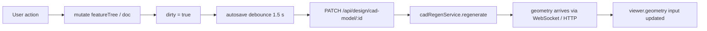

# cad-editor

> **System** ▸ [Overview](../../00-overview.md) ▸ [CAD Modeler](../../10-cad-modeler.md) ▸ [Editor UI](../editor-ui.md) ▸ **cad-editor**
> Related: [cad-viewer](./cad-viewer.md) · [cad-sketch-editor](./cad-sketch-editor.md) · [cad-feature-tree-panel](./cad-feature-tree-panel.md) · [editor-ui](../editor-ui.md)

---

## Requirements

| REQ | Status | Summary |
|-----|--------|---------|
| 616 | unapproved | Tabbed ribbon (File/Features/Sketch/Assembly) with 3D-always sketching |
| 545 | unapproved | Ordered feature list drives sequential regeneration |
| 691 | unapproved | Editor displays lock holder + dirty state; checkout/check-in/release-lock controls |
| 707 | unapproved | Editor shows workflow state and available transition actions |

### REQ 616 — Tabbed ribbon + 3D-always sketching

- **Description:** The top of the CAD editor shall present a tabbed toolbar (ribbon) similar to SolidWorks and OnShape, with at minimum a Features tab and a Sketch tab. The active tab shall track the editor context (auto-switch to Sketch when a sketch is active, to Features when none is). While a sketch is active the viewport stays in perspective/3D — sketch entities render as a 2D overlay on the host plane, and picking/dragging operate via ray-plane intersection.
- **Rationale:** SolidWorks and OnShape users expect tabs plus a persistent 3D context — switching to compare sketch placement against existing 3D geometry is the central modeling gesture.
- **Verification:** Confirm the Features tab shows when no sketch is active, the Sketch tab shows when a sketch is active, both tabs can be manually selected, and the 3D viewer remains live in both modes.
- **Validation:** A designer can compare their sketch against the underlying solid without toggling to a separate 2D mode.

---

## Succinct description

The single host component for the entire CAD editor: owns the ribbon, the mode signal, all sidebar panels, and orchestrates every user action into feature-tree mutations and backend regeneration calls.

## How it works — for everyone (non-technical)

Think of the cad-editor as the control room for modeling. It holds the toolbar at the top, the feature list on the left, the 3D view in the middle, and any open sidebar (like the Extrude settings) on the right. When you click "Sketch" it switches to sketch mode; click "Extrude" and a settings panel slides in. It listens to every click, delegates drawing to the sketch editor and 3D rendering to the viewer, and writes the result back to the server.

## How it works — in detail (technical)

**Selector:** `app-cad-editor`

The component is the application's single entry point for CAD editing (CAD parts and assemblies both route here; `assemblyMode()` is a signal toggled by route data via `AssemblyEditController`).

### Ribbon + tabs

Four ribbon tabs — `file`, `features`, `sketch`, `assembly` — are rendered in the template. The `activeTab` signal defaults to `'features'`; `effect(() => { if (activeSketchId()) setActiveTab('sketch'); })` auto-switches but a manual click is sticky for the session (REQ 616). Tab content is swapped using `[hidden]` (not `*ngIf`) so the `CadSketchEditorComponent` child instance is never destroyed mid-gesture.

### Mode signal

```typescript
type EditorMode =
  | 'idle' | 'pick-plane'
  | 'pick-extrude-target' | 'pick-cut-extrude-target'
  | 'pick-revolve-target' | 'pick-cut-revolve-target'
  | 'pick-sweep-target' | 'pick-cut-sweep-target';
```

`mode` is the single source of truth for what the editor is waiting for. A viewer click in `'pick-plane'` sets `activeSketchId`; in `'pick-extrude-target'` it populates `extrudeSketchId`. Pressing Esc always resets to `'idle'`.

### Feature tree + regen loop



Autosave calls `PATCH /api/design/cad-model/:id` with the current `featureTree` and `doc`. Regeneration is triggered by `CadStreamService` (WebSocket) or a fallback one-shot `GET /api/design/cad-model/:id/geometry`. The returned `ModelGeometry` is passed directly to `CadViewerComponent` as an input signal.

### Undo / redo

`HistorySnapshot = { featureTree: FeatureTree; doc: SketchDocument }`. A circular buffer in `undoStack` / `redoStack` captures state before each mutation; Ctrl+Z / Ctrl+Y replay from those snapshots via `pushHistory()` / `undo()` / `redo()`.

### Dialog / sidebar wiring

Every sidebar (Extrude, Fillet, Chamfer, Shell, Pattern, etc.) is rendered inline inside the cad-editor template under a conditional `*ngIf`. Dialogs (`CadCheckinDialogComponent`, `CadExportDialogComponent`, `SketchDeleteWarningDialogComponent`) are opened via `MatDialog`. Results are returned as typed `CadCheckinResult` / `ExportDialogResult` / `SketchDeleteAction` to the editor for processing.

## Key files

- `frontend/src/app/components/cad/cad-editor/cad-editor.component.ts` — the host (4000+ lines; every sidebar and ribbon tab in one file)
- `frontend/src/app/cad/lib/featureTree.ts` — `addFeature`, `removeFeature`, `updateFeatureParam`
- `frontend/src/app/cad/lib/document.ts` — `createSketch`, `deleteSketch`, `setSketchVisibility`
- `frontend/src/app/services/cad-model.service.ts` — HTTP client (autosave, regen, checkout, check-in)
- `frontend/src/app/services/cad-stream.service.ts` — WebSocket regen notifications
