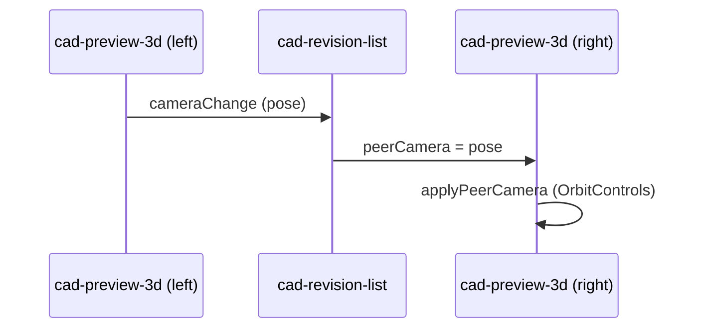

# cad-preview-3d

> **System** ▸ [Overview](../../00-overview.md) ▸ [VCS](../../30-vcs.md) ▸ **cad-preview-3d**
> Related: [cad-revision-list](./cad-revision-list.md) · [cad-mini-preview](./cad-mini-preview.md) · [VCS](../../30-vcs.md)

---

## Requirements

Requirements governed by [VCS group](../../30-vcs.md).

| REQ | Status | Summary |
|-----|--------|---------|
| 712 | unapproved | Interactive camera rotation, zoom, and point-to-point distance in the version-history 3D preview |
| 713 | unapproved | Compare view colours faces by persistent-name diff: added=green, removed=red, unchanged=neutral |
| 726 | unapproved | Camera-lock toggle in Compare view syncs the right preview's camera to the left's |

### REQ 712 — Interactive 3D preview

- **Description:** The CAD version-history 3D preview shall support interactive camera rotation, zoom, and point-to-point distance measurement.
- **Rationale:** Reviewers need to inspect geometry from any angle without opening the full editor.
- **Verification:** Load a commit in the history preview, orbit, zoom, and measure two vertices; confirm the distance is shown.
- **Validation:** A reviewer can assess geometry in-panel without navigating away.

---

## Succinct description

A self-contained Three.js viewer used exclusively in the version-history compare view: renders frozen commit geometry, colours faces by diff status, supports orbit+zoom, and provides point-to-point distance measurement.

## How it works — for everyone (non-technical)

The version history "Compare" view shows two 3D panels side by side. This component powers each panel. You can click and drag to orbit, scroll to zoom, and click two points to measure the distance between them. Faces that were added in the newer commit appear green; removed faces appear red; unchanged faces are grey-blue.

## How it works — in detail (technical)

**Selector:** `app-cad-preview-3d`

Uses `@angular/core` `@Input()` / `@Output()` pattern (not signals) because it predates the signals migration on this particular component.

### Key inputs

| Input | Type | Purpose |
|-------|------|---------|
| `geometry` | `CadCommitGeometry \| null` | Frozen tessellated geometry for this commit |
| `faceStatuses` | `Record<string, FaceStatus>` | Per-face diff status (`'added' \| 'removed' \| 'unchanged'`) |
| `defaultView` | `CadDefaultView \| null` | Saved camera orientation (applied on `ngOnChanges`) |
| `peerCamera` | `PreviewCamera \| null` | Incoming camera from the paired Compare panel (camera-lock) |

Key output: `cameraChange: EventEmitter<PreviewCamera>` — emitted on every orbit/zoom, consumed by the peer when camera-lock is enabled.

### Geometry rendering

Geometry arrives as `CadCommitGeometry` (frozen BRep tessellation from `VcsObject` store). Each face is a `{ persistentName, positions, normals, indices }` record. Faces are coloured using `FACE_COLORS: Record<'neutral' | FaceStatus, number>` — unchanged → 0x9fb4d6, added → 0x66bb6a, removed → 0xef5350.

### Measurement

Clicking a vertex/edge/face on the first click stores `snap1`; a second click computes the distance. `computeMeasure` from `cad/lib/measure.ts` handles vertex-to-vertex, vertex-to-edge, edge-to-edge, and face measurement. `fitCircle` is used for arc/circle edge detection. Results are displayed as a text overlay in the viewer.

### Camera lock

## Key files

- `frontend/src/app/components/cad/cad-preview-3d/cad-preview-3d.component.ts`
- `frontend/src/app/cad/lib/measure.ts` — `computeMeasure`, `fitCircle`
- `frontend/src/app/models/cad-model.model.ts` — `CadCommitGeometry`, `FaceStatus`, `CadDefaultView`
