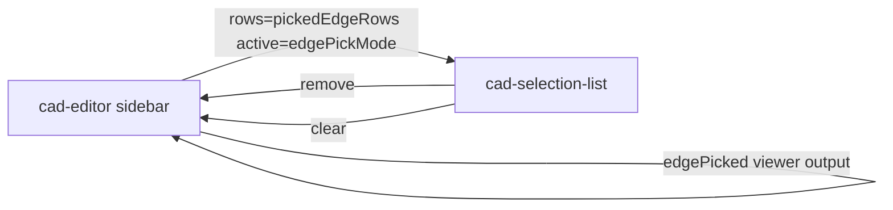

# cad-selection-list

> **System** ▸ [Overview](../../00-overview.md) ▸ [CAD Modeler](../../10-cad-modeler.md) ▸ [Editor UI](../editor-ui.md) ▸ **cad-selection-list**
> Related: [cad-editor](./cad-editor.md) · [editor-ui](../editor-ui.md)

---

## Requirements

Requirements governed by [editor-ui](../editor-ui.md). This component is pure infrastructure with no direct requirement; it is the shared picker-panel shell used by fillet, chamfer, measure, pattern, shell, and hole sidebars.

---

## Succinct description

A reusable SolidWorks-style "selection box" component: a labelled panel showing zero-to-many picked-entity rows, each with an icon, label, and remove button.

## How it works — for everyone (non-technical)

Whenever a sidebar needs you to pick faces or edges from the 3D view (for example, "pick edges to fillet"), it shows a selection box — this component. It lists everything you've picked so far, and you can click the × on any row to remove it. When the box is "active" (the picker is armed and waiting for your next click) it highlights blue so you know where your next click will go.

## How it works — in detail (technical)

**Selector:** `cad-selection-list`

Pure presentational component (`ChangeDetectionStrategy.OnPush`). All state is passed in via inputs; no internal mutable state.

### Inputs and outputs

```typescript
label:        string           // required — field title
headerIcon:   string | null    // optional Material icon left of title
rows:         SelectionRow[]   // required — one per picked item
active:       boolean          // highlight panel blue when picker is armed
showCount:    boolean          // show count chip in header
emptyHint:    string | null    // italic hint when rows is empty
testid:       string | null    // base data-testid (children get -{row-N}, -remove-N, -clear)

Outputs:
remove:  string   // emits row.id when × is clicked
clear:   void     // emits when "Clear all" header button is clicked
```

`SelectionRow = { id: string; label: string; icon?: string; tooltip?: string }`.

### ng-content slot

`<ng-content>` renders between the header and the entity list — hosts inject pick-mode toggle buttons or informational text directly inside the panel chrome.

### Usage pattern



The cad-editor creates a `SelectionRow[]` derived signal from the current picked-face/edge/vertex set and passes it to this component. The `remove` output causes the editor to remove the id from its picked set; `clear` resets the whole set.

## Key files

- `frontend/src/app/components/cad/cad-selection-list/cad-selection-list.component.ts`
