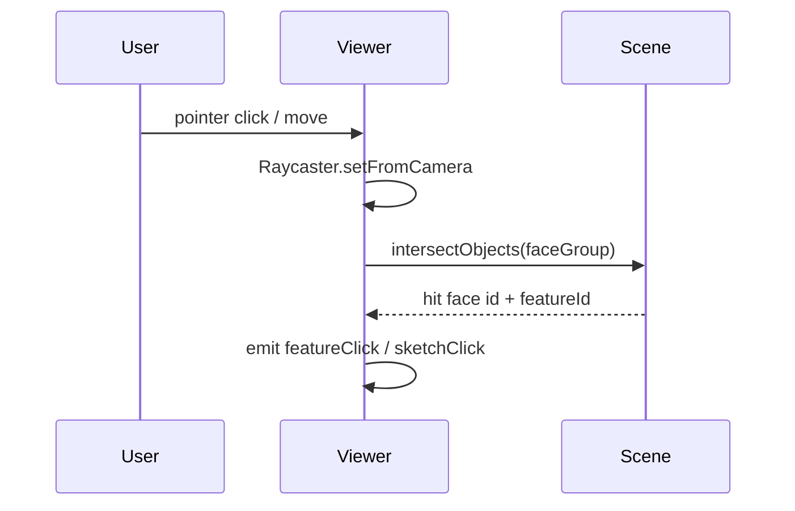

# cad-viewer

> **System** ▸ [Overview](../../00-overview.md) ▸ [CAD Modeler](../../10-cad-modeler.md) ▸ [Viewer rendering](../viewer-rendering.md) ▸ **cad-viewer**
> Related: [cad-editor](./cad-editor.md) · [cad-sketch-editor](./cad-sketch-editor.md) · [viewer-rendering](../viewer-rendering.md)

---

## Requirements

| REQ | Status | Summary |
|-----|--------|---------|
| 513 | unapproved | Render solid geometry when a CAD model is loaded |
| 514–516 | unapproved | Orbit, pan, zoom camera controls |
| 517–520 | unapproved | Per-face persistent naming; hover and selection highlight |
| 620 | unapproved | Six display modes (wireframe variants + visible-edges + hidden-dashed) |
| 708–709 | unapproved | Default view + save-as-default-view controls |

### REQ 620 — Six display modes

- **Description:** The 3D viewer shall provide six display modes the user can toggle: (1) Wireframe — all edges, no faces; (2) Wireframe hidden dashed — all edges, hidden edges dashed; (3) Wireframe no hidden — visible edges only; (4) Visible edges (default) — shaded faces + visible edges; (5) All edges — shaded + all edges; (6) Hidden dashed — shaded + visible edges + hidden edges dashed.
- **Rationale:** Engineers need to see through geometry to verify feature placement, coincident edges, and internal cuts without leaving the view.
- **Verification:** Toggle each mode; confirm face visibility and edge dashing match the description.
- **Validation:** A designer can validate an internal cut without switching to a section view.

---

## Succinct description

The Three.js WebGL viewer: renders solid geometry, sketch overlays, datum planes, and all picker overlays; dispatches sketch pointer events via ray-plane intersection.

## How it works — for everyone (non-technical)

The viewer is the 3D window in the middle of the editor. It draws the part's surfaces, wires, and construction planes using the same 3D engine used in many browser games (Three.js). It also listens for your mouse clicks and movements, figures out which face or sketch entity you touched, and tells the editor. When you're drawing a sketch it projects your mouse position onto the flat sketch plane so you can place points precisely.

## How it works — in detail (technical)

**Selector:** `app-cad-viewer`

### Scene architecture

`initScene()` creates an `OrthographicCamera` and two `WebGLRenderer` instances: the main scene renderer and a navigation-cube renderer (`cubeRenderer`) in a separate WebGL context rendered into `cubeMountRef`. A `CSS2DRenderer` overlays HTML dimension labels. All rendering runs outside Angular zone (`zone.runOutsideAngular`) for zero change-detection overhead.

Four top-level scene `Group` objects partition the scene:
- `faceGroup` — one `THREE.Mesh` per BRep face, keyed by `persistentName`
- `edgeGroup` — `{front, hiddenSolid, hiddenDashed}` entries per edge id or face id
- `datumGroup` — datum planes, axes, labels
- `sketchGroup` — per-sketch overlay groups plus `sketchPreviewGroup`

### Display modes

```typescript
export type DisplayMode =
  | 'wireframe' | 'wireframe-hidden-dashed' | 'wireframe-no-hidden'
  | 'visible-edges' | 'all-edges' | 'hidden-dashed';
```

Each mode maps to a `DisplayModeSpec` (`facesShaded`, `facesDepth`, `showFrontEdges`, `showHiddenSolid`, `showHiddenDashed`). `applyDisplayMode` toggles `mesh.visible` and `material.depthFunc` across the face and edge groups without rebuilding geometry.

### Sketch overlay and ray-plane picking

Sketch entities (lines, arcs, circles) are drawn as `Line2` (supports real pixel line-width, unlike `LineBasicMaterial` which is capped at 1 px on most WebGL implementations). The active sketch's plane is stored as `sketchPlaneNormal`; `orientToPlane(plane)` snaps the camera perpendicular to the plane on sketch entry (REQ 727).

Pointer events in sketch mode invoke `toSketchCoords(screenX, screenY)`: a `Raycaster` + `THREE.Plane.intersectRay` converts screen pixels into 2D sketch-plane coordinates. The result is emitted via `sketchClick`, `sketchPointerDown`, `sketchPointerMove`, `sketchPointerUp` outputs.

### Inputs and outputs

Key inputs: `geometry`, `sketchDoc`, `activeSketchId`, `displayMode`, `sketchPreview`, `profileFills`, `holePreviews`, `cosmeticThreads`, `featurePreview`, `edgeBlendPreview`, `datumPlanePreview`, `patternPreview`, `shellPreview`.

Key outputs: `selectionChange`, `featureClick`, `featureContextMenu`, `sketchClick`, `sketchPointerDown`, `sketchPointerMove`, `sketchPointerUp`, `axisPicked`, `facePicked`, `vertexPicked`, `profileFillClick`, `saveDefaultView`.

### Navigation cube

The nav cube renders 26 hit regions (6 face centres + 12 edge midpoints + 8 corners). A face-centre click jumps to the canonical orthographic view for that face; edge/corner clicks jump to 45° / isometric views. LMB-drag on the cube body free-orbits the main scene.



## Key files

- `frontend/src/app/components/cad/cad-viewer/cad-viewer.component.ts` — the full viewer (4500+ lines)
- `frontend/src/app/cad/lib/tessellator.ts` — chord-tolerance tessellator feeding sketch overlay polylines
- `frontend/src/app/cad/lib/dimensions.ts` — `dimensionRenders` consumed for CSS2D label placement
