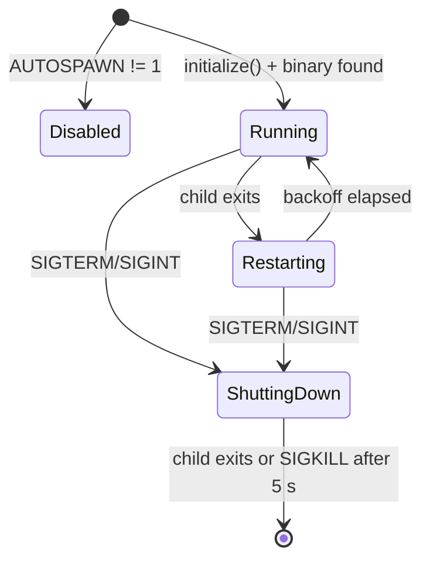

# cadKernelSupervisor — Kernel Process Supervisor

> **System** ▸ [Overview](../../00-overview.md) ▸ [CAD Modeler](../../10-cad-modeler.md) ▸ [Regeneration Pipeline](../regen-pipeline.md) ▸ **cadKernelSupervisor**
> Related: [cadKernelClient](./cadKernelClient.md)

---

## Requirements

Requirements: governed by [Regeneration Pipeline](../regen-pipeline.md). No dedicated REQ for this module; it is infrastructure that keeps the kernel sidecar alive rather than a user-visible feature.

---

## Succinct description

`cadKernelSupervisor.js` is an opt-in process supervisor that spawns the compiled `cad-kernel` binary as a child process and restarts it with exponential backoff on crash. Disabled by default to preserve the manual `cargo run` development workflow.

## How it works — for everyone (non-technical)

The geometry engine is a separate program that the backend can optionally start and babysit. If the engine crashes, the supervisor waits a moment and tries again (doubling the wait each time, up to 30 seconds). When the backend itself shuts down, the supervisor sends a polite stop signal to the engine and gives it 5 seconds to finish before forcing it to quit.

## How it works — in detail (technical)

### Export

```javascript
module.exports = instance;  // singleton CadKernelSupervisor
```

`backend/index.js` calls `instance.initialize()` once on startup.

### `CadKernelSupervisor` class

```javascript
class CadKernelSupervisor {
  initialize()    // opt-in entry point
  shutdown()      // SIGTERM → 5 s grace → SIGKILL
}
```

### Activation

Enabled only when `CAD_KERNEL_AUTOSPAWN=1`. When disabled, `initialize()` logs a note and returns immediately. Production deployments should set the env var; dev users keep direct control of the kernel process.

### Binary resolution

1. `CAD_KERNEL_BIN` env var (absolute path).
2. Otherwise `<repo-root>/cad-kernel/target/release/cad-kernel`.

If neither exists, `initialize()` logs an error and aborts — no crash.

### Crash restart with exponential backoff

```
DEFAULT_BACKOFF_MS = 1_000
MAX_BACKOFF_MS    = 30_000
HEALTHY_UPTIME_MS = 60_000
```

On `exit` event: if the process had been up for more than 60 s the backoff resets to 1 s (transient crash). Otherwise it doubles, capped at 30 s. `this.restartTimer` schedules `_spawn()` with the computed delay.

### Stdout / stderr piping

Both streams are piped and prefixed `[cad-kernel]` so kernel diagnostics appear in the same Docker/systemd log as the Node process.

### Graceful shutdown

`process.on('SIGTERM')` and `process.on('SIGINT')` call `shutdown()`. It sends SIGTERM, then sets a 5-second `killTimer` (`.unref()` so it doesn't keep Node alive) to SIGKILL if the child hasn't exited.



---

## Key files

- `backend/services/cadKernelSupervisor.js` — this module
- `cad-kernel/target/release/cad-kernel` — the compiled binary (must be built with `cargo build --release`)
