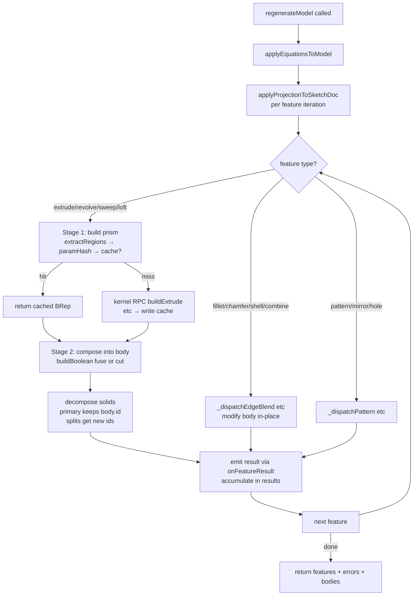

# cadRegenService — Regeneration Orchestrator

> **System** ▸ [Overview](../../00-overview.md) ▸ [CAD Modeler](../../10-cad-modeler.md) ▸ [Regeneration Pipeline](../regen-pipeline.md) ▸ **cadRegenService**
> Related: [cadProfile](./cadProfile.md) · [cadEquations](./cadEquations.md) · [cadProjection](./cadProjection.md) · [cadKernelClient](./cadKernelClient.md)

---

## Requirements

| REQ | Status | Summary |
|-----|--------|---------|
| 545 | unapproved | Ordered feature list producing the model's 3D geometry |
| 547 | unapproved | Sequential re-evaluation on every feature change |
| 638 | unapproved | Resolve equations before dispatch; cache keys over resolved values |
| 684 | unapproved | On release, regenerate and store each body's frozen geometry |

### REQ 547 — Sequential re-evaluation

- **Description:** When a feature is added, removed, or has any of its parameters modified, the CAD module shall sequentially re-evaluate every feature in the tree in order and shall update the rendered scene to reflect the resulting geometry.
- **Rationale:** Parametric modeling requires that downstream geometry stay consistent with the feature tree at all times.
- **Verification:** Exercised end-to-end by `frontend/e2e/cad/cad-editor.spec.ts > 'Extruding a closed profile produces a solid'`, which asserts the feature-tree row count grows after adding a feature.
- **Validation:** A user editing a feature parameter sees the model update without manual refresh.

---

## Succinct description

`cadRegenService.js` is the server-side regeneration orchestrator: it walks the feature tree in order, dispatches each feature to the correct geometry builder, manages a multi-body pipeline, and returns per-body tessellated mesh data to the HTTP caller or streams it incrementally via WebSocket.

## How it works — for everyone (non-technical)

Think of this service as the factory floor foreman. When a designer saves a change, the foreman reads the recipe (the feature tree) from the top, sends each step to the machinery (the Rust kernel), receives back the finished 3D piece, and then combines it with the running part — cutting, fusing, or placing it as a new separate body. Finished results go straight back to the browser so the viewer can update. A smart parts store (the BRep cache) means the foreman skips any step whose inputs haven't changed since last time.

## How it works — in detail (technical)

### Entry point

```
regenerateModel(model, { kernelClient?, db?, onFeatureResult?, rollbackBeforeIndex?, includeBodyBreps? })
  → Promise<{ features, errors, bodies }>
```

`model` is a `DesignCADModel` Sequelize instance carrying `featureTree`, `sketchDoc`, and `equations`. The function is pure async — it never mutates the database record passed in, only reads `DesignBRepCache` rows.

### Pre-walk phases

1. **Equation resolution** — `applyEquationsToModel(model)` returns a new `featureTree` and `sketchDoc` with all drivable numeric params overwritten by their resolved equation values. Errors are collected into `equationErrors` and folded into the top-level `errors` array.
2. **Text resolver** — `buildTextResolver(model)` builds a `#{var}` expander (part number, revision, equation globals) attached to `model.__textResolver` for use by the profile extractor.
3. **Rollback bar** — when `rollbackBeforeIndex` is set, features at or past that index are skipped entirely without kernel calls.
4. **Vertex + face seed maps** — sketch-plane points are pre-seeded into `vertexMap` (for `upToVertex` end-condition) and `faceMap` (for `upToSurface`).

### Feature-walk dispatch

The main loop iterates `featureTree.features`, skipping `origin`, `suppressed`, and `hidden` rows, then routes each feature to a typed dispatcher:

| Feature type(s) | Dispatcher | Returns |
|---|---|---|
| `extrude`, `cutExtrude` | `_regenerateExtrude` | prism BRep + per-region faces/topology |
| `revolve`, `cutRevolve` | `_regenerateRevolve` | same shape as extrude |
| `sweep`, `cutSweep` | `_regenerateSweep` | same shape as extrude |
| `loft` | `_regenerateLoft` | same shape as extrude |
| `fillet`, `chamfer` | `_dispatchEdgeBlend` | modifies most-recent body in-place |
| `shell` | `_dispatchShell` | modifies most-recent body in-place |
| `combine` | `_dispatchCombine` | boolean op between named bodies |
| `mirror`, `linearPattern`, `circularPattern` | `_dispatchPattern` | fuses copies into most-recent body |
| `hole` | `_dispatchHole` | cuts hole wizard profiles |
| `mirrorBody` | `_dispatchMirrorBody` | reflects bodies across a plane |
| `moveCopyBody` | `_dispatchMoveCopyBody` | transforms bodies rigidly |
| `datumPlane`, `datumAxis`, `datumPoint` | skipped (frontend-only reference geometry) | — |

### Prism + compose (two-stage pipeline)

For all sketch-profile feature types (extrude/revolve/sweep/loft + their cut variants):

- **Stage 1 — build prism.** Calls `extractRegions` on the feature's sketch, hashes the profile + parameters into a `paramHash`, checks `DesignBRepCache` for a hit. On miss: calls the kernel RPC (`buildExtrude` / `buildRevolve` / etc.), writes the result back to the cache, returns `{ prismBrep, merged (faces), topology, cached }`.
- **Stage 2 — compose.** Determines target bodies: additive features with `merge !== false` compose into the most-recent body; `merge === false` or first-feature seeds a new one; cuts apply to *all* bodies (SolidWorks "All bodies" scope). Calls `_composeIntoBody` which in turn calls the kernel's `buildBoolean` RPC (fuse or cut). The boolean result is decomposed into `composed.solids`; the primary solid (closest centroid to the old body's centroid) keeps the body's id, and any split-off pieces get `${feature.id}#splitN` ids.

### Multi-body tracking

`bodies` is an array of `{ id, brep, paramHash, faces, topology, centroid }`. Body `id` = the id of the first feature that created it — stable across regens. Per-body topology IDs are scoped by `_scopeTopology(topo, bodyId)` to prevent edge-id collisions in the viewer's Three.js edge Map.

### Cache key

`DesignBRepCache` rows are keyed by `(cadModelID, featureID, paramHash, upstreamHash, namingVersion)`. `NAMING_VERSION` (currently 20) is bumped whenever the kernel's mesh or naming output changes shape, automatically invalidating stale rows. `upstreamHash` carries the parent body's `paramHash` for compose operations, so editing any upstream feature propagates cache misses correctly.

### Export functions

- `exportModelStep(model, { bodyIds? })` — runs regen with `includeBodyBreps: true` then calls `exportBodyBreps(breps, 'step')`.
- `exportModelStl(model, { bodyIds? })` — same but calls `exportBodyBreps(breps, 'stl')`.
- `exportBodyBreps(breps, format)` — calls the kernel's `exportStep` or `exportStl` RPC directly with a list of base64 BRep payloads.

### Streaming

`onFeatureResult(result)` is called synchronously after each feature completes (cache hit or kernel response). The streaming controller uses this to push `feature-result` WebSocket events to subscribed editor tabs via `cadStreamService.broadcastToModel`.



---

## Key files

- `backend/services/cadRegenService.js` — this module (~3200 lines)
- `backend/services/cadProfile.js` — `extractRegions` called per extrude/revolve/sweep/loft
- `backend/services/cadEquations.js` — `applyEquationsToModel` called at walk start
- `backend/services/cadProjection.js` — `applyProjectionToSketchDoc` called per feature iteration
- `backend/services/cadKernelClient.js` — `getDefaultClient().call(method, params)` for all kernel RPCs
- `backend/models/design/designBrepCache.js` — `DesignBRepCache` Sequelize model
