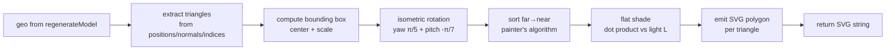

# cadThumbnailSvg — SVG Thumbnail Renderer

> **System** ▸ [Overview](../../00-overview.md) ▸ [CAD Modeler](../../10-cad-modeler.md) ▸ [Regeneration Pipeline](../regen-pipeline.md) ▸ **cadThumbnailSvg**
> Related: [cadRegenService](./cadRegenService.md)

---

## Requirements

| REQ | Status | Summary |
|-----|--------|---------|
| 710 | unapproved | On check-in, capture a low-resolution raster image of the model for the version-history preview |
| 711 | unapproved | Version-history 3D preview displays the stored commit image immediately as a placeholder |

### REQ 710 — Commit thumbnail capture

- **Description:** On check-in, the CAD module shall capture a low-resolution raster image of the model rendered from its default camera orientation and store it with the commit.
- **Rationale:** A thumbnail makes version history scannable — users can identify a commit by shape at a glance without loading its full geometry.
- **Verification:** Test — verify that a check-in writes a non-null `thumbnailSvg` field on the resulting commit object in `backend/tests/__tests__/vcs/cad-commit-thumbnail.test.js`.
- **Validation:** The version-history list shows a small preview image next to each commit entry.

---

## Succinct description

`cadThumbnailSvg.js` (at `backend/services/vcs/cadThumbnailSvg.js`) is a pure-JS isometric flat-shaded SVG renderer. Given the tessellated geometry output of `cadRegenService.regenerateModel`, it produces a static SVG string suitable for embedding in commit records and the version-history list.

## How it works — for everyone (non-technical)

After calculating a model's geometry, the server takes a quick "photograph" of it from a fixed angle — no canvas, no GPU, just math. It projects every triangle of every face onto a 2D plane, sorts them back-to-front, and writes them out as SVG polygon elements with a simple light-and-shade color. The result is a compact, crisp preview image for the version history.

## How it works — in detail (technical)

### Real file path

`backend/services/vcs/cadThumbnailSvg.js` — note the `vcs/` subdirectory, not the top-level `services/` directory.

### Export

```javascript
module.exports = { renderGeometrySvg };
```

### `renderGeometrySvg(geo, w = 240, h = 180) → string | null`

Input `geo` has shape `{ features: [{ faces: [{ positions, normals, indices }] }] }` — identical to `cadRegenService.regenerateModel`'s return value. Returns `null` when `geo` contains no triangles (empty model).

**Steps:**

1. **Triangle extraction.** Walks every `face.indices` triple, looks up vertex positions and normals from `face.positions` / `face.normals`. Per-vertex normals are averaged across the triangle; when `normals` is short (or absent) the face normal is computed via cross product.

2. **Bounding box + centering.** Accumulates `min`/`max` across all vertices; computes `center` and `size` (max extent axis).

3. **Isometric projection.** A fixed yaw (π/5 ≈ 36°) then pitch (−π/7 ≈ −26°) rotation is applied by composing two rotation matrices inline. Scale = `min(w,h) * 0.82 / size` to fill ~82% of the viewport. Projection: `[w/2 + r[0]*scale, h/2 - r[1]*scale, r[2]]`.

4. **Painter's algorithm.** Triangles are sorted ascending by their average projected Z (far → near) and drawn in that order so nearer triangles overdraw farther ones.

5. **Flat shading.** Light direction `L = normalize([0.45, 0.75, 0.5])`. Per-triangle intensity `d = max(0.18, |dot(n, L)|)`. Color: `rgb(s-6, s+4, s+22)` where `s = round(64 + d * 150)` — a cool blue-grey ramp ranging from dark (~64) to near-white (~214). Background is `#1c1c2a`.

6. **SVG assembly.** One `<polygon>` per triangle with `stroke="rgba(15,15,25,0.45)" stroke-width="0.4"` for subtle edge shading. Output is a self-contained `<svg>` string with no external resources.



---

## Key files

- `backend/services/vcs/cadThumbnailSvg.js` — this module (in the `vcs/` subdirectory)
- `backend/services/cadRegenService.js` — provides the `geo` input format
