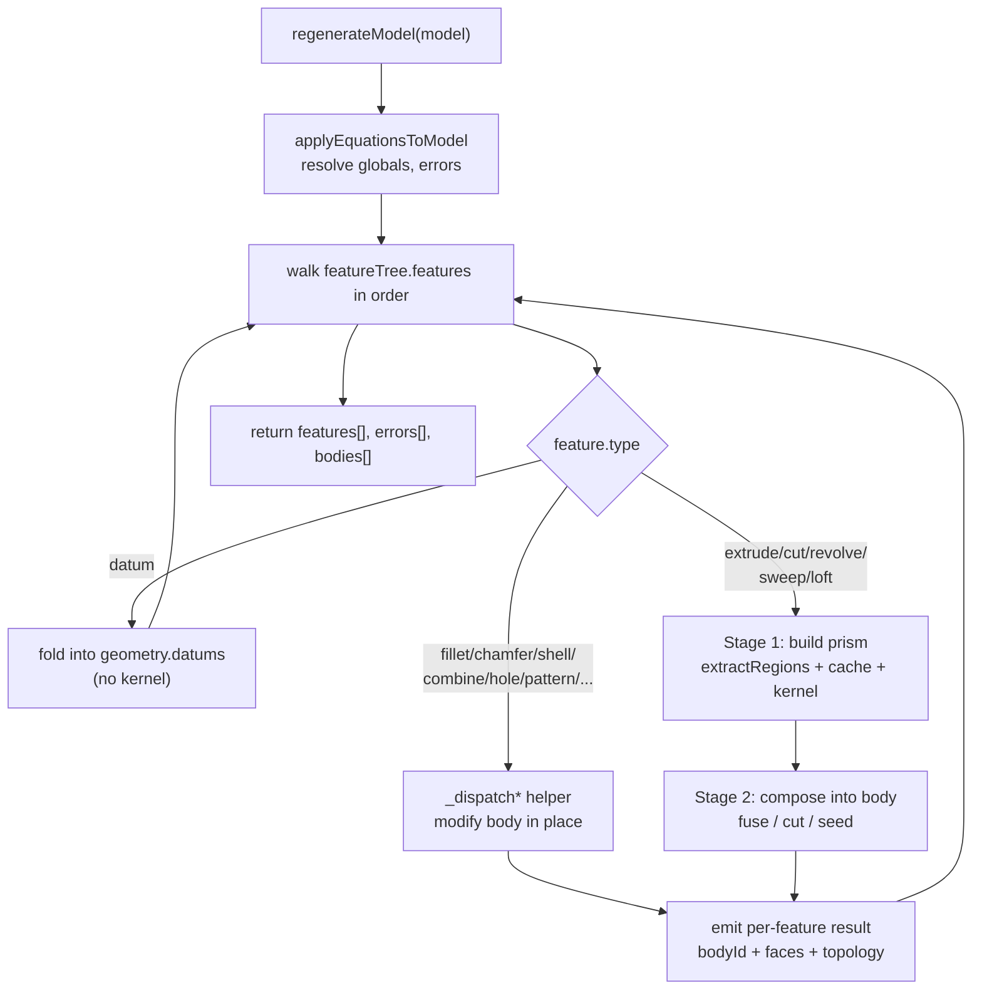

# Regeneration Pipeline

> **System** ▸ [Overview](../00-overview.md) ▸ [CAD Modeler](../10-cad-modeler.md) ▸ **Regeneration Pipeline**
> Related: [cad-runtime overview](./00-overview.md) · [Viewer rendering](./viewer-rendering.md) · [Kernel](../20-kernel.md) · [Feature tree](../cad-modeler/feature-tree.md)

---

## Requirements

| REQ | Status | Summary |
|-----|--------|---------|
| 545 | unapproved | Ordered feature list producing the model's 3D geometry; each feature has a unique id, type, and params |
| 547 | unapproved | Adding/removing/editing a feature re-evaluates every feature in order and updates the rendered scene |
| 638 | unapproved | Resolve all equations BEFORE feature dispatch; hash cache keys over resolved numeric values |

### REQ 545 — Feature history (the model recipe)

- **Description:** The CAD module shall maintain an ordered list of features that produces the model's 3D geometry; each feature shall have a unique identifier, a type, and parameters appropriate to that type.
- **Rationale:** Parametric modeling treats features as first-class entities so they can be edited, reordered, and used as inputs to subsequent features. The feature tree is the spine all parametric operations hang off.
- **Verification:** Test — `frontend/src/app/cad/lib/featureTree.spec.ts` (start with origin, append, remove, immutable updates, type guards).
- **Validation:** A user can examine the list of features that produced the current model.

### REQ 547 — Sequential re-evaluation

- **Description:** When a feature is added, removed, or has any of its parameters modified, the CAD module shall sequentially re-evaluate every feature in the tree in order and shall update the rendered scene to reflect the resulting geometry.
- **Rationale:** Parametric modeling requires that downstream geometry stay consistent with the feature tree at all times.
- **Verification:** Exercised end-to-end by `frontend/e2e/cad/cad-editor.spec.ts > 'Extruding a closed profile produces a solid'`, which asserts the feature-tree row count grows after adding a feature.
- **Validation:** A user editing a feature parameter sees the model update without manual refresh.

### REQ 638 — Equation resolution before dispatch, resolved-value hashing

- **Description:** During regeneration, the backend shall resolve all equations BEFORE feature dispatch and overwrite every feature numeric parameter that has a matching target-key entry with the resolved value. The cache paramHash shall be computed over the RESOLVED numeric values, so editing a global only invalidates the cache rows of features that actually reference it.
- **Rationale:** Resolution must happen at the canonical compute point (regen) so the kernel always sees concrete numbers. Hashing resolved values gives optimal cache reuse — unrelated features stay cached when one global changes.
- **Verification:** Test asserts that mutating an unused global does not change the paramHash of a feature that does not reference it; a driven feature's paramHash DOES change when its driver changes.
- **Validation:** User edits a global driving one of ten extrudes; only that one extrude shows a cache miss in backend logs.

---

## Succinct description

The regeneration pipeline is the backend service that turns a stored feature tree + sketch document into displayable 3D geometry: it resolves equations, walks the features in order, extracts profiles from sketches, consults a content-keyed BRep cache, calls the Rust kernel on cache misses, and accumulates the result into one or more solid bodies whose faces carry stable, body-scoped names.

---

## How it works — for everyone (non-technical)

A CAD part isn't stored as a finished 3D shape. It's stored as a *recipe* — an ordered list of steps ("draw this outline," "push it 10 mm into a block," "round these edges"). Regeneration is the act of *following the recipe* to produce the actual shape.

The system is careful about not redoing work it has already done. Every step is expensive (it asks a separate math engine to compute real geometry), so the results are filed away under a fingerprint of that step's exact inputs. Next time the recipe runs, if a step's fingerprint matches a filed result, the system reuses it instead of recomputing. Change one dimension and only the steps that actually depend on that dimension get recomputed — everything else is pulled straight from the file cabinet.

Before any of that, the system substitutes in any formulas the designer wrote ("length = 2 × width") so every step sees a plain number. And because a part can be made of several separate chunks of metal, the recipe keeps track of each chunk ("body") as it builds them up, fusing new material in or cutting it away as the steps demand.

---

## How it works — in detail (technical)

The orchestrator is `regenerateModel(model, options)` in `backend/services/cadRegenService.js`. It is called by the cad-model controller (and the streaming controller) on every save/edit, and by the STEP/STL exporters.

### 1. Equation resolution (REQ 638)

Before any feature dispatch, `applyEquationsToModel(model)` (from `backend/services/cadEquations.js`) returns a new `featureTree` + `sketchDoc` with every drivable numeric parameter overwritten by its resolved value, plus an `equationErrors` array that is folded into the regen response. Because the resolved numbers are baked into the tree *before* hashing, cache invalidation is automatic and per-feature: a feature that doesn't reference the changed global hashes identically and stays cached.

A per-regen text resolver (`model.__textResolver`, built by `buildTextResolver`) expands `#{var}` placeholders in sketch text — part name / number / revision and equation globals — so committed glyph geometry matches the editor preview. It is stashed on the model per-regen (not module-level) so concurrent regenerations of different models stay isolated.

### 2. The feature walk (REQ 545, 547)

`regenerateModel` iterates `featureTree.features` in order. For each feature it:

- skips `origin`, `suppressed`, and `visible === false` features (and anything at or past the SolidWorks-style `rollbackBeforeIndex` rollback bar);
- rejects unsupported `feature.type` values (the supported set includes `extrude`, `cutExtrude`, `revolve`, `cutRevolve`, `sweep`, `cutSweep`, `loft`, `fillet`, `chamfer`, `shell`, `combine`, `hole`, `mirror`, `linearPattern`, `circularPattern`, `mirrorBody`, `moveCopyBody`, and the datum kinds);
- treats `datumPlane` / `datumAxis` / `datumPoint` as pure frontend reference geometry — no kernel call, no body change;
- dispatches edge-blend (fillet/chamfer), shell, combine, hole, pattern, mirror-body, and move/copy-body features to their own `_dispatch*` helpers, which modify a body in place rather than building a fresh prism.

Prism-based features (extrude / cut / revolve / sweep / loft) run a two-stage flow per iteration.

### 3. Profile extraction (`cadProfile.js`)

Stage 1 of a prism feature calls `extractRegions(sketch.state, resolve)` (`backend/services/cadProfile.js`), the server-side port of the frontend `profile.ts`. It:

- canonicalizes points first (`canonicalizePoints`) — unioning point ids joined by `coincident` constraints or sitting within `1e-4` of each other — so a four-line square reads as a closed chain rather than eight degree-one vertices;
- walks closed loops, then nests them: each loop's containing parent is found by point-in-polygon sampling, producing `ProfileRegion` records of `{ outer, holes }` (so a donut/annular profile extrudes with its inner holes subtracted);
- preserves curve identity — each edge is a typed `line`, `arc`, or `circle` profile edge.

The feature's `regionIndices` (legacy `loopIndices`) select which regions to extrude. `_regenerateExtrude` issues **one kernel `buildExtrude` call per selected region**, then fuses multi-region prisms via `buildBoolean` to produce a single feature-level BRep.

### 4. The content-keyed BRep cache (`DesignBRepCache`)

Each kernel-bound step is keyed by the tuple **(cadModelID, featureID, paramHash, upstreamHash)** plus a `namingVersion`. The model is `backend/models/design/designBrepCache.js`; the unique index `design_brep_cache_key_unique` enforces the key.

- `paramHash` (`_hashParams` → SHA-256 over canonical JSON, truncated to 32 hex chars) is computed over the **resolved** profile, holes, plane, distance, flipped flag, end/start conditions, and direction-2 — i.e. concrete numbers (REQ 638).
- `featureID` is scoped per region as `${feature.id}#${ri}`, so independent region edits don't invalidate each other.
- `upstreamHash` is currently `''` for per-region prisms (no upstream BRep dependency at that layer).
- `namingVersion` (currently `20`, `NAMING_VERSION`, kept in lockstep with the kernel's `NAMING_SCHEMA_VERSION`) is bumped whenever the kernel's BRep/mesh output shape changes — old rows with a lower version no longer match and every affected feature re-runs through the kernel.

On a cache **hit**, the row's `lastAccessedAt` is bumped (keeping it alive against eviction) and the stored `brepBytes` (Postgres `BYTEA`) + `tessellatedFaces` JSONB are reused with zero kernel calls. On a **miss**, the kernel result is `upsert`-ed back into the cache.

`backend/services/cadCacheEvictionService.js` runs hourly (from `backend/index.js`, disabled in tests) and `DELETE`s rows whose `lastAccessedAt` is older than `CAD_BREP_CACHE_TTL_DAYS` (default 14). Because every hit bumps the timestamp, hot rows survive indefinitely and only cold parameter values fall off. The cache is *derived* — it can be dropped and rebuilt at any time; `featureTree` JSONB stays authoritative.

### 5. Cumulative bodies (Stage 2)

`regenerateModel` tracks an array of `bodies`, each `{ id, brep, paramHash, faces, topology, centroid }`. Stage 2 composes the per-feature prism into them:

- **Additive** features (`extrude` / `revolve` / `sweep` / `loft`) with `merge !== false` fuse into the most-recent body; with `merge === false` (or as the first feature) they seed a NEW body. An additive feature that seeds a body and has multiple disjoint regions seeds **one body per region** (each extruded letter becomes its own body, SolidWorks/Onshape-style).
- **Cut** features (`cutExtrude` / `cutRevolve` / `cutSweep`) default to "all bodies" feature scope — every existing body the cutting prism intersects gets material removed via `_composeIntoBody`.
- A body's `id` is the id of the first feature that created it, so it stays stable across regenerations. When a boolean op physically **splits** a body, `composed.solids` has more than one entry: the piece whose centroid is closest to the old body's centroid keeps the id; other pieces become new bodies (`#split`/`#piece` suffixed). A cut that annihilates a body removes it (`bodyDeleted`).

The running `vertexMap` and `faceMap` are populated as features complete so later features (Up to Vertex / Up to Surface end conditions) can resolve picked topology to 3D positions.

### 6. Body-scoped naming

The kernel returns per-solid topology with local ids (`e0`, `e1`, …) and faces with a `persistentName`. Two bodies' local ids would collide in the frontend's edge-id-keyed Map (leaking stale lines into the scene), so the regen service scopes them:

- `_scopeTopology(topo, scope)` prefixes vertex/edge ids with the body id (`${scope}/e0`).
- `_scopeFaceBoundaryEdges(faces, scope)` prefixes each face's `boundaryEdgeIds` the same way.

The scope is the body id, and per-region prisms are additionally scoped by `${feature.id}#${ri}`, producing nested names like `f5/f5#0/e0`.

### 7. Output and streaming

`regenerateModel` returns `{ features, errors, bodies }`. Each `features` entry carries `featureId`, `bodyId`, tessellated `faces`, `topology`, a `cached` flag, and a per-body `bodyParamHash` (so the frontend can suppress redundant geometry updates). An optional `onFeatureResult` callback is invoked synchronously as each feature completes; `backend/services/cadStreamService.js` (a WebSocket server on `/ws/cad`, modeled on `printAgentService`) uses it to broadcast `regenerate-started` / `feature-result` / `regenerate-complete` events to subscribed editor tabs so the viewer can render incrementally. (Binary mesh-delta frames are reserved for a later incremental-edit phase.)

`exportModelStep` / `exportModelStl` reuse the same cache-backed regen with `includeBodyBreps: true`, then call the kernel's `exportStep` / `exportStl` RPC over the resulting body BReps.

---

## Key files

- `backend/services/cadRegenService.js` — the regeneration orchestrator: equation resolution, feature walk, cumulative bodies, body-scoped naming, cache lookups, kernel dispatch, STEP/STL export
- `backend/services/cadProfile.js` — server-side profile extraction (`extractRegions`, `canonicalizePoints`, loop nesting → `ProfileRegion`)
- `backend/services/cadEquations.js` — equation resolution applied before dispatch (`applyEquationsToModel`, `resolveEquations`)
- `backend/models/design/designBrepCache.js` — the `DesignBRepCache` model + the `(cadModelID, featureID, paramHash, upstreamHash)` unique-key contract
- `backend/services/cadCacheEvictionService.js` — hourly TTL eviction of cold cache rows
- `backend/services/cadStreamService.js` — `/ws/cad` WebSocket session manager broadcasting per-feature regen progress
