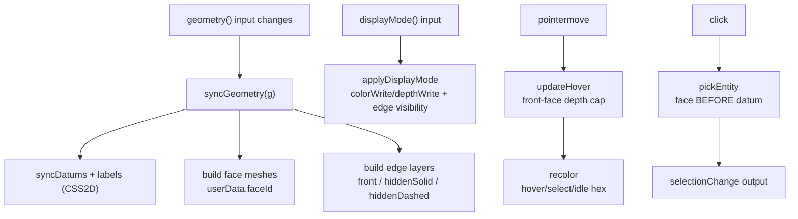

# Viewer Rendering

> **System** ▸ [Overview](../00-overview.md) ▸ [CAD Modeler](../10-cad-modeler.md) ▸ **Viewer Rendering**
> Related: [cad-runtime overview](./00-overview.md) · [Editor UI](./editor-ui.md) · [Regeneration pipeline](./regen-pipeline.md) · [Kernel](../20-kernel.md)

---

## Requirements

| REQ | Status | Summary |
|-----|--------|---------|
| 513 | unapproved | Render the model's solid geometry in a 3D orthographic view |
| 514 | unapproved | Orbit the camera around a focal point on orbit input |
| 515 | unapproved | Pan the camera in the view plane on pan input |
| 516 | unapproved | Zoom (change camera distance) on zoom input |
| 517 | unapproved | Assign each face a unique id stable for the solid's session lifetime |
| 518 | unapproved | Highlight the face under the pointer within ~100 ms |
| 519 | unapproved | Set the clicked face as the selected face |
| 520 | unapproved | Render selected face distinctly from hovered and unselected |
| 620 | unapproved | Six toggleable display modes |
| 628 | unapproved | Render sketch points as depth-test-off spheres in the 3D overlay |
| 629 | unapproved | Rubber-band drawing preview + point snapping with a yellow ring |
| 630 | unapproved | Sketch origin (0,0) is a snap target |
| 631 | unapproved | Selected sketch entities render with a thicker stroke (Line2) |
| 708 | unapproved | "Default view" control reorients to saved/isometric view |
| 709 | unapproved | "Save as default view" persists camera orientation without checkout |
| 728 | unapproved | Rotate-90 CW/CCW controls around the orientation cube |
| 729 | unapproved | Text label naming each visible datum plane |
| 531 | unapproved | Pan and zoom reposition the sketch view |
| 537 | unapproved | On sketch entry, orient the camera perpendicular to the sketch plane |
| 539 | unapproved | Outside sketch mode, render sketch geometry in the scene |
| 541 | unapproved | While a sketch is active, render the host solid's geometry as context |
| 623 | unapproved | Viewer reports feature-level click events; editor maintains selection state |

### REQ 620 — Six display modes

- **Description:** The 3D viewer shall provide six display modes the user can toggle: (1) Wireframe — all edges, no faces; (2) Wireframe + hidden dashed; (3) Wireframe (no hidden); (4) Visible edges — shaded faces with only visible edges (default); (5) All edges — shaded faces with all edges solid; (6) Hidden edges dashed — shaded faces, visible edges solid, hidden edges dashed.
- **Rationale:** Standard CAD viewing convention — different inspection tasks need different visibility, and SolidWorks and OnShape both expose the same set.
- **Verification:** A header dropdown offers all six modes; toggling flips face `colorWrite`/`depthWrite` plus three edge-layer visibilities (front LessEqualDepth, hidden solid GreaterDepth, hidden dashed GreaterDepth). Edge geometry uses `THREE.EdgesGeometry` with a 45° threshold.
- **Validation:** User can switch display modes mid-design; the viewer reflects the chosen mode immediately.

### REQ 517 — Stable face identity

- **Description:** The CAD module shall assign each face of a rendered solid a unique identifier that remains constant for the lifetime of that solid in the active editor session.
- **Rationale:** Stable face identity is the foundation for selection, feature targeting, and topological naming across regenerations.
- **Verification:** Face ids are stable within a session; `frontend/src/app/cad/lib/featureTree.spec.ts` covers id stability at the feature-tree level.
- **Validation:** A face referenced by id at session start can be re-located by that id later in the session.

### REQ 729 — Datum plane labels

- **Description:** While a datum plane is visible in the 3D viewer, the CAD module shall display a small text label naming that plane (e.g. Front, Top, Right) positioned at a corner of the plane.
- **Rationale:** With multiple datum planes shown, unlabeled translucent planes are hard to tell apart; corner name labels make orientation unambiguous.
- **Verification:** Manual smoke test; implemented in `cad-viewer.component.ts` using CSS2D labels.
- **Validation:** A user reads the name of each visible plane without guessing.

---

## Succinct description

`cad-viewer.component.ts` is the Three.js viewer: it renders kernel-tessellated `FaceMesh` geometry with six display modes and hidden-line removal, distinguishes hover/select state by color, draws and labels datum planes, supports a section/clipping plane, hit-tests faces/edges/datums/vertices parametrically with a face-prefers-datum precedence rule, exposes default-view + 90° rotation controls around an orientation cube, and recovers gracefully when the browser can't grant a WebGL context.

---

## How it works — for everyone (non-technical)

The viewer is the window into the 3D part. It takes the shape the kernel computed and draws it on screen, and it lets you move the camera around it — spin it, slide it, zoom in and out — without ever changing the part itself.

It can draw the same part several ways: as a solid shaded object, as a see-through wireframe of just its edges, or with the hidden edges drawn as faint dashes so you can understand the back of the part without rotating it. As you move the mouse, the surface under the cursor lights up so you know what a click would grab; click, and it stays highlighted in a different color.

It also shows helper geometry — the flat reference "datum" planes a designer draws on, each tagged with a little name label (Front, Top, Right) so you don't lose track of which is which. There are quick buttons to snap the view to a saved default angle or rotate it 90° at a time to square things up. And if the graphics card runs out of room (after many 3D windows in one session), it shows a friendly "reload the 3D view" panel instead of crashing.

---

## How it works — in detail (technical)

The viewer is `frontend/src/app/components/cad/cad-viewer/cad-viewer.component.ts` — a standalone Angular component using signals and effects, running its render loop outside the Angular zone for performance.

### Scene setup and camera (REQ 513–516)

`initScene()` creates a `THREE.WebGLRenderer` and an **orthographic** camera. Orthographic projection (not perspective) is deliberate: faces exactly edge-on to the camera project to a zero-area sliver and vanish correctly, where perspective foreshortening would leak a visible band. `orbitDistance` doubles as the orthographic half-height so wheel-zoom and pan keep their scale.

Camera control is spherical (`orbitTheta`, `orbitPhi`, `orbitDistance`, `orbitTarget`):
- **orbit** (REQ 514) rotates `theta`/`phi` around the orbit target;
- **pan** (REQ 515) translates the orbit target in the view plane;
- **zoom** (REQ 516) is `onWheel`, scaling `orbitDistance` (clamped 5–2000).

In 3D mode the active gesture for a left drag is selectable (`setNav('orbit'|'pan'|'zoom')`); in sketch mode the input map rebinds (left = sketch, right = orbit, middle = pan). Arrow keys also rotate the view (`onViewerKeydown`: plain arrow = 15°, Shift+arrow = 90°), skipped while a text input has focus.

### Display modes and hidden-line removal (REQ 620)

The six modes are a `Record<DisplayMode, DisplayModeSpec>` (`DISPLAY_MODES`). Each spec is five booleans: `facesShaded`, `facesDepth`, `showFrontEdges`, `showHiddenSolid`, `showHiddenDashed`. `applyDisplayMode(mode)` applies them by flipping, per face mesh, the material's `colorWrite`/`depthWrite` (and `mesh.visible`), and toggling three edge layers per face.

Hidden-line removal is achieved with **depth-function tricks rather than a separate HLR pass**: the front edge layer draws with `depthFunc: THREE.LessEqualDepth` so it shows only where it's in front; the hidden layers use `depthFunc: THREE.GreaterDepth` so they draw only where occluded — solid (`hiddenSolidMaterial`) or dashed (`hiddenDashedMaterial` / `hiddenTangentMaterial`). Even in wireframe modes the faces can keep writing depth (`facesDepth: true`) so the depth tests still classify edges as visible vs hidden. Edge geometry is built from `THREE.EdgesGeometry` with a 45° threshold so cylinder facets stay quiet while sharp corners read as feature edges.

### Faces: identity, hover, selection (REQ 517–520)

Each face mesh carries its server-assigned id in `userData.faceId` (body-scoped from the regen pipeline), stable for the solid's session lifetime (REQ 517). `recolor(selected, hovered, selectedFeatures, pickedFaces)` is the single coloring pass and gives each state a distinct hex (REQ 520):

| State | Color |
|-------|-------|
| hovered | `0x40c4ff` (bright blue) |
| selected | `0x0066cc` (deep blue) |
| picked (sidebar edge/face pick) | `0x1976d2` |
| owning feature selected | `0xffb74d` (orange) |
| idle | `0x8aa0c4` |

Hover (REQ 518) is recomputed on every `pointermove` in `updateHover`, which first measures the nearest front-face distance and uses it as a depth cap so picks on the *back* of a body don't highlight. Clicking sets the selected face (REQ 519) and emits `selectionChange`.

### Picking precedence — face prefers datum (REQ 519)

`pickEntity()` raycasts the **face group first**; a face hit wins and returns immediately. Only if no face is hit does it raycast the datum group (walking the parent chain to the object carrying `userData.datumId`, returning `datum:<id>`). This face-prefers-datum rule means a translucent datum plane in front of a solid face never intercepts a click intended for the face. `_pickDatumOnly()` is the datum-only fallback used when the face raycast missed but the hover path still needs a datum under the cursor. All hit-testing is **parametric** — it raycasts against the actual geometry/markers, not a coarse tessellation, so pick accuracy is independent of render tessellation.

### Datum planes and labels (REQ 729)

`syncDatums` builds one quad mesh per visible datum (`datums` is already visibility-filtered upstream). Each quad gets a `CSS2DObject` corner label whose text comes from `datumPlaneName(d)` (`XY` / `YZ` / `XZ`, or the datum's own `name`), positioned at the top-left corner of the 80×80 quad (`position.set(-38, 38, 0)`) and colored to match the plane. Labels are children of the quad so they track its orientation. CSS2D labels are rendered by a `CSS2DRenderer` overlay (`labelRenderer`).

### Section / clipping plane (REQ 766 mechanism)

A `sectionPlane` input drives the renderer's `clippingPlanes`: when set, an effect builds a single `THREE.Plane` from the input normal + point and assigns it to `renderer.clippingPlanes`; when null, the array is cleared.

### Sketch overlay rendering (REQ 615, 628, 629, 630, 631)

In the REQ 616 model the sketch renders as a 2D overlay *inside* the 3D scene rather than on a separate SVG canvas. `syncSketches` builds one overlay group per visible sketch (including the active one). `toSketchCoords(ev)` is the central screen→sketch conversion: it raycasts to the sketch's `THREE.Plane`, then projects the hit onto the plane's `xAxis`/`yAxis` basis with dot products (returning null when the camera is edge-on).

- **Points (REQ 628):** rendered as small spheres with `depthTest: false` and a high `renderOrder` so endpoint dots sit on top of shaded faces; construction points keep the muted fill, free points are white.
- **Drawing preview (REQ 629):** a `SketchPreview` union (`line` / `circle` / `arc` / `point-marker` / `snap-indicator` / …) drives a dashed orange (`0xffb74d`) rubber-band overlay that follows the cursor. A nearby existing point within snap radius shows a yellow ring and locks the cursor to it.
- **Origin snap (REQ 630):** the sketch origin `(0,0)` is in the snap candidate set, so the cursor locks to the part-origin projection on the plane (handled in the editor's `snapToPoint`, surfaced via the same snap-indicator preview).
- **Selection thickness (REQ 631):** selected sketch lines render via `Line2` + a shared `LineMaterial` (`selectedSketchMaterial`) with a real pixel `linewidth: 4` in highlight orange — `THREE.LineBasicMaterial` is clamped to 1px on most WebGL implementations, so `Line2` is required for genuinely thick lines. The material's `resolution` is updated on init and every resize. Selected points fill orange and grow slightly.

### Default view, save view, and 90° rotation (REQ 708, 709, 728)

Controls live beneath the orientation cube:
- `applyDefaultView()` (REQ 708) animates the camera to the saved `defaultView` input, or — when none is saved — frames the geometry and animates to a 45°/45° isometric. It no-ops in sketch mode (the view is pinned to the plane).
- `onSaveDefaultView()` (REQ 709) emits the current camera orientation (`currentView()` → `{ theta, phi, distance, target }`) via the `saveDefaultView` output for the parent to persist; this is a view preference, so it isn't gated by the edit lock.
- `rotateView(sign)` (REQ 728) animates a ±90° rotation of the camera `up` vector about the forward axis (≈380 ms eased), wired to the two arc buttons flanking the nav cube.

`captureThumbnail()` reuses the saved-view orientation to render a low-resolution PNG (datums/overlays hidden) for the commit thumbnail.

### WebGL context recovery

`THREE.WebGLRenderer` creation is wrapped in try/catch in `initScene()`: on failure (GPU context exhaustion after a long multi-view session, or hardware acceleration off) it sets the `webglUnavailable` signal and returns *before* `this.scene` and the groups exist — every render effect guards on `if (this.scene)`, so they all short-circuit instead of crashing. The template shows a "3D view unavailable" panel with a **Reload 3D view** button (`retryWebgl()`) that re-runs `initScene()` and re-syncs the geometry. On teardown, `forceContextLoss()` is called on the renderers to release the context immediately rather than waiting for GC.

---

## Key files

- `frontend/src/app/components/cad/cad-viewer/cad-viewer.component.ts` — the Three.js viewer: scene/camera, display modes + HLR, face hover/select recolor, parametric picking (face-prefers-datum), datum quads + CSS2D labels, sketch overlay (points/preview/snap/thick selection), section plane, default-view + 90° rotation controls, WebGL context recovery
