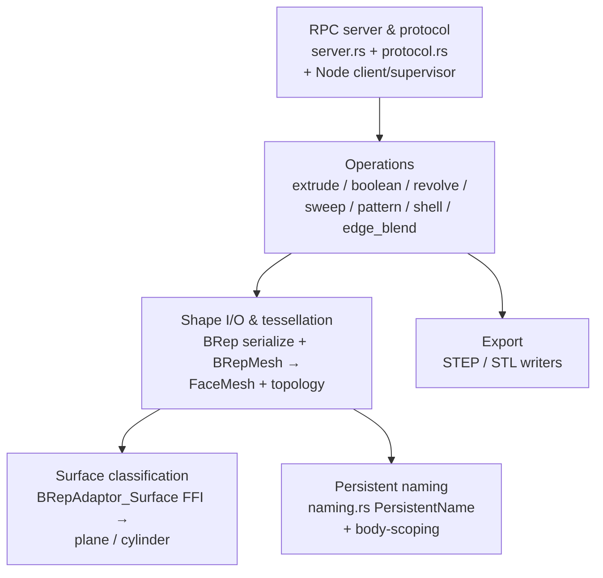

# Kernel Subsystem Map

> **System** ▸ [Overview](../00-overview.md) ▸ [Kernel](../20-kernel.md) ▸ **Subsystem map**
> Related: [RPC server & protocol](./rpc-server-protocol.md) · [Operations](./operations.md) · [Shape I/O & tessellation](./shape-io-tessellation.md)

---

## Requirements

This page is the index for the kernel's Tier-2 docs. The requirements below are the ones the kernel *as a whole* answers; each linked doc carries the detail.

| REQ | Status | Summary |
|-----|--------|---------|
| 549 | unapproved | Extrude — sketch profile + distance → 3D solid |
| 517 | unapproved | Stable per-face identifiers for the life of the solid |
| 723 | unapproved | STL via `exportStl`, STEP via `exportStep` |
| 749 | unapproved | Per-face plane/cylinder surface classification for the mate solver |

### REQ 549 — Extrude (the foundational op)

- **Description:** The CAD module shall provide an extrude feature that takes a sketch reference and a positive distance value and produces a 3D solid by translating the sketch's closed profile along the sketch plane's outward normal by the given distance.
- **Rationale:** Extrude is the foundational sketch-based parametric operation in 3D CAD; without it, sketches cannot become solid geometry.
- **Verification:** `frontend/e2e/cad/cad-editor.spec.ts` — extruding a closed quadrilateral profile produces a six-faced box and exits sketch mode.
- **Validation:** A user creating an extrude feature sees a 3D solid prism appear in the scene matching the profile and distance.

### REQ 517 — Stable face identifiers

- **Description:** The CAD module shall assign each face of a rendered solid a unique identifier that remains constant for the lifetime of that solid in the active editor session.
- **Rationale:** Stable face identity is the foundation for selection, feature targeting, and topological naming across regenerations.
- **Verification:** Face IDs are stable within a session (`frontend/src/app/cad/lib/featureTree.spec.ts` covers feature-tree id stability; face-id stability is verified manually).
- **Validation:** A face referenced by ID at session start can be re-located by that ID later in the session without ambiguity.

---

## Succinct description

The kernel is a standalone Rust service wrapping the OpenCASCADE (OCCT) B-rep geometry engine. It speaks JSON-RPC over TCP, turns build requests into boundary-representation solids, tessellates them into render-ready meshes with stable face names and surface classification, and serializes/exports geometry. These docs split that surface into its natural seams.

## How it works — for everyone (non-technical)

The kernel is a separate calculator program for solid shapes. The rest of the system sends it small instructions ("push this outline 10 mm," "round these edges," "combine these two parts") and gets back finished 3D shapes drawn as triangles. This index page is a directory of the more detailed write-ups: how the messages travel back and forth, what each shape-building instruction does, how shapes become triangles, how the kernel tells flat surfaces from round ones, how it gives every surface a permanent name, and how it writes out industry-standard CAD files.

## How it works — in detail (technical)

The kernel is one Rust binary (`cad-kernel/`) built around five concerns. Each Tier-2 doc owns one:

| Doc | Owns | Defining reqs |
|-----|------|---------------|
| [rpc-server-protocol](./rpc-server-protocol.md) | The TCP JSON-RPC server, method dispatch, panic isolation, shared wire types, the Node process client + supervisor, the health probe | 744 |
| [operations](./operations.md) | Each build op: extrude, boolean, revolve, sweep, pattern, shell, edge_blend | 549, 662, 658, 659, 642, 643 |
| [shape-io-tessellation](./shape-io-tessellation.md) | BRep serialize/deserialize, topology extraction, BRepMesh → `FaceMesh`, chord tolerance | 517, 562 |
| [surface-classification](./surface-classification.md) | Per-face plane/cylinder classification + the `BRepAdaptor_Surface` FFI | 749 |
| [persistent-naming](./persistent-naming.md) | Face/edge identifiers that survive regeneration, schema version, body-scoping | 517, 683 |
| [export-step-iges-stl](./export-step-iges-stl.md) | STEP/STL writers, base64 STL over JSON-RPC, frozen-geometry export | 723, 719, 754 |

The single binary's entry point (`cad-kernel/src/main.rs`) installs an OCCT terminate handler, reads the bind address from `CAD_KERNEL_ADDR`, and runs the async TCP listener. The `NAMING_SCHEMA_VERSION` constant (currently `20`) lives here and is the cache-invalidation lever shared with the backend — see [persistent-naming](./persistent-naming.md).

## Key files

- `cad-kernel/src/main.rs` — binary entry point, `NAMING_SCHEMA_VERSION`, bind address
- `cad-kernel/src/server.rs` — JSON-RPC server + method dispatch
- `cad-kernel/src/protocol.rs` — shared request/response wire types
- `cad-kernel/src/ops/` — the build operations
- `cad-kernel/src/naming.rs` — persistent naming
- `backend/services/cadKernelClient.js`, `cadKernelSupervisor.js` — Node process client + supervisor
