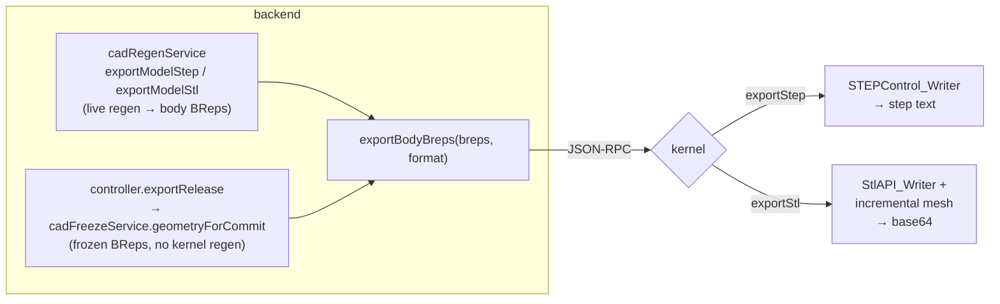

# Export — STEP, STL (and IGES note)

> **System** ▸ [Overview](../00-overview.md) ▸ [Kernel](../20-kernel.md) ▸ **Export**
> Related: [Kernel subsystem map](./00-overview.md) · [Shape I/O & tessellation](./shape-io-tessellation.md) · [VCS](../30-vcs.md) · [Assembly](../40-assembly.md)

---

## Requirements

| REQ | Status | Summary |
|-----|--------|---------|
| 723 | unapproved | STL via the OCCT `exportStl` op; STEP via `exportStep` |
| 719 | unapproved | Dev release produces downloadable STL + STEP from frozen geometry, no live regen |
| 754 | unapproved | Whole-assembly STEP/STL export by composing placed component BReps |

### REQ 723 — Kernel export ops

- **Description:** STL export shall use the OCCT kernel `exportStl` operation; STEP export shall use `exportStep`.
- **Rationale:** Publication-grade meshes require the kernel tessellator, not the viewer mesh.
- **Verification:** `cad-kernel/src/ops/export.rs`.
- **Validation:** Export an STL of a released part and confirm it opens in a mesh viewer.

### REQ 719 — Released-geometry export

- **Description:** A development release shall produce downloadable STL and STEP files reproduced from the frozen release geometry without a live regeneration.
- **Rationale:** Released files must match the locked geometry exactly and remain available even if the kernel changes.
- **Verification:** `backend/tests/__tests__/vcs/cad-release-export.test.js`.
- **Validation:** Download the STL and STEP of a released revision and confirm they match the locked geometry.

### REQ 754 — Whole-assembly export

- **Description:** The CAD module shall export the whole assembly as a STEP or STL file by applying each component instance placement transform to that component's BRep and composing the placed solids into a single exported model.
- **Rationale:** Whole-assembly export is required for hand-off to downstream CAM/inspection; reusing the per-body BRep export with the placement transform avoids new kernel export machinery.
- **Verification:** `backend/tests/__tests__/design/assembly-export.test.js`.
- **Validation:** A user can download a STEP file of an assembly containing all components in their assembled positions.

---

## Succinct description

Two kernel RPC ops — `exportStep` and `exportStl` — take a list of base64 BReps, combine them into one OCCT shape (or compound for multiple bodies), and write a STEP (text) or binary STL (base64) file. The backend feeds them either live-regenerated bodies or frozen release geometry. IGES is **not** exposed as a kernel op (see the note below).

## How it works — for everyone (non-technical)

When a part or assembly is done, you often need to hand it to someone else's software — a machine shop's CAM tool, a 3D printer, an inspection rig. Those tools read standard file formats. STEP is the precise, exact-geometry format (curves stay curves); STL is the triangle-mesh format (good for 3D printing). The kernel takes the finished shapes and writes whichever file you ask for. For a *released* part, it doesn't even recompute the geometry — it pulls the exact frozen copy that was locked at release time, so the file you download is guaranteed to match what was approved. For an assembly, it first moves every component into its assembled position, then writes them all into one file.

## How it works — in detail (technical)

### The two kernel ops

`cad-kernel/src/ops/export.rs` exposes both writers; `server.rs` dispatches `exportStep` → `export_step` and `exportStl` → `export_stl`.

Both take `breps: Vec<String>` (base64 BReps, the same payloads the cache stores and the boolean ops consume), deserialize each via `deserialize_brep_from_base64`, and combine: one body exports directly; multiple bodies become a `Compound::from_shapes(...).clean()` (STEP and STL both hold several solids in one file). Then:

- **`export_step`** → `Shape::write_step(path)` (OCCT `STEPControl_Writer`) to a temp `.step`, read back as text, returned in `ExportStepResult { step }`.
- **`export_stl`** → `Shape::write_stl_with_tolerance(path, tol)` (OCCT incremental mesh + `StlAPI_Writer`) to a temp `.stl`, read as bytes, base64-encoded into `ExportStlResult { stlBase64 }`. The chord tolerance comes from `ExportStlParams.tolerance` (default `0.01`).

Note STL crosses JSON-RPC as base64 binary — `protocol.rs` declares the field with an explicit `#[serde(rename = "stlBase64")]` so the wire key is `stlBase64`. An empty `breps` list is rejected (`"no bodies to export"`).

### Backend wiring

`backend/services/cadRegenService.js` is the call site:

- `exportBodyBreps(breps, format)` calls `client.call('exportStl' | 'exportStep', { breps })`. For STL it normalizes the result key (`rpc.stlBase64 || rpc.stl_base64 || rpc.stl`).
- `exportModelStep(model, { bodyIds })` / `exportModelStl(model, { bodyIds })` regenerate the model (cache-backed) with `includeBodyBreps`, optionally filter to a subset of `bodyIds`, then call `exportBodyBreps`.

HTTP surface (`backend/api/design/cad-model/`):

- `GET /:id/export/step` → `controller.exportStep` → `cadRegenService.exportModelStep` (live model export, `cad`/`read`).
- `GET /:id/release/step` and `GET /:id/release/stl` → `controller.exportReleaseStep` / `exportReleaseStl` → `exportRelease(req, res, format)`.

(There is an `exportModelStl` service function, but the live-model HTTP route only wires STEP; STL for a live model isn't exposed as a route. STL is offered through the release path.)

### Released-geometry export (REQ 719)

`exportRelease` (in `controller.js`) reproduces a released revision *without a kernel regen*:

1. Resolve the part's `revision` → the write-once VCS tag named for that revision → its frozen commit.
2. `cadFreezeService.geometryForCommit(repo, model, ref.targetHash)` loads the frozen per-body BReps stored on the release commit (content-addressed; zero kernel build calls — see [VCS](../30-vcs.md)).
3. Filter to bodies that carry a BRep, then `cadRegenService.exportBodyBreps(breps, 'stl' | 'step')` — the *only* kernel involvement is the final serialize.
4. Stream the result with a `Content-Disposition` filename of `{sku-or-name}-{revision}.{ext}`.

So the bytes come from the frozen geometry, only re-serialized — guaranteeing the download matches the locked revision even after a kernel upgrade. Kernel-down degrades to HTTP 503; an RPC error to 500.

### Whole-assembly export (REQ 754)

Assembly export (covered in [Assembly](../40-assembly.md)) reuses this same per-body BRep export. The assembly regen applies each component instance's placement transform to the child's BRep, then composes the placed solids and hands the combined BRep list to the same `exportStep` / `exportStl` ops — no new kernel export machinery.

### IGES note (discrepancy)

The doc filename references IGES, but **the kernel does not expose an IGES export op.** `export.rs` implements only `export_step` and `export_stl`, and `server.rs` registers only `exportStep` / `exportStl`. IGES support exists solely in the vendored OCCT bridge (`cad-kernel/vendor/opencascade-rs/crates/opencascade-sys/src/iges_control.rs`, declaring `IGESControl_Reader` / `IGESControl_Writer` and linking `TKDEIGES`) — it is wired in `opencascade-sys` but **not surfaced as a kernel RPC method or backend route.** Treat IGES as a latent capability, not a shipped feature.

## Key files

- `cad-kernel/src/ops/export.rs` — `export_step`, `export_stl`
- `cad-kernel/src/protocol.rs` — `ExportStepParams`/`ExportStepResult`, `ExportStlParams`/`ExportStlResult` (`stlBase64`)
- `cad-kernel/src/server.rs` — `exportStep` / `exportStl` dispatch
- `backend/services/cadRegenService.js` — `exportBodyBreps`, `exportModelStep`, `exportModelStl`
- `backend/api/design/cad-model/controller.js` — `exportStep`, `exportReleaseStep`/`exportReleaseStl`, `exportRelease`
- `backend/api/design/cad-model/routes.js` — `/:id/export/step`, `/:id/release/step`, `/:id/release/stl`
- `cad-kernel/vendor/opencascade-rs/crates/opencascade-sys/src/iges_control.rs` — vendored (unused-by-RPC) IGES FFI
