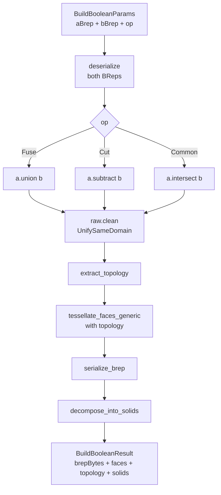

# ops/boolean.rs — Boolean operations (Fuse / Cut / Common)

> **System** ▸ [Overview](../../00-overview.md) ▸ [Kernel](../../20-kernel.md) ▸ [Operations](../operations.md) ▸ **ops/boolean.rs**
> Related: [ops-extrude.md](./ops-extrude.md) · [ops-shape_io.md](./ops-shape_io.md) · [Operations](../operations.md)

---

## Requirements

| REQ | Status | Summary |
|-----|--------|---------|
| 662 | unapproved | Combine — boolean (Add / Subtract / Common) between two existing bodies |

### REQ 662 — Combine (body booleans)

- **Description:** The CAD editor shall provide a Combine feature that performs a boolean operation between two or more existing bodies: Add (fuse), Subtract (target − union(tools)), Common (intersection). Tool bodies are consumed; the result keeps the Target body's id. Backend dispatches to the kernel `buildBoolean` op once per tool, chaining the result. Disjoint result solids fan out into separate bodies.
- **Rationale:** Multi-body modeling is incomplete without explicit body-vs-body booleans; Combine matches SolidWorks' Combine directly.
- **Verification:** Backend test exercising `_dispatchCombine` on a 2-body model with each operation; manual two-box Add/Subtract/Common.
- **Validation:** A user applies Subtract between two overlapping boxes and sees the intersection volume removed.

---

## Succinct description

`ops/boolean.rs` applies one of three OCCT boolean operations (Fuse / Cut / Common) to two base64-encoded BRep inputs, cleans co-domain face splits via `UnifySameDomain`, extracts topology and face tessellations, and decomposes the result into independent solids for multi-body tracking.

## How it works — for everyone (non-technical)

This module is the scissors and glue of the 3D engine. Given two solids already computed by earlier features, it can join them (union), punch one out of the other (subtract), or keep only where they overlap (intersect). The result comes back as one or more solids — if a subtraction splits the original into two pieces they each come back separately so the rest of the system can track both.

## How it works — in detail (technical)

### `build(params: &BuildBooleanParams) -> Result<BuildBooleanResult>`

1. `deserialize_brep_from_base64(a_brep)` and `...(b_brep)` via `shape_io`.
2. Dispatch:
   - `BuildBooleanOp::Fuse`   → `a.union(&b)`
   - `BuildBooleanOp::Cut`    → `a.subtract(&b)`
   - `BuildBooleanOp::Common` → `a.intersect(&b)`
3. `raw.clean()` — `ShapeUpgrade_UnifySameDomain` with all three unify flags. Boolean ops can split a single analytic surface into many sub-faces where the other shape's vertices or seams cross it; `clean()` merges co-domain adjacents and drops spurious edges. Without this, revolves against boxes produce pie-slice sub-faces.
4. `extract_topology(&shape)` — seam/tangent detection and vertex deduplication (from `shape_io`).
5. `tessellate_faces_generic_with_topology(&shape, feature_id, Some(&topology))` — centroid-lexicographic sort, 0.05 chord tolerance, `PersistentName::side(feature_id, i)` naming.
6. `serialize_brep(&shape)` → bail on empty bytes (degenerate result).
7. `decompose_into_solids(&shape, feature_id)` — enumerates `TopAbs_SOLID` via `shape.solids()`, one `SolidPart` per disjoint piece.

### Multi-body tracking via SolidPart

`decompose_into_solids` returns `Vec<SolidPart>`, each with its own BRep, centroid, volume, faces, and topology. The backend's body-matching logic uses centroid distance + volume (largest piece inherits the original body ID; others become `${feature_id}#split${N}`). An empty solids list means the boolean annihilated the body (zero-volume result) — handled as a body deletion upstream.

### Empty-BRep guard

After `serialize_brep`, if `brep_bytes.is_empty()` the call returns a descriptive error ("cutting a body in a way that produces zero volume") rather than returning a result with an unusable empty BRep.

## Key files

- `cad-kernel/src/ops/boolean.rs` — this module
- `cad-kernel/src/ops/shape_io.rs` — `deserialize_brep_from_base64`, `extract_topology`, `tessellate_faces_generic_with_topology`, `decompose_into_solids`, `serialize_brep`
- `cad-kernel/src/protocol.rs` — `BuildBooleanParams`, `BuildBooleanResult`, `BuildBooleanOp`, `SolidPart`
