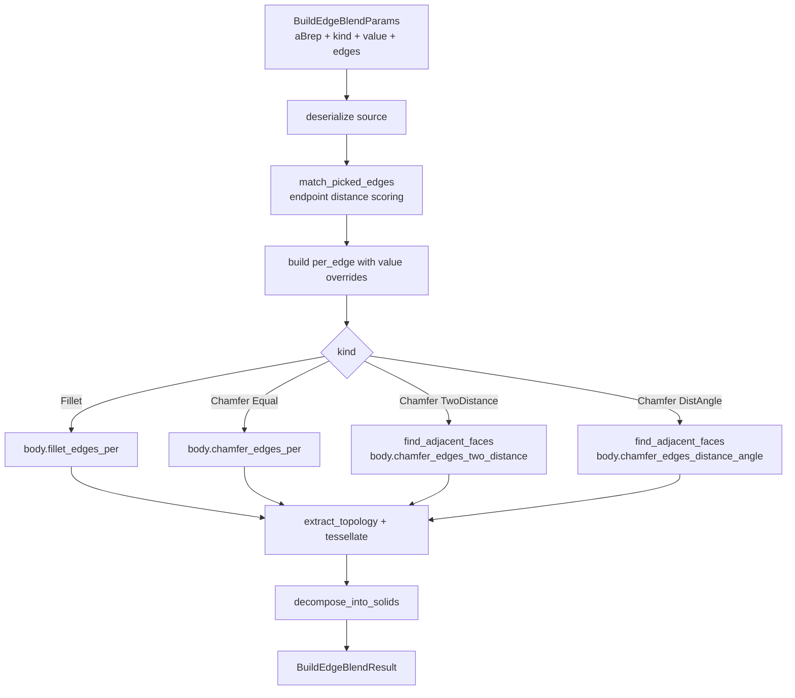

# ops/edge_blend.rs — Fillet and Chamfer operations

> **System** ▸ [Overview](../../00-overview.md) ▸ [Kernel](../../20-kernel.md) ▸ [Operations](../operations.md) ▸ **ops/edge_blend.rs**
> Related: [ops-boolean.md](./ops-boolean.md) · [ops-shape_io.md](./ops-shape_io.md) · [Operations](../operations.md)

---

## Requirements

| REQ | Status | Summary |
|-----|--------|---------|
| 642 | unapproved | Fillet — rolling-ball round on picked edges |
| 643 | unapproved | Chamfer — bevel with three SolidWorks-style modes |
| 644 | unapproved | Picked edges persisted by world-space endpoint coordinates |
| 647 | unapproved | Per-edge value override reserved in the data model (`EdgeRef3D.value` optional) |

### REQ 642 — Fillet

- **Description:** The CAD editor shall provide a Fillet (Round) action that, when invoked, opens a sidebar for collecting one or more edge picks and a radius value, then adds a Fillet feature to the tree.
- **Rationale:** Fillets reduce stress concentration, are required for castings and injection-moulded parts, and are standard in every CAD package.
- **Verification:** Picking two edges of a box with radius 2 produces a face count consistent with OCCT's fillet builder; face IDs on un-filleted faces are stable.
- **Validation:** User picks two edges on a box, enters radius 3 mm, and sees rounded corners.

### REQ 643 — Chamfer

- **Description:** The CAD editor shall provide a Chamfer (Bevel) action with three SolidWorks-style modes: (a) equal distance — single leg; (b) two distances — asymmetric; (c) distance and angle.
- **Rationale:** Chamfers are common on machined parts for deburring and lead-in.
- **Verification:** Equal-distance chamfer on a box corner produces a 45° bevel face.
- **Validation:** User picks an edge, enters 2 mm equal distance, and sees a 45° cut.

---

## Succinct description

`ops/edge_blend.rs` applies a fillet (rolling-ball round) or chamfer (bevel) to a set of edges on an input BRep. Edges are located by world-space endpoint matching. Chamfer supports three modes: equal distance, two distances (asymmetric), and distance-plus-angle. Per-edge value overrides are supported.

## How it works — for everyone (non-technical)

Fillet rounds a sharp edge into a smooth curve (like sanding a corner). Chamfer cuts a flat bevel across a sharp edge (like bevelling the corner of a plank). Both are applied by pointing at the edges you want to modify; the kernel finds those edges by matching the position of their endpoints, applies the OCCT blend operation, and returns the modified solid.

## How it works — in detail (technical)

### `build(params: &BuildEdgeBlendParams) -> Result<BuildEdgeBlendResult>`

1. Validate: at least one edge; `value > 0` and finite.
2. `deserialize_brep_from_base64(a_brep)`.
3. Snapshot: `body.edges().collect::<Vec<_>>()`.
4. `match_picked_edges(&body_edges, &params.edges)` → `Vec<usize>` of matched indices.
5. Build `per_edge: Vec<(f64, &Edge)>` — each pick's value defaults to `params.value`; overrides via `EdgeRef.value`.
6. Dispatch:
   - `Fillet` → `body.fillet_edges_per(iter of (value, edge))` — `BRepFilletAPI_MakeFillet`.
   - `Chamfer::Equal` → `body.chamfer_edges_per(iter)` — `BRepFilletAPI_MakeChamfer::Add(d, edge)`.
   - `Chamfer::TwoDistance` → needs a reference face per edge (`find_adjacent_faces`); `body.chamfer_edges_two_distance(iter of (d1, d2, edge, face))`.
   - `Chamfer::DistanceAngle` → `deg.to_radians()`; `body.chamfer_edges_distance_angle(iter of (d, radians, edge, face))`. Valid range: `(0°, 90°)`.
7. `extract_topology`, `tessellate_faces_generic_with_topology`.
8. Guard empty BRep (radius/distance too large for the picked edge geometry).
9. `decompose_into_solids`.

### Edge matching: `match_picked_edges`

`EdgeRef { start, end, value? }` carries two world-space endpoints. The matcher:
- Bounding-diagonal tolerance: `max(1.0 mm, diagonal × 0.1%)`.
- Per pick: score = `min(direct, swapped)` where `direct = dist(p.start, e.start) + dist(p.end, e.end)` and `swapped` swaps the pairing. Uses `tol * 2.0` as the acceptance threshold (doubled because both endpoints contribute).

### Adjacent face lookup for asymmetric chamfer: `find_adjacent_faces`

Iterates every face's edges and matches by endpoint coincidence (tolerance `1e-4`). The first face found that shares the picked edge is used as the reference face for `ChamferMode::TwoDistance` and `ChamferMode::DistanceAngle`.

## Key files

- `cad-kernel/src/ops/edge_blend.rs` — this module
- `cad-kernel/src/ops/shape_io.rs` — `deserialize_brep_from_base64`, `extract_topology`, `tessellate_faces_generic_with_topology`, `decompose_into_solids`, `serialize_brep`
- `cad-kernel/src/protocol.rs` — `BuildEdgeBlendParams`, `BuildEdgeBlendResult`, `EdgeRef`, `EdgeBlendKind`, `ChamferMode`
