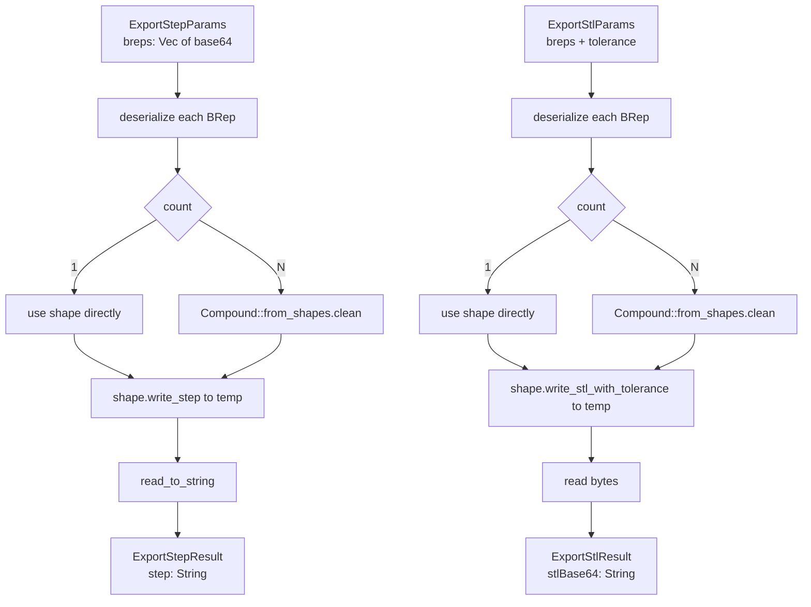

# ops/export.rs — STEP and STL export

> **System** ▸ [Overview](../../00-overview.md) ▸ [Kernel](../../20-kernel.md) ▸ [Export (STEP/IGES/STL)](../export-step-iges-stl.md) ▸ **ops/export.rs**
> Related: [ops-shape_io.md](./ops-shape_io.md) · [Export (STEP/IGES/STL)](../export-step-iges-stl.md)

---

## Requirements

| REQ | Status | Summary |
|-----|--------|---------|
| 719 | unapproved | Downloadable STL and STEP from frozen release geometry |
| 723 | unapproved | STL export via `exportStl` op; STEP export via `exportStep` |

### REQ 723 — Export ops

- **Description:** STL export shall use the OCCT kernel exportStl operation; STEP export shall use exportStep.
- **Rationale:** Frozen geometry must be reproducible from the kernel's own serialization rather than from JavaScript approximations.
- **Verification:** `exportStep` returns valid ISO 10303 STEP text for a simple box; `exportStl` returns a valid binary STL blob.
- **Validation:** A user downloads an STL and opens it in a slicer; downloads a STEP and opens it in another CAD package.

---

## Succinct description

`ops/export.rs` deserializes one or more base64 BRep bodies, combines them into a single OCCT shape (or compound for multi-body), writes to a temp file via OCCT's `STEPControl_Writer` or `StlAPI_Writer`, reads the bytes back, and returns them as text (STEP) or base64 (STL).

## How it works — for everyone (non-technical)

This module is the export desk. You give it the frozen geometry of every body in the model (as the same byte blobs the kernel uses internally) and it produces a file in a standard format that any other program can open. STEP is an industry-standard text format readable by every professional CAD tool; STL is the de facto standard for 3D printers. Both go through a temp file on disk because the OCCT writers only know how to write to file paths.

## How it works — in detail (technical)

### `export_step(params: &ExportStepParams) -> Result<ExportStepResult>`

1. Validate: `breps` non-empty.
2. `deserialize_brep_from_base64(b)` per body.
3. One body → use directly; multiple bodies → `Compound::from_shapes(shapes.iter()).clean()`.
4. `shape.write_step(&path)` via `STEPControl_Writer`. Returns `Err` on OCCT failure.
5. `fs::read_to_string(path)` → `ExportStepResult { step: String }`.
6. Delete temp file.

### `export_stl(params: &ExportStlParams) -> Result<ExportStlResult>`

1. Validate: `breps` non-empty.
2. Same compound logic as STEP.
3. `tol = if params.tolerance > 0.0 { tolerance } else { 0.01 }` (default 0.01 mm).
4. `shape.write_stl_with_tolerance(&path, tol)` via `StlAPI_Writer` + incremental BRepMesh. Returns `Err` on failure.
5. `fs::read(path)` — binary STL bytes.
6. `brep_to_base64(bytes)` → `ExportStlResult { stlBase64: String }`.

### Why temp files

`write_step` and `write_stl_with_tolerance` are exposed by the vendored OCCT binding only via `&Path`. An in-memory writer would require additional `STEPControl_Controller` FFI that is not in the current cxx bridge. The temp-file pattern is consistent with BRep serialization in `shape_io.rs`.

### Multi-body compound

`Compound::from_shapes(shapes.iter())` wraps all solid shapes in a `TopoDS_Compound`. STEP handles multi-body compounds natively (each solid becomes a PRODUCT in the STEP file). STL flattens everything into a single triangle soup — multi-body is indistinguishable from single-body in binary STL.

## Key files

- `cad-kernel/src/ops/export.rs` — this module
- `cad-kernel/src/ops/shape_io.rs` — `deserialize_brep_from_base64`, `brep_to_base64`
- `cad-kernel/src/protocol.rs` — `ExportStepParams`, `ExportStepResult`, `ExportStlParams`, `ExportStlResult`
- `vendor/opencascade-rs/crates/opencascade/src/primitives/shape.rs` — `write_step`, `write_stl_with_tolerance`
