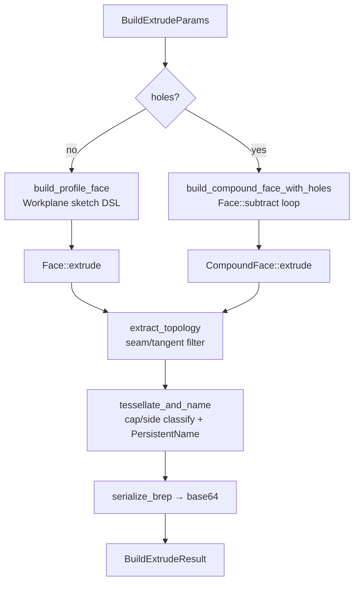

# ops/extrude.rs — Extrude and Loft operations

> **System** ▸ [Overview](../../00-overview.md) ▸ [Kernel](../../20-kernel.md) ▸ [Operations](../operations.md) ▸ **ops/extrude.rs**
> Related: [ops-boolean.md](./ops-boolean.md) · [ops-revolve.md](./ops-revolve.md) · [ops-shape_io.md](./ops-shape_io.md) · [naming.md](./naming.md)

---

## Requirements

| REQ | Status | Summary |
|-----|--------|---------|
| 549 | unapproved | Extrude — sketch profile + distance → 3D solid |
| 617 | unapproved | Typed ProfileLoop preserving curve identity (line/arc/circle/bezier edges) |
| 618 | unapproved | Flipped extrude direction toggle |
| 621 | unapproved | Multiple independent closed loops in one sketch (multi-region extrude) |

### REQ 549 — Extrude

- **Description:** The CAD module shall provide an extrude feature that takes a sketch reference and a positive distance value and produces a 3D solid by translating the sketch's closed profile along the sketch plane's outward normal by the given distance.
- **Rationale:** Extrude is the foundational sketch-based parametric operation in 3D CAD; without it sketches cannot become solid geometry.
- **Verification:** `frontend/e2e/cad/cad-editor.spec.ts` asserts six faces from a quadrilateral profile (a box).
- **Validation:** A user creating an extrude feature sees a 3D solid prism appear matching the profile and distance.

---

## Succinct description

`ops/extrude.rs` converts a typed `Vec<ProfileEdge>` (lines, arcs, circles, Béziers) on a host workplane into an OCCT face, sweeps it into a prism, tessellates all faces, assigns persistent names, and serializes the BRep. It also contains `build_loft` for lofting through ordered profile sections.

## How it works — for everyone (non-technical)

Imagine drawing a shape on paper and then pushing it through clay for a fixed distance: the outline becomes a solid. This module does exactly that, but in 3D geometry. It reads the sketch's outline (which can include straight lines, arcs, and circles), builds a flat face from it, and then pushes that face along the normal direction to create a solid. The direction, start point, and distance come from the feature parameters. At the end, every surface of the resulting solid gets a permanent name so the rest of the system can refer to it later.

## How it works — in detail (technical)

### Entry point: `build`

1. Compute direction-2 magnitude (`d2_magnitude`). Direction 2 grows opposite direction 1; both are folded into a single prism by translating the start plane back by `d2_signed` and extruding the total `d1 + d2` distance. This avoids an internal seam at the origin plane that `Shape::union` would leave behind.
2. Offset the workplane origin by `effective_start = start_offset + d2_signed` along the normal.
3. Call `build_prism(workplane, profile, holes, extrude_dir)`:
   - No holes → `build_profile_face` → `Face::extrude(dir)` → `Solid::into::<Shape>()`.
   - With holes → `build_compound_face_with_holes` → `CompoundFace::extrude(dir)`.
4. Call `extract_topology` (seam/tangent detection, vertex deduplication).
5. Call `tessellate_and_name` (classify cap-bottom/side/cap-top; mesh each face; assign persistent names).
6. `serialize_brep` → base64.

### Profile construction: `build_profile_face`

Special cases handled before the general path:
- **Single Circle** — `Workplane::circle(cx, cy, r)` → `Face::from_wire`. Fast path, no polygon walking needed.
- **Any Bézier** — delegated to `build_bezier_profile_face` which uses `Edge::bezier + Wire::from_edges` so glyph curves become smooth OCCT edges rather than chord approximations.

General path for line/arc profiles:
1. Build a chord-polygon (start points of each edge) for orientation/area checks.
2. `dedup_consecutive` removes adjacent coincident vertices (tolerance `1e-8 units²`).
3. `validate_polygon` rejects: zero-length edges, degenerate collinear triples (Y-junction), near-zero area (threshold `1e-6`).
4. `signed_polygon_area` (shoelace formula): if negative → reverse the edge list (OCCT needs CCW for outward-pointing solid). Arc reversal also swaps `start↔end` and flips `ccw`.
5. Walk edges via `Workplane::sketch().move_to().line_to()` / `.three_point_arc()`. Degenerate edges (zero-length by the running cursor check) are skipped rather than passed to OCCT.
6. `sketch.wire()` → `Face::from_wire`.

### Persistent naming: `tessellate_and_name`

Each OCCT face is classified by the axial distance of its centroid along the extrude direction:
- `|axial - 0.0| ≤ tol` → `CapBottom`
- `|axial - signed_distance| ≤ tol` → `CapTop`
- Otherwise → `Side`, sorted by angle `atan2(in_plane.z, in_plane.x)` for stability.

`PersistentName::cap_bottom/cap_top/side(feature_id, side_index)` from `naming.rs`. Face IDs double as persistent names (`face_id == persistent_name`). `classify_face_surface` (from `shape_io`) appends the plane/cylinder annotation.

### Loft: `build_loft`

Calls `build_workplane + build_profile_face` per section, extracts each face's outer wire, passes the wire list to `Solid::loft` (OCCT `BRepOffsetAPI_ThruSections`). Naming uses the first section's plane as reference; result type reuses `BuildExtrudeResult`.

### Tolerance constants

| Constant | Value | Purpose |
|---|---|---|
| `DEFAULT_CHORD_TOLERANCE` | 0.05 | mesh chord height (matches frontend tessellator) |
| `MIN_VERTEX_DIST_SQ` | 1e-8 | dedup / zero-length edge guard |
| `MIN_POLY_AREA` | 1e-6 | degenerate face rejection |
| `COLLINEAR_TOL` | 1e-9 | cross-product threshold for collinear triple check |
| `THROUGH_ALL_FALLBACK` | 1e4 mm | effective through-all distance |

## Key files

- `cad-kernel/src/ops/extrude.rs` — this module
- `cad-kernel/src/naming.rs` — `PersistentName` constructors
- `cad-kernel/src/ops/shape_io.rs` — `classify_face_surface`, `extract_topology`
- `cad-kernel/src/protocol.rs` — `BuildExtrudeParams`, `ProfileEdge`, `Plane3`
