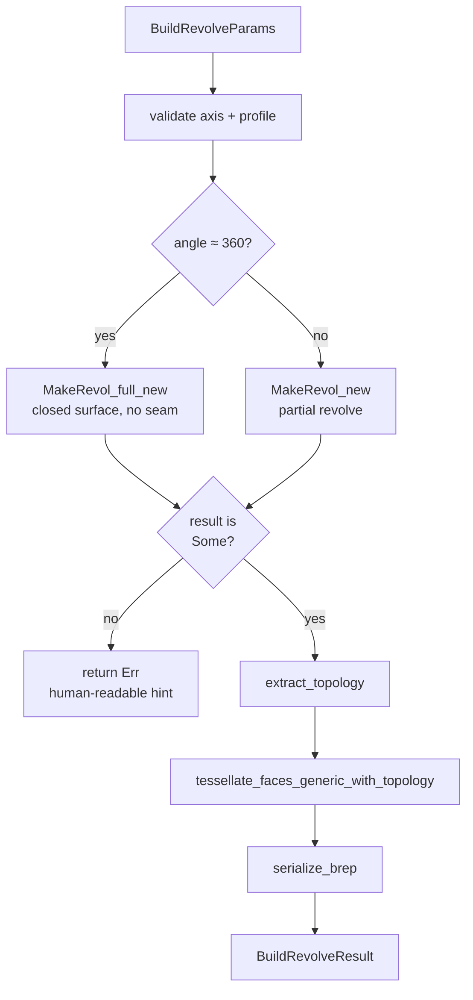

# ops/revolve.rs — Revolve operation

> **System** ▸ [Overview](../../00-overview.md) ▸ [Kernel](../../20-kernel.md) ▸ [Operations](../operations.md) ▸ **ops/revolve.rs**
> Related: [ops-extrude.md](./ops-extrude.md) · [ops-shape_io.md](./ops-shape_io.md) · [Operations](../operations.md)

---

## Requirements

Governed by [Operations](../operations.md). Revolve reuses the same profile-building and tessellation infrastructure as extrude.

| REQ | Status | Summary |
|-----|--------|---------|
| 549 | unapproved | Extrude/Revolve — sketch-based solid feature |

---

## Succinct description

`ops/revolve.rs` builds a profile face on the host plane (using the same `build_profile_face` / `build_compound_face_with_holes` as extrude) and revolves it about a world-space axis by a specified angle using OCCT's `BRepPrimAPI_MakeRevol`.

## How it works — for everyone (non-technical)

A revolve is the "pottery wheel" operation: take a 2D outline and spin it around an axis to make a solid of revolution. A 360° spin of a C-shaped profile makes a hollow ring (torus-like); a partial spin makes an arc-shaped slice. The axis can be anywhere in 3D space — it's usually a sketched line in the profile's plane.

## How it works — in detail (technical)

### `build(params: &BuildRevolveParams) -> Result<BuildRevolveResult>`

1. Validate: non-empty profile; non-degenerate axis direction vector (`|axis_dir| > 1e-9`). Normalize `axis_dir`.
2. Choose constructor: `(params.angle_deg - 360.0).abs() < 1e-3` → `angle = None` (closed revolve); otherwise `angle = Some(Angle::Degrees(...))`.
   - **Closed (`None`)**: `BRepPrimAPI_MakeRevol_full_new` — the parametric surface wraps; the profile edges DON'T survive as seam edges. This is the desired behavior for a full revolution.
   - **Partial (`Some(angle)`)**: `BRepPrimAPI_MakeRevol_new` — profile edges at start and end positions survive in the BRep.
3. Build workplane and profile face (or compound face for holes) via imports from `ops::extrude`.
4. `Face::revolve(axis_origin, axis_dir, angle)` or `CompoundFace::revolve(...)` — both return `Option<Solid/Shape>` (None on OCCT exception). The `None` path emits a user-friendly error message listing common causes (profile coincident with axis, axis crosses interior, degenerate profile).
5. `extract_topology`, `tessellate_faces_generic_with_topology`, `serialize_brep` — same pipeline as boolean.
6. Guard empty BRep bytes.

### Full vs partial revolve: the seam-edge distinction

OCCT has two `MakeRevol` constructors. The no-angle constructor builds a closed surface: parametrically, u=0 and u=2π are the same topology entity, so the profile edges disappear as standalone BRep edges. The with-angle constructor builds two distinct boundaries at the start and end positions — even if `angleDeg == 360`, these boundaries are separate geometry and render as visible seam lines around the body. This module uses the no-angle constructor whenever the requested angle is within 0.001° of 360.

### Holes

`params.holes` is a `Vec<Vec<ProfileEdge>>` following the same donut convention as extrude. When non-empty, `build_compound_face_with_holes` from `ops::extrude` is called; `CompoundFace::revolve` handles the rest.

## Key files

- `cad-kernel/src/ops/revolve.rs` — this module
- `cad-kernel/src/ops/extrude.rs` — `build_workplane`, `build_profile_face`, `build_compound_face_with_holes`
- `cad-kernel/src/ops/shape_io.rs` — `extract_topology`, `tessellate_faces_generic_with_topology`, `serialize_brep`, `brep_to_base64`
- `cad-kernel/src/protocol.rs` — `BuildRevolveParams`, `BuildRevolveResult`
