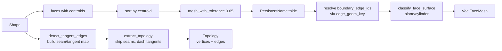

# ops/shape_io.rs — BRep I/O, tessellation, and topology extraction

> **System** ▸ [Overview](../../00-overview.md) ▸ [Kernel](../../20-kernel.md) ▸ [Shape I/O & tessellation](../shape-io-tessellation.md) ▸ **ops/shape_io.rs**
> Related: [ops-extrude.md](./ops-extrude.md) · [ops-boolean.md](./ops-boolean.md) · [naming.md](./naming.md) · [surface-ffi.md](./surface-ffi.md)

---

## Requirements

Governed by [Shape I/O & tessellation](../shape-io-tessellation.md).

| REQ | Status | Summary |
|-----|--------|---------|
| 517 | unapproved | Stable per-face identifiers across regeneration |
| 749 | unapproved | Per-face surface classification (plane/cylinder) |

---

## Succinct description

`ops/shape_io.rs` is the shared utility module for the kernel's ops layer. It handles BRep serialize/deserialize (via temp file), generic face tessellation, topology extraction (vertex deduplication, seam/tangent edge detection), solid decomposition for multi-body tracking, and face surface classification.

## How it works — for everyone (non-technical)

This module is the shared toolbox that all the operation modules (boolean, revolve, sweep, shell, edge-blend, pattern) use. It knows how to: turn a 3D shape into bytes for storage and back again; break a shape into tiny triangles the browser can draw; build the list of edges and corners that the browser uses to draw wireframe outlines; and label each surface as flat or cylindrical for the assembly solver.

## How it works — in detail (technical)

### BRep round-trip

OCCT's Rust binding exposes `write_brep_text` / `read_brep_text` only via file paths. Both functions use a temp file per call, distinguished by a globally-unique counter (`AtomicU64 TEMP_FILE_COUNTER`) combined with the process ID — avoiding races when two requests execute concurrently:

```rust
fn temp_brep_path(tag: &str) -> PathBuf {
    // letwinventory-cad-kernel-<pid>-<tag>-<counter>.brep
}
```

- `serialize_brep(shape) -> Vec<u8>` — writes to temp, reads bytes, deletes temp. Returns empty on OCCT error.
- `deserialize_brep_from_base64(b64) -> Result<Shape>` — base64-decode, write bytes to temp, `Shape::read_brep_text`, delete temp.
- `brep_to_base64(bytes) -> String` — `BASE64.encode`.

### Generic tessellation: `tessellate_faces_generic_with_topology`

Used by boolean / revolve / sweep / shell / pattern (extrude uses its own `tessellate_and_name` which has cap/side classification):

1. Collect all faces with centroids `(cx, cy, cz, Face)`.
2. Sort lexicographically by `(cx, cy, cz)`. This gives stable IDs under small parameter changes; faces only reshuffle when topology changes.
3. Per face: `face_shape.mesh_with_tolerance(0.05)`, `flatten_mesh` → `(positions, normals, indices)`. Normals are padded to match positions if the OCCT normal array is shorter (known upstream bug in opencascade-rs's `mesh.rs`).
4. `PersistentName::side(feature_id, i).encode()` → `face_id`.
5. Resolve `boundary_edge_ids` using the pre-built `id_by_key` map (key = `[[lo],[mid],[hi]]` quantized at 1e-6 precision).
6. `classify_face_surface(face)` — appends `FaceSurface` for planes/cylinders.

`tessellate_faces_generic` is a thin wrapper calling `tessellate_faces_generic_with_topology(shape, feature_id, None)` for callers that don't need boundary edges.

### Topology extraction: `extract_topology`

Produces `Topology { vertices, edges }` for the wireframe viewer:

1. `detect_tangent_edges(shape)` — builds a `HashMap<[[i64;3];3], TangentKind>` (Tangent or Seam).
2. Iterates `shape.edges()`:
   - **Seam** (parametric u/v wrap on a single face, or co-domain split): **dropped entirely** — not emitted to the frontend.
   - **Tangent** (two distinct faces with parallel normals at the edge midpoint, |cos θ| > 0.9962): emitted with `isTangent = true` so the viewer dashes them.
   - **Feature edge**: emitted normally.
3. Per non-seam edge: deduplicate vertices by quantized position (`1e-6` grid), emit `TopologyEdge { id, isStraight, isTangent, endpoints, polyline? }`.

### Seam / tangent edge detection: `detect_tangent_edges`

Builds `edge_faces: HashMap<key, Vec<(face_idx, ref_count)>>`:
- **Count ≥ 2 on a single face** → `TangentKind::Seam` (cylinder u-wrap).
- **Exactly 2 owners**: compute `face_normal` at the quantized midpoint via `Face::normal_at`; `|dot| > 0.9962` → `Tangent`.
- **≥ 3 owners** (non-manifold): pairwise check; all-pairs tangent → `Tangent`.
- **1 owner, count 1**: boundary edge → kept.

### Edge curve sampling: `sample_edge_curve`

Uses `edge.edge_type()` from OCCT's `BRepAdaptor_Curve::GetType`. Lines return `(true, None)`. Curves call `edge.approximation_segments()` (angular-deflection sampler); if ≥ 3 points are returned, they become the `polyline` field so the viewer draws the analytic curve directly. Fewer than 3 → `(false, None)` (straight fallback).

### Edge geometry key: `edge_geom_key`

`[[i64;3]; 3]` = `[lo_endpoint, midpoint_sample, hi_endpoint]`, quantized at `1e6` and sorted lo ≤ hi by lexicographic comparison. The midpoint is the middle index of `approximation_segments` (orientation-stable: reversing the polyline yields the same middle). This key is used by both the tangent detector and the face→boundary-edge resolver.

### Solid decomposition: `decompose_into_solids`

`shape.solids()` via `TopExp_Explorer TopAbs_SOLID`. Per solid: scoped feature ID `${feature_id}#body${i}`, full tessellation, BRep, `volume_centroid`. Returns `Vec<SolidPart>`.

### Surface classification: `classify_face_surface`

Calls `face.surface_kind()` (from the vendored `primitives/face.rs`), maps to `FaceSurface`:
- `FaceSurface::Plane` → `ProtoFaceSurface { kind:"plane", origin, normal }`. Origin from `center_of_mass`, normal from `normal_at_center`.
- `FaceSurface::Cylinder` → `ProtoFaceSurface { kind:"cylinder", origin, axis, radius }`. Axis/radius from `BRepAdaptor_Surface`.
- Other → `None`.



## Key files

- `cad-kernel/src/ops/shape_io.rs` — this module
- `cad-kernel/src/naming.rs` — `PersistentName`
- `cad-kernel/src/protocol.rs` — `FaceMesh`, `FaceSurface`, `Topology`, `SolidPart`
- `vendor/opencascade-rs/crates/opencascade/src/primitives/face.rs` — `Face::surface_kind`, `Face::normal_at`
- `vendor/opencascade-rs/crates/opencascade-sys/src/b_rep_adaptor.rs` — `BRepAdaptor_Surface` FFI
