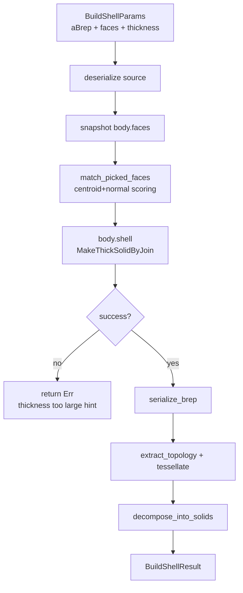

# ops/shell.rs — Shell (hollow solid) operation

> **System** ▸ [Overview](../../00-overview.md) ▸ [Kernel](../../20-kernel.md) ▸ [Operations](../operations.md) ▸ **ops/shell.rs**
> Related: [ops-boolean.md](./ops-boolean.md) · [ops-shape_io.md](./ops-shape_io.md) · [Operations](../operations.md)

---

## Requirements

| REQ | Status | Summary |
|-----|--------|---------|
| 659 | unapproved | Shell — hollow a solid by removing one or more picked faces and offsetting |

### REQ 659 — Shell feature

- **Description:** The CAD editor shall provide a Shell feature that hollows a solid by removing one or more picked faces and offsetting the remaining faces by a wall thickness. Positive thickness offsets outward; negative offsets inward. REQ 659.
- **Rationale:** Thin-walled parts (enclosures, shells) are common in manufactured products; without Shell they require laborious boolean subtractions.
- **Verification:** A solid box shelled at 2mm with the top face removed produces a box with 2mm walls and an open top.
- **Validation:** A user shells an extrude and sees a thin-walled hollow body in the viewer.

---

## Succinct description

`ops/shell.rs` removes one or more picked faces from a source BRep and offsets the remaining faces inward (or outward) by a signed wall thickness via OCCT's `BRepOffsetAPI_MakeThickSolid::MakeThickSolidByJoin`. Faces to remove are matched geometrically (centroid + normal) rather than by ID.

## How it works — for everyone (non-technical)

Shell is like cutting the top off a box and then making all the walls a uniform thickness. You tell the kernel which faces to remove (open up) and how thick the walls should be, and it hollows out the solid. The faces are found by their position and direction — not by a fragile internal number — so the operation keeps working even after upstream features change.

## How it works — in detail (technical)

### `build(params: &BuildShellParams) -> Result<BuildShellResult>`

1. Validate: at least one face, non-zero finite thickness, positive finite tolerance.
2. `deserialize_brep_from_base64(a_brep)`.
3. Snapshot all faces: `body.faces().collect::<Vec<_>>()`.
4. `match_picked_faces(&body_faces, &params.faces)` — returns matched indices.
5. Build `removed: Vec<&Face>` from indices.
6. `body.shell(removed.iter().copied(), thickness, tolerance)` — thin wrapper around `MakeThickSolidByJoin`, returns `Result` via cxx so OCCT `Standard_Failure` becomes `Err` rather than `std::terminate`.
7. Guard empty BRep bytes (self-intersecting offset surfaces produce an empty result).
8. `extract_topology`, `tessellate_faces_generic_with_topology`, `decompose_into_solids`.

### Geometric face matching: `match_picked_faces`

Picks are `ShellFaceRef { centroid: [f64;3], normal: [f64;3] }`. The matcher:
- Computes a bounding diagonal over all face centroids.
- Tolerance: `max(1.0 mm, diagonal × 0.1%)`.
- Per pick: score = `centroid_distance - 0.1 × max(dot(face_normal, pick_normal), 0)`. Lower is better. The normal dot term breaks ties between parallel faces sharing a centroid (e.g. top and bottom of a thin plate).
- Rejects if closest match > tolerance.
- Rejects duplicate matches (same body face matched by two picks → `MakeThickSolid` would receive a malformed list).

### Thickness sign convention

Positive thickness = outward offset (adds material outside the body). Negative thickness = inward offset (removes material from inside). Matches OCCT's `MakeThickSolidByJoin` convention.

### Per-face thickness overrides

`ShellFaceRef` carries only `centroid` and `normal`; there is no `thickness` field. `MakeThickSolidByJoin` is single-thickness — a uniform value applies to all remaining faces. Per-face overrides would require the lower-level `Initialize + SetOffsetOnFace` OCCT path, which is not yet in the cxx FFI.

## Key files

- `cad-kernel/src/ops/shell.rs` — this module
- `cad-kernel/src/ops/shape_io.rs` — `deserialize_brep_from_base64`, `extract_topology`, `tessellate_faces_generic_with_topology`, `decompose_into_solids`, `serialize_brep`
- `cad-kernel/src/protocol.rs` — `BuildShellParams`, `BuildShellResult`, `ShellFaceRef`
