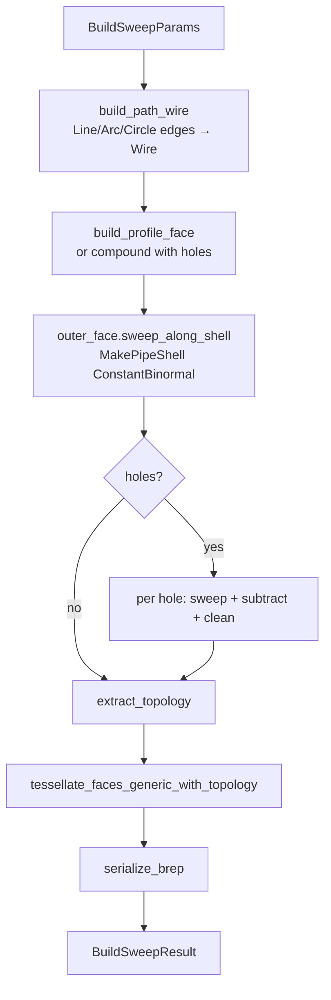

# ops/sweep.rs — Sweep (pipe) operation

> **System** ▸ [Overview](../../00-overview.md) ▸ [Kernel](../../20-kernel.md) ▸ [Operations](../operations.md) ▸ **ops/sweep.rs**
> Related: [ops-extrude.md](./ops-extrude.md) · [ops-boolean.md](./ops-boolean.md) · [ops-shape_io.md](./ops-shape_io.md)

---

## Requirements

Governed by [Operations](../operations.md). Sweep shares the profile-building infrastructure with extrude and revolve.

| REQ | Status | Summary |
|-----|--------|---------|
| 549 | unapproved | Sketch-based solid feature (extrude / revolve / sweep family) |

---

## Succinct description

`ops/sweep.rs` drags a closed profile face along a 3D path wire (chain of line/arc/circle segments) using OCCT's `BRepOffsetAPI_MakePipeShell`, then subtracts any hole-tubes via boolean cut. The result is tessellated and serialized as a BRep.

## How it works — for everyone (non-technical)

A sweep is the "extrusion rail" operation: instead of pushing the cross-section straight, you guide it along a curved track. A circular cross-section swept along an arc makes a bent pipe; a square cross-section swept along a winding path makes a square duct. The path can include straight lines and arcs and can even be a closed circle (for ring-shaped parts).

## How it works — in detail (technical)

### `build(params: &BuildSweepParams) -> Result<BuildSweepResult>`

1. Validate: non-empty profile; non-empty path.
2. `build_path_wire(path_edges)` — converts `Vec<PathEdge>` to an OCCT `Wire`:
   - Single `PathEdge::Circle` → `Edge::circle(center, normal, radius)` → `Wire::from_edges([&e])`.
   - Multi-edge chain → `Edge::segment` for lines, `Edge::arc` for 3-point arcs. Degenerate guards: zero-length line segments; collinear arc start/mid/end (`|cross product|² < 1e-12`). A `PathEdge::Circle` appearing in a multi-edge list is rejected (circles are only valid as a sole closed path).
3. `build_profile_face` (or `build_compound_face_with_holes` for holes) using `build_workplane(profile_plane)` — reused from `ops::extrude`.
4. `outer_face.sweep_along_shell(&path)`:
   - Uses `BRepOffsetAPI_MakePipeShell` (forgiving — handles sharp corners), not `MakePipe` (C1-only).
   - `SetMode(false)` = ConstantBinormal trihedron: cross-section orientation propagated by the discrete frame, stable through sharp corners.
   - Returns `Option<Solid>` via `build` result check + `IsDone()`. `None` → descriptive error.
5. **Hole subtraction**: for each hole loop, sweep the hole face along the same path to get a tube, then `shape.subtract(&hole_shape)` + `.clean()`. `CompoundFace::sweep_along_shell` is not available in the vendored binding, so the subtraction is done manually here.
6. `extract_topology`, `tessellate_faces_generic_with_topology`, `serialize_brep`.

### MakePipeShell vs MakePipe

`sweep_along` (the simpler `BRepOffsetAPI_MakePipe`) requires a C1-continuous path; a path with a sharp corner (two line segments meeting at an angle) throws `StdFail_NotDone`, which is a C++ exception that would abort the kernel. `sweep_along_shell` wraps `MakePipeShell`, which handles non-smooth paths at the cost of slightly more expensive internal bookkeeping.

### PathEdge world-space convention

Unlike `ProfileEdge` (which carries 2D coords relative to a plane), `PathEdge` coordinates are world-space — the backend has already projected the 2D sketch path through the path sketch's plane before sending. `PathEdge::Arc` uses start/mid/end (three-point arc) matching the form `GC_MakeArcOfCircle` consumes directly.

## Key files

- `cad-kernel/src/ops/sweep.rs` — this module
- `cad-kernel/src/ops/extrude.rs` — `build_workplane`, `build_profile_face`
- `cad-kernel/src/ops/shape_io.rs` — `extract_topology`, `serialize_brep`, `brep_to_base64`
- `cad-kernel/src/protocol.rs` — `BuildSweepParams`, `BuildSweepResult`, `PathEdge`
- `vendor/opencascade-rs/crates/opencascade/src/primitives/face.rs` — `sweep_along_shell`
