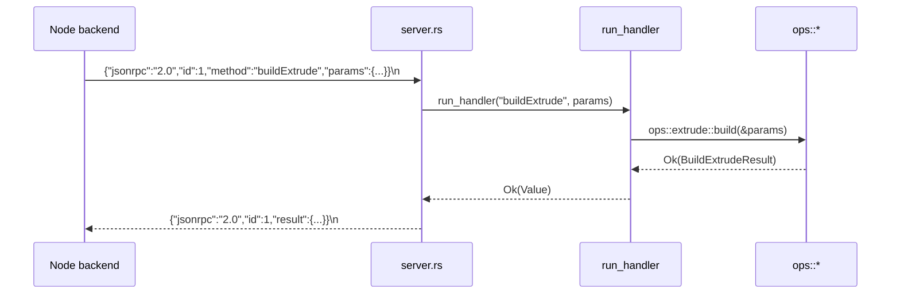

# server.rs — TCP JSON-RPC dispatcher

> **System** ▸ [Overview](../../00-overview.md) ▸ [Kernel](../../20-kernel.md) ▸ [RPC server & protocol](../rpc-server-protocol.md) ▸ **server.rs**
> Related: [protocol.md](./protocol.md) · [ops-extrude.md](./ops-extrude.md) · [RPC server & protocol](../rpc-server-protocol.md)

---

## Requirements

Governed by [RPC server & protocol](../rpc-server-protocol.md). The defining requirement for this module is REQ 744 (kernel health probe / ping).

| REQ | Status | Summary |
|-----|--------|---------|
| 744 | unapproved | Kernel availability via lightweight ping, independent of regen traffic |

---

## Succinct description

`server.rs` is the TCP accept loop and JSON-RPC dispatcher. It listens for connections, reads one JSON object per newline, routes the `method` field to the right op, wraps the result in a JSON-RPC 2.0 envelope, and writes the reply back — one reply line per request.

## How it works — for everyone (non-technical)

Think of this module as the receptionist at the front desk of the geometry engine. It sits by the phone waiting for messages to arrive. When one comes in, it reads the message, figures out which specialist to hand it to (extrude? revolve? fillet?), waits for the answer, and sends it back. Notifications (messages with no return address) are processed silently with no reply. If anything goes wrong — bad message format, the specialist panics — the receptionist sends a polite error reply and keeps going rather than hanging up.

## How it works — in detail (technical)

### Bind and accept

`serve(bind_addr: &str)` creates a `TcpListener` and spawns a new `tokio::task` per accepted connection. `TCP_NODELAY` is set on every socket; regen replies are small blobs and Nagle's algorithm would add unwanted latency for an interactive editor.

### Per-connection loop

`handle_connection` splits the stream into reader/writer halves and wraps the reader in `BufReader::lines()`. Each received line is passed to `dispatch`, which returns `Option<String>` — `None` for notifications (no `id`), `Some(json)` for normal requests.

### Dispatch

`dispatch` increments `REQUEST_COUNT` (an `AtomicU64` in `main.rs`), deserializes into `RpcRequest`, checks `jsonrpc == "2.0"`, then calls `run_handler(method, params)`.

`run_handler` matches on the method string:

| Method | Handler |
|---|---|
| `ping` | inline `Ok(json!({ "ok": true }))` |
| `buildExtrude` | `ops::extrude::build` |
| `buildRevolve` | `ops::revolve::build` |
| `buildBoolean` | `ops::boolean::build` |
| `buildEdgeBlend` | `ops::edge_blend::build` |
| `buildSweep` | `ops::sweep::build` |
| `buildShell` | `ops::shell::build` |
| `buildPattern` | `ops::pattern::build` |
| `buildLoft` | `ops::extrude::build_loft` |
| `exportStep` | `ops::export::export_step` |
| `exportStl` | `ops::export::export_stl` |

Every non-ping handler is wrapped in `std::panic::catch_unwind(AssertUnwindSafe(...))`. This catches Rust panics from the kernel's own code and converts them to `INTERNAL_ERROR` responses so one bad request cannot crash the connection. OCCT C++ exceptions that escape the cxx bridge and call `std::terminate` are NOT caught here — they abort the process (the supervisor restarts it).

### Error codes

Constants from `protocol.rs`: `PARSE_ERROR (-32700)`, `INVALID_REQUEST (-32600)`, `METHOD_NOT_FOUND (-32601)`, `INVALID_PARAMS (-32602)`, `INTERNAL_ERROR (-32603)`.

### Notification handling

If `req.id` is absent, `is_notification = true`; `run_handler` still executes (side-effecting notifications are permitted by JSON-RPC 2.0) but `dispatch` returns `None` so no bytes are written back.

## Key files

- `cad-kernel/src/server.rs` — this module
- `cad-kernel/src/main.rs` — `serve()` entry point, `REQUEST_COUNT`, `NAMING_SCHEMA_VERSION`, bind address
- `cad-kernel/src/protocol.rs` — `RpcRequest`, `RpcResponse`, error code constants
- `cad-kernel/src/ops/mod.rs` — op submodule registry
