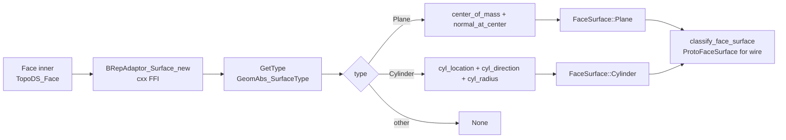

# surface-ffi.md — BRepAdaptor_Surface FFI (surface classification)

> **System** ▸ [Overview](../../00-overview.md) ▸ [Kernel](../../20-kernel.md) ▸ [Surface classification](../surface-classification.md) ▸ **surface-ffi**
> Related: [ops-shape_io.md](./ops-shape_io.md) · [protocol.md](./protocol.md) · [Surface classification](../surface-classification.md)

---

## Requirements

| REQ | Status | Summary |
|-----|--------|---------|
| 749 | unapproved | Per-face surface classification (plane/cylinder) for assembly mate solver |

### REQ 749 — Surface classification

- **Description:** For each planar or cylindrical face it emits, the CAD kernel shall include a surface classification giving the geometry needed to position mates — a plane's origin and normal, or a cylinder's axis and radius.
- **Rationale:** The assembly mate solver constrains surfaces (coincident planes, concentric cylinders); it needs analytic surface data, not just a triangle mesh.
- **Verification:** A cylindrical face returns a stable axis direction and radius across regenerations; a planar face returns origin + normal.
- **Validation:** A user mates a bolt shaft concentric to a hole and the solver uses the kernel-emitted cylinder axes.

---

## Succinct description

Three files implement the BRep surface classification pipeline: the cxx FFI bridge (`b_rep_adaptor.rs`), the OCCT enum mapping (`geom_abs.rs`), and the high-level Rust wrapper (`primitives/face.rs`). Together they expose `Face::surface_kind() -> Option<FaceSurface>` which returns analytic plane or cylinder geometry for the assembly mate solver.

## How it works — for everyone (non-technical)

When the kernel produces a face, it can look at the mathematical definition of that face's surface and say "this is a flat plane pointing in direction X" or "this is part of a cylinder with radius R around axis Y." That information goes to the assembly solver so it can line two parts up by their surfaces — like inserting a bolt shaft into a hole. This module is the bridge between OCCT's internal surface classification and the rest of the Rust kernel.

## How it works — in detail (technical)

### File 1: `b_rep_adaptor.rs` — cxx bridge

`cad-kernel/vendor/opencascade-rs/crates/opencascade-sys/src/b_rep_adaptor.rs`

The cxx bridge declares the `BRepAdaptor_Surface` type and its constructors/accessors:

```rust
type BRepAdaptor_Surface;
fn BRepAdaptor_Surface_new(face: &TopoDS_Face) -> UniquePtr<BRepAdaptor_Surface>;
fn GetType(self: &BRepAdaptor_Surface) -> GeomAbs_SurfaceType;
fn BRepAdaptor_Surface_cyl_location(surface: &BRepAdaptor_Surface) -> UniquePtr<gp_Pnt>;
fn BRepAdaptor_Surface_cyl_direction(surface: &BRepAdaptor_Surface) -> UniquePtr<gp_Dir>;
fn BRepAdaptor_Surface_cyl_radius(surface: &BRepAdaptor_Surface) -> f64;
```

The same file also binds `BRepAdaptor_Curve` for edge-type detection (`GetType() -> GeomAbs_CurveType`, `FirstParameter`, `LastParameter`, `BRepAdaptor_Curve_value`), used by the curve-sampling path in `shape_io.rs`.

The C++ implementation is in `opencascade-sys/include/b_rep_adaptor.hxx` (not listed in the Rust source tree but required at build time).

### File 2: `geom_abs.rs` — surface and curve type enums

`cad-kernel/vendor/opencascade-rs/crates/opencascade-sys/src/geom_abs.rs`

Mirrors the OCCT C++ enums `GeomAbs_CurveType` and `GeomAbs_SurfaceType` as Rust `#[repr(u32)]` enums:

```rust
pub enum GeomAbs_SurfaceType {
    GeomAbs_Plane,       // 0
    GeomAbs_Cylinder,    // 1
    GeomAbs_Cone,        // 2
    GeomAbs_Sphere,      // 3
    GeomAbs_Torus,       // 4
    GeomAbs_BezierSurface,
    GeomAbs_BSplineSurface,
    GeomAbs_SurfaceOfRevolution,
    GeomAbs_SurfaceOfExtrusion,
    GeomAbs_OffsetSurface,
    GeomAbs_OtherSurface,
}

pub enum GeomAbs_CurveType {
    GeomAbs_Line, GeomAbs_Circle, GeomAbs_Ellipse,
    GeomAbs_Hyperbola, GeomAbs_Parabola,
    GeomAbs_BezierCurve, GeomAbs_BSplineCurve,
    GeomAbs_OffsetCurve, GeomAbs_OtherCurve,
}
```

Only `Plane` and `Cylinder` are consumed by the current classification path. Other surface types return `None` from `surface_kind()`.

### File 3: `primitives/face.rs` — `FaceSurface` and `surface_kind`

`cad-kernel/vendor/opencascade-rs/crates/opencascade/src/primitives/face.rs`

The `FaceSurface` Rust enum:

```rust
pub enum FaceSurface {
    Plane    { origin: DVec3, normal: DVec3 },
    Cylinder { origin: DVec3, axis: DVec3, radius: f64 },
}
```

`Face::surface_kind() -> Option<FaceSurface>`:

```rust
let adaptor = ffi::b_rep_adaptor::BRepAdaptor_Surface_new(&self.inner);
match adaptor.GetType() {
    GeomAbs_Plane => Some(FaceSurface::Plane {
        origin: self.center_of_mass(),
        normal: self.normal_at_center(),
    }),
    GeomAbs_Cylinder => {
        let loc = BRepAdaptor_Surface_cyl_location(&adaptor);
        let dir = BRepAdaptor_Surface_cyl_direction(&adaptor);
        let radius = BRepAdaptor_Surface_cyl_radius(&adaptor);
        Some(FaceSurface::Cylinder { origin, axis, radius })
    },
    _ => None,
}
```

**Plane**: origin and normal use the existing orientation-aware helpers (`center_of_mass` via `BRepGProp::SurfaceProperties`, `normal_at_center` via `BRepGProp_Face::Normal`) so the normal points outward relative to the solid's orientation.

**Cylinder**: `cyl_location` returns the axis origin (a point on the cylinder axis); `cyl_direction` returns the axis unit vector; `cyl_radius` returns the scalar radius. These come directly from OCCT's `BRepAdaptor_Surface::Cylinder()` → `gp_Cylinder` → `gp_Ax1` decomposition.

### Consumption in shape_io

`ops/shape_io.rs::classify_face_surface(face: &Face) -> Option<ProtoFaceSurface>` calls `face.surface_kind()` and maps `FaceSurface` to the protocol struct `FaceSurface { kind, origin, normal?, axis?, radius? }`. Every tessellated face has `classify_face_surface` called on it inside `tessellate_faces_generic_with_topology` and `tessellate_and_name`.



## Key files

- `cad-kernel/vendor/opencascade-rs/crates/opencascade-sys/src/b_rep_adaptor.rs` — cxx bridge for `BRepAdaptor_Surface` (and `BRepAdaptor_Curve`)
- `cad-kernel/vendor/opencascade-rs/crates/opencascade-sys/src/geom_abs.rs` — `GeomAbs_SurfaceType` and `GeomAbs_CurveType` enums
- `cad-kernel/vendor/opencascade-rs/crates/opencascade/src/primitives/face.rs` — `FaceSurface` enum and `Face::surface_kind()`
- `cad-kernel/src/ops/shape_io.rs` — `classify_face_surface()` consumer
- `cad-kernel/src/protocol.rs` — `FaceSurface` wire struct
