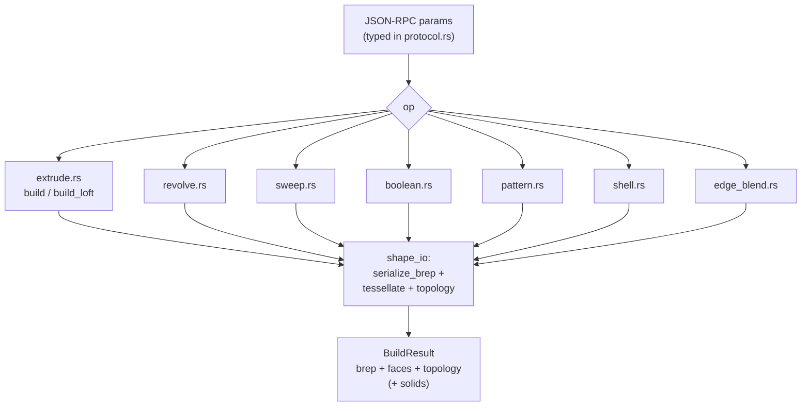

# Build Operations

> **System** ▸ [Overview](../00-overview.md) ▸ [Kernel](../20-kernel.md) ▸ **Operations**
> Related: [Kernel subsystem map](./00-overview.md) · [RPC server & protocol](./rpc-server-protocol.md) · [Shape I/O & tessellation](./shape-io-tessellation.md) · [Persistent naming](./persistent-naming.md)

---

## Requirements

| REQ | Status | Summary |
|-----|--------|---------|
| 549 | unapproved | Extrude — sketch profile + distance → 3D solid |
| 662 | unapproved | Combine — boolean (Add / Subtract / Common) between bodies |
| 658 | unapproved | Mirror / Linear / Circular pattern features |
| 659 | unapproved | Shell — hollow a solid by removing faces |
| 642 | unapproved | Fillet (rolling-ball round) |
| 643 | unapproved | Chamfer (bevel, three modes) |

### REQ 549 — Extrude

- **Description:** The CAD module shall provide an extrude feature that takes a sketch reference and a positive distance value and produces a 3D solid by translating the sketch's closed profile along the sketch plane's outward normal by the given distance.
- **Rationale:** Extrude is the foundational sketch-based parametric operation in 3D CAD; without it, sketches cannot become solid geometry.
- **Verification:** `frontend/e2e/cad/cad-editor.spec.ts` asserts six faces from a quadrilateral profile (a box).
- **Validation:** A user creating an extrude feature sees a 3D solid prism appear matching the profile and distance.

### REQ 662 — Combine (body booleans)

- **Description:** The CAD editor shall provide a Combine feature that performs a boolean operation between two or more existing bodies: Add (fuse), Subtract (target − union(tools)), Common (intersection). Tool bodies are consumed; the result keeps the Target body's id. Backend dispatches to the kernel `buildBoolean` op once per tool, chaining the result. Disjoint result solids fan out into separate bodies.
- **Rationale:** Multi-body modeling is incomplete without explicit body-vs-body booleans; Combine matches SolidWorks' Combine directly.
- **Verification:** Backend test exercising `_dispatchCombine` on a 2-body model with each operation; manual two-box Add/Subtract/Common.
- **Validation:** A designer can compose multi-body parts using booleans without sketching cut/boss features.

### REQ 658 — Pattern features

- **Description:** Three pattern features that replicate features by transforming their BRep bodies: Mirror (reflect across a plane), Linear (translate along one/two directions), Circular (rotate about an axis). The kernel collects source bodies, applies the configured transforms, and fuses each copy into the cumulative body unless `mergeWithSource` is false.
- **Rationale:** Patterns and mirrors are the highest-impact missing category from SolidWorks parity; one pattern feature replaces N duplicated features and parametrically drives count/spacing.
- **Verification:** Kernel test exercising `buildPattern` with a source BREP + three transforms, asserting four solids (or one fused). Frontend tests on the transform-list compute helpers.
- **Validation:** A designer can replicate a feature along a direction, around an axis, or across a plane without manually duplicating it.

---

## Succinct description

Each operation maps a typed JSON-RPC request to OpenCASCADE calls and returns a serialized BRep plus a tessellated `FaceMesh[]`, topology, and (for multi-body ops) a per-solid breakdown. One op per shape-building primitive; the backend composes them into the cumulative-body pipeline.

## How it works — for everyone (non-technical)

Think of these as the verbs the kernel understands:

- **Extrude** — push a flat outline straight out to make a solid (a circle becomes a cylinder).
- **Revolve** — spin an outline around a line to make a round part (a profile becomes a bottle or shaft).
- **Sweep** — drag an outline along a path to make a pipe or wire.
- **Boolean / Combine** — glue two solids together, cut one out of another, or keep only the overlap.
- **Pattern** — stamp copies of a shape in a row, around a circle, or mirror it to the other side.
- **Shell** — hollow a solid out, leaving thin walls, like turning a block into a box.
- **Fillet / Chamfer** — round off or bevel sharp edges.

The application picks the verb, fills in the numbers, and the kernel does the geometry math and hands back the finished shape.

## How it works — in detail (technical)

All ops live in `cad-kernel/src/ops/`. Every op returns a result struct carrying `brep_bytes` (base64 BRep), `faces: Vec<FaceMesh>`, and `topology`; the multi-body ops (boolean, pattern, shell, edge_blend) also return `solids: Vec<SolidPart>`. Tessellation, topology extraction, and BRep round-tripping are shared from `shape_io.rs` — see [shape-io-tessellation](./shape-io-tessellation.md).

### Extrude (`extrude.rs`, REQ 549)

`build` takes a `Vec<ProfileEdge>` outer loop, optional `holes`, a `Plane3` host, a `distance`, and optional `flipped` / `start_offset` / `direction2`.

- **Workplane** — `build_workplane` makes an OCCT `Workplane::new(x_dir, normal)` and sets the world-space origin verbatim.
- **Profile face** — `build_profile_face` handles three cases: a single `Circle` edge is the loop (fast path matching REQ 612); `Bezier` edges (text glyphs) build via `Edge::bezier` + `Wire::from_edges`; otherwise a chord-polygon walk with arcs constructed as analytic `three_point_arc` edges. The walk is defensive: it validates the polygon (`validate_polygon` rejects zero-length edges, degenerate collinear corners, near-zero area), reverses to CCW via the shoelace signed area, and skips zero-length edges before they reach OCCT (which would otherwise throw `StdFail_NotDone` → SIGABRT).
- **Holes** — `build_compound_face_with_holes` subtracts each inner loop's face from the outer (CompoundFace), producing donut/annular profiles.
- **Direction 2 / start offset** — folded into a *single* prism (translate the start back by d2, extrude the total `|d1|+|d2|`) so no internal parting face remains at the sketch plane.
- **Loft** — `build_loft` lofts through ≥2 ordered profile sections via OCCT `ThruSections`; result shape matches `BuildExtrudeResult` so the backend composer is indifferent.

Faces are named by `tessellate_and_name`, which classifies each face as cap-bottom / cap-top / side by its centroid's offset along the plane normal — see [persistent-naming](./persistent-naming.md).

### Revolve (`revolve.rs`)

`build` builds the same profile face, then `Face::revolve(axis_origin, axis_dir, angle)`. The axis is world-space (origin + direction). A full revolve (`|angle − 360| < 0.001`) passes `None` for the angle to trigger OCCT's true-closed revolve — passing `Some(360°)` instead leaves duplicate start/end profile edges baked in as visible seams. `Face::revolve` returns `Option`; `None` (an OCCT throw caught via cxx `Result`) becomes a human-readable error naming the common causes (profile on/across the axis, self-intersecting profile).

### Sweep (`sweep.rs`)

`build` assembles a path `Wire` from typed `PathEdge`s (line → `Edge::segment`, 3-point arc → `Edge::arc`, lone circle → `Edge::circle`), builds the profile face, then `outer_face.sweep_along_shell(&path)` (OCCT `BRepOffsetAPI_MakePipeShell` — forgiving of sharp corners, unlike `MakePipe` which is C1-only). Holes are swept into tube-solids and boolean-subtracted from the outer solid, with `clean()` after each cut to merge co-domain faces.

### Boolean (`boolean.rs`, REQ 662)

`build` deserializes two base64 BReps and applies `union` (Fuse), `subtract` (Cut), or `intersect` (Common), then `clean()` (`ShapeUpgrade_UnifySameDomain`) to merge co-domain sub-faces a boolean can spawn where the other shape's edges cross a surface. After serializing, `decompose_into_solids` splits the result into disjoint solids (`SolidPart` per piece, each with its own BRep, centroid, volume, faces, topology) so the backend can track SolidWorks-style body splits (the largest piece keeps the original body id). The backend's Combine feature (REQ 662) calls this once per tool body, chaining results.

### Pattern (`pattern.rs`, REQ 658)

`build` takes one source BRep and a `Vec<PatternTransform>` — `Translate` (linear), `Rotate` (circular), or `Mirror` — computed per pattern kind on the frontend. `apply_transform` builds each transformed copy (`translate_xyz` / `rotate_around` / `mirror_plane`), then fuses them: with `merge_with_source` (default) the source unions with all copies; without it, only the copies fuse into a free-floating body. `clean()` merges co-domain faces; `decompose_into_solids` yields the multi-body breakdown.

### Shell (`shell.rs`, REQ 659)

`build` deserializes the body, matches each picked face *geometrically* (`match_picked_faces` by centroid + outward normal, tolerance scaled to the bounding diagonal, normal-alignment tie-break) since OCCT renumbers faces across regens, then calls `Shape::shell` (OCCT `BRepOffsetAPI_MakeThickSolid::MakeThickSolidByJoin`) with the removed faces and signed `thickness` (positive = outward, negative = inward). Duplicate face matches are rejected. The cxx FFI returns `Result` so an infeasible offset becomes a clean error, not an abort. `BRepOffsetAPI_MakeThickSolid` is single-thickness; per-face overrides require the lower-level `Initialize + SetOffsetOnFace` path not yet in the cxx FFI.

### Edge blend — Fillet & Chamfer (`edge_blend.rs`, REQ 642/643)

`build` matches picked edges to OCCT edges by world-space endpoint pairs (`match_picked_edges`, direct-or-swapped distance, generous tolerance) and resolves an optional per-edge value override. Then:

- **Fillet** — `body.fillet_edges_per(...)` (OCCT `BRepFilletAPI_MakeFillet`, rolling-ball blend).
- **Chamfer** — by `ChamferMode`:
  - `Equal` — `chamfer_edges_per` (symmetric 45°).
  - `TwoDistance` — `chamfer_edges_two_distance` with `distance2`; the reference face is the first adjacent face `find_adjacent_faces` discovers at the edge.
  - `DistanceAngle` — `chamfer_edges_distance_angle` with `angle` (validated `(0°, 90°)`, converted to radians) measured from the reference face.

An empty result BRep surfaces a human-readable error (value too large for an edge, or unblendable adjacency).

## Key files

- `cad-kernel/src/ops/extrude.rs` — `build`, `build_loft`, `build_profile_face`, `build_workplane`, `validate_polygon`
- `cad-kernel/src/ops/revolve.rs` — `build`
- `cad-kernel/src/ops/sweep.rs` — `build`, `build_path_wire`
- `cad-kernel/src/ops/boolean.rs` — `build`
- `cad-kernel/src/ops/pattern.rs` — `build`, `apply_transform`
- `cad-kernel/src/ops/shell.rs` — `build`, `match_picked_faces`
- `cad-kernel/src/ops/edge_blend.rs` — `build`, `match_picked_edges`, `find_adjacent_faces`
- `cad-kernel/src/ops/mod.rs` — module index
- `cad-kernel/src/protocol.rs` — `BuildExtrudeParams`, `BuildBooleanParams`, `PatternTransform`, `ShellFaceRef`, `EdgeRef`, etc.
