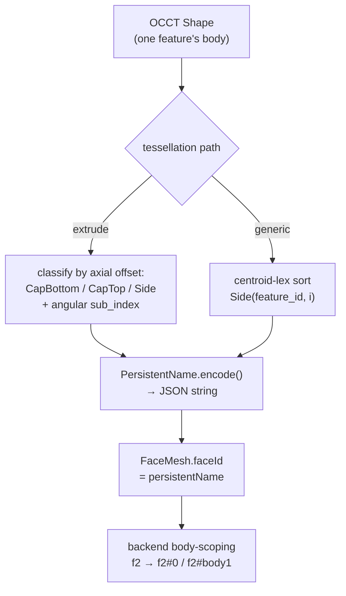

# Persistent Naming

> **System** ▸ [Overview](../00-overview.md) ▸ [Kernel](../20-kernel.md) ▸ **Persistent naming**
> Related: [Kernel subsystem map](./00-overview.md) · [Shape I/O & tessellation](./shape-io-tessellation.md) · [VCS](../30-vcs.md)

---

## Requirements

| REQ | Status | Summary |
|-----|--------|---------|
| 517 | unapproved | Stable per-face identifiers for the life of the solid |
| 683 | unapproved | Each commit records the kernel version and naming-schema version |

### REQ 517 — Stable face identifiers

- **Description:** The CAD module shall assign each face of a rendered solid a unique identifier that remains constant for the lifetime of that solid in the active editor session.
- **Rationale:** Stable face identity is the foundation for selection, feature targeting, and topological naming across regenerations; positional indices are unstable.
- **Verification:** Face IDs are stable within a session (`frontend/src/app/cad/lib/featureTree.spec.ts` covers feature-tree id stability; face-id stability is verified manually).
- **Validation:** A face referenced by ID at session start can be re-located by that ID later in the session without ambiguity.

### REQ 683 — Versioned commits

- **Description:** Every commit shall record the geometry kernel version and the naming-schema version in effect at the time the commit was created.
- **Rationale:** Geometry is regenerated from a recipe by a kernel that changes over time; stamping the versions gives provenance and lets the system detect when a regenerated draft might differ from when it was committed.
- **Verification:** Unit test — each commit meta carries `kernelVersion` + `namingVersion` (`backend/tests/__tests__/vcs/cad-vcs-service.test.js`).
- **Validation:** For any historical version, the system records which kernel produced it.

---

## Succinct description

Every face (and topology edge) the kernel emits carries a `PersistentName` — a structured identifier built from the producing feature, the face's role within it, and a sub-index — so selections, edge picks, and diff coloring survive regeneration. A schema-version constant pins the naming rules; the backend body-scopes the names so they stay unique in multi-body parts.

## How it works — for everyone (non-technical)

When you click a face and say "round this edge," the system has to remember *which* face you meant — even after the part rebuilds because you changed an earlier step. If faces were just numbered 1, 2, 3 in whatever order the math produced them, those numbers would shuffle on every rebuild and your selection would jump to a different face. Instead, each face gets a meaningful name like "the top cap of the extrude feature" or "side number 3 of that feature." Those names describe *what the face is*, not *where it happened to land in a list*, so they stick. The system also stamps every saved version with which engine and naming-rules version produced it, so years later it knows exactly how a historical part was built.

## How it works — in detail (technical)

### The `PersistentName` structure

`cad-kernel/src/naming.rs` defines the identifier:

```text
PersistentName {
  feature_id:    String,   // which feature produced this entity
  role:          Role,     // what it is within the feature
  sub_index:     u32,      // disambiguates when role isn't unique
  upstream_refs: Vec<String>, // upstream entities this depends on
}
```

`Role` is a kebab-cased enum: `CapTop`, `CapBottom`, `Side`, `EdgeTop`, `EdgeBottom`, `EdgeVertical`, plus reserved `FilletFace` / `FilletCap`. `encode()` serializes the whole struct to a compact JSON string (deterministic field order from serde), and that string is both the `faceId` and the `persistentName` on the emitted `FaceMesh`.

Convenience constructors keep call sites readable: `PersistentName::cap_top(feature_id)`, `cap_bottom(feature_id)`, and `side(feature_id, profile_edge_index)`.

### How faces get named

Two paths assign names (both in the [shape-io / tessellation](./shape-io-tessellation.md) stage):

- **Extrude** (`tessellate_and_name` in `extrude.rs`) classifies each face by where its centroid sits along the plane normal: `axial ≈ 0` → `CapBottom`, `axial ≈ signed_distance` → `CapTop`, else `Side`. Side faces are sorted by their in-plane angle and assigned an incrementing `sub_index`, so "side 0" stays the same face across regens even when OCCT's internal enumeration order changes.
- **Generic** (`tessellate_faces_generic_with_topology` in `shape_io.rs`, used by boolean/revolve/sweep/pattern/shell/edge_blend) sorts faces centroid-lexicographically and names each `PersistentName::side(feature_id, i)`. IDs stay stable under small parameter tweaks because OCCT centroids move continuously; only a topology change reshuffles the order. (Full topological renaming across topology changes is the next step beyond this positional-within-sort scheme.)

This positional-within-a-deterministic-sort approach is what satisfies REQ 517's *within-session* stability.



### Body-scoping in the backend

The kernel names faces relative to a `feature_id`. In a multi-body part one feature can produce several disjoint solids, so the backend (`backend/services/cadRegenService.js`) scopes names per body/region to keep them unique. Concretely:

- Per-region extrudes are dispatched with a scope of `` `${feature.id}#${ri}` `` (region index), and `decompose_into_solids` namespaces split-body faces under `` `${feature_id}#body{i}` ``. So a raw kernel name from feature `f2` becomes body-scoped (e.g. `f2-f0` → a `f2#0-…` form) rather than colliding with another body's faces.
- `_scopeFaceBoundaryEdges` and `_scopeTopology` (in `cadRegenService.js`) prefix each face's `boundaryEdgeIds` and each topology vertex/edge id with `` `${scope}/` `` (e.g. `f5#0/e0` → `f5/f5#0/e0`) so two bodies' local `e0`/`e1` topology ids don't collide on the frontend's edge-keyed Map (which would otherwise leak stale lines between bodies).

### Schema version (REQ 683)

`NAMING_SCHEMA_VERSION` in `cad-kernel/src/main.rs` (currently `20`) is the single lever for naming/output-shape changes. Its doc comment is a changelog of every bump (arcs → real OCCT arcs, regions/holes, cumulative-body pipeline, multi-body decomposition, shell validity checks, …). The backend mirrors it as `NAMING_VERSION` in `cadRegenService.js` (also `20`) — the two **must** be bumped together.

The version matters in two places:

1. **BRep cache invalidation.** Cache rows tagged with an older naming version are recomputed when the kernel's rules change, so stale geometry never resurfaces.
2. **Commit provenance (REQ 683).** Every VCS commit's meta records the kernel/naming version in effect, so a historical revision records exactly which kernel produced it. (Freeze stores the actual geometry too — see [VCS](../30-vcs.md).)

## Key files

- `cad-kernel/src/naming.rs` — `PersistentName`, `Role`, `encode`, constructors
- `cad-kernel/src/main.rs` — `NAMING_SCHEMA_VERSION` (+ its bump changelog)
- `cad-kernel/src/ops/extrude.rs` — `tessellate_and_name` (cap/side classification)
- `cad-kernel/src/ops/shape_io.rs` — `tessellate_faces_generic_with_topology` (generic naming), `decompose_into_solids` (`#body{i}` scope)
- `backend/services/cadRegenService.js` — `NAMING_VERSION`, region/body scoping, `_scopeFaceBoundaryEdges`, `_scopeTopology`
