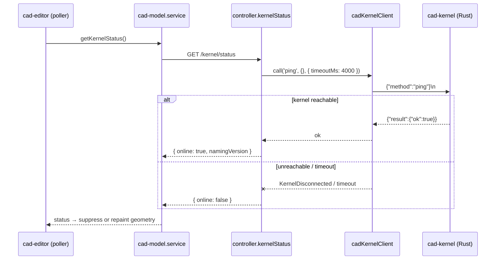

# RPC Server, Protocol & Process Supervision

> **System** ▸ [Overview](../00-overview.md) ▸ [Kernel](../20-kernel.md) ▸ **RPC server & protocol**
> Related: [Kernel subsystem map](./00-overview.md) · [Operations](./operations.md) · [Shape I/O & tessellation](./shape-io-tessellation.md)

---

## Requirements

| REQ | Status | Summary |
|-----|--------|---------|
| 744 | unapproved | CAD-kernel availability via a dedicated health probe (ping), independent of the progress stream |

### REQ 744 — Kernel health probe

- **Description:** The CAD editor shall determine CAD-kernel availability via a dedicated health probe (a lightweight kernel ping over the same connection used for regeneration), independent of the WebSocket progress stream. When the kernel is unreachable, the editor shall suppress 3D geometry rendering and display an explicit offline notice rather than showing stale or cached geometry, and shall automatically resume rendering when the kernel becomes reachable again.
- **Rationale:** The kernel produces the geometry; if it is offline the user must not be misled by stale/cached geometry left on screen. The prior indicator was wired to the best-effort WebSocket progress stream, so it falsely reported the kernel offline whenever that socket dropped even though HTTP regeneration still worked.
- **Verification:** `backend/api/design/cad-model/controller.js` (`kernelStatus`) + `routes.js` (`GET /kernel/status`); `backend/services/cadKernelClient.js` (per-call timeout, `ping`); `frontend/src/app/services/cad-model.service.ts` (`getKernelStatus`); `cad-editor.component.ts` (kernel poller, geometry suppression, offline overlay); `backend/tests/__tests__/vcs/cad-kernel-status.test.js`.
- **Validation:** With the kernel running, the editor badge never falsely reads offline. With the kernel stopped, within ~8s the badge reads offline, the 3D view clears, and an offline notice shows; restarting the kernel auto-repaints the model.

---

## Succinct description

A line-delimited JSON-RPC 2.0 server over TCP. The Rust kernel listens; the Node backend connects with one long-lived multiplexed client. A supervisor optionally owns the kernel's lifecycle, and a `ping` method backs the editor's accurate online/offline state.

## How it works — for everyone (non-technical)

The kernel and the main application are two separate programs that talk to each other over a network connection — the same way a web browser talks to a web server. Messages are plain text, one request per line, each carrying an ID so replies can be matched to the right question even when several are in flight. One always-open phone line is shared for all the geometry work. A small "are you there?" message (a *ping*) lets the editor know instantly whether the kernel is alive, so it can tell the user "geometry engine offline" instead of leaving an old, possibly-wrong picture on screen. If the application is configured to manage the kernel itself, a supervisor restarts it automatically whenever it crashes.

## How it works — in detail (technical)

### Wire format

The transport is line-delimited UTF-8 JSON over TCP (`cad-kernel/src/server.rs`): exactly one JSON object per `\n`. TCP — not a Unix socket — because the standard dev setup runs the Node backend inside Docker while the kernel runs on the host; TCP crosses that boundary, a socket file does not. `TCP_NODELAY` is set on both ends (the kernel and the client) because regen payloads are small and Nagle batching would only add latency.

The JSON-RPC 2.0 envelope is defined in `cad-kernel/src/protocol.rs`:

- `RpcRequest { jsonrpc, id?, method, params }` — `id` absent ⇒ a notification (no response is sent).
- `RpcResponse { jsonrpc, id, body }` where `body` is an untagged `RpcBody::Ok { result }` or `RpcBody::Err { error }`.
- `RpcError { code, message, data? }` with the standard JSON-RPC codes (`PARSE_ERROR -32700`, `INVALID_REQUEST -32600`, `METHOD_NOT_FOUND -32601`, `INVALID_PARAMS -32602`, `INTERNAL_ERROR -32603`).

### Dispatch and panic isolation

`server::dispatch` parses the line, validates `jsonrpc == "2.0"`, then `run_handler` matches on `method`. Every geometry method follows the same pattern: deserialize the typed params struct (failure → `INVALID_PARAMS`), call the op inside `std::panic::catch_unwind`, and map the three outcomes:

- `Ok(Ok(result))` → serialize to the JSON-RPC `result`.
- `Ok(Err(e))` → op returned an error → `INTERNAL_ERROR` with the message.
- `Err(panic)` → a Rust panic → `INTERNAL_ERROR` with `internal panic: …` (extracted by `panic_message`).

The `catch_unwind` guard contains panics from the kernel's *own* Rust code so one bad request can't take the process down. It does **not** catch C++ exceptions thrown from OCCT — those still abort the process, which is why `main.rs` installs `opencascade::install_terminate_handler()` (to log the exception's `what()` before aborting) and why the supervisor restarts on crash. Many ops also wrap their OCCT calls in cxx `Result`-returning constructors so common failures surface as clean `Err` rather than aborts (see [operations](./operations.md)).

Methods registered in `run_handler`:

| Method | Handler |
|--------|---------|
| `ping` | returns `{ "ok": true }` |
| `buildExtrude` | `ops::extrude::build` |
| `buildLoft` | `ops::extrude::build_loft` |
| `buildRevolve` | `ops::revolve::build` |
| `buildBoolean` | `ops::boolean::build` |
| `buildSweep` | `ops::sweep::build` |
| `buildPattern` | `ops::pattern::build` |
| `buildShell` | `ops::shell::build` |
| `buildEdgeBlend` | `ops::edge_blend::build` |
| `exportStep` | `ops::export::export_step` |
| `exportStl` | `ops::export::export_stl` |

An unknown method → `METHOD_NOT_FOUND`.

### The Node client

`backend/services/cadKernelClient.js` is the single client. It holds one long-lived TCP connection and multiplexes calls by `id` through a `pending` Map (`id → { resolve, reject, timeoutHandle, method }`), the same pattern as `printAgentService`. `call(method, params, { timeoutMs })`:

1. `_ensureConnected()` — lazily opens the socket; a `connecting` promise dedupes concurrent connects.
2. assigns the next `id`, writes `JSON.stringify({ jsonrpc, id, method, params }) + '\n'`.
3. arms a timeout (default 30 s; overridable per call so cheap probes fail fast).
4. `_onData` buffers bytes and splits on `\n`; `_dispatchResponse` looks up the pending entry, clears its timeout, and resolves with `result` or rejects with `KernelRpcError(method, code, message, data)`.

Socket close/error rejects all in-flight calls with `KernelDisconnected`; the next `call()` reconnects. The address comes from `CAD_KERNEL_ADDR` (`host:port`, bare `port`, default `127.0.0.1:9876`); Docker setups point it at `host.docker.internal:9876`. A module singleton (`getDefaultClient`) is shared across the API server.

### The supervisor

`backend/services/cadKernelSupervisor.js` is opt-in via `CAD_KERNEL_AUTOSPAWN=1` (default off preserves the manual `cargo run` workflow). When enabled it:

- resolves the binary (`CAD_KERNEL_BIN`, else `<repo>/cad-kernel/target/release/cad-kernel`),
- spawns it, piping stdout/stderr through the Node logs prefixed `[cad-kernel]`,
- restarts on exit with exponential backoff (1 s → 2 s → … capped at 30 s), resetting backoff after 60 s of healthy uptime,
- on `SIGTERM`/`SIGINT` sends `SIGTERM` then `SIGKILL` after a 5 s grace.

The supervisor and client share only the env var — there's no direct coordination; the client simply retries connecting on the next RPC after a restart.

### The health probe (REQ 744)

The editor's online/offline state is driven by a real kernel `ping`, not the progress WebSocket:

`controller.kernelStatus` (`backend/api/design/cad-model/controller.js`) always returns HTTP 200 — the payload *is* the status (`{ online, namingVersion? }`). It pings over the same singleton connection the regenerate path uses, with a short 4 s timeout so a wedged kernel doesn't hang the probe. The route is `GET /kernel/status` (`cad`/`read`). The frontend (`cad-model.service.ts` `getKernelStatus`, consumed by the editor's poller) suppresses 3D rendering and shows an offline overlay when `online` is false, and auto-repaints when it flips back.

## Key files

- `cad-kernel/src/server.rs` — TCP listener, connection loop, `dispatch`, `run_handler`, panic isolation
- `cad-kernel/src/protocol.rs` — JSON-RPC envelope (`RpcRequest`/`RpcResponse`/`RpcError`) + error codes + all params/result types
- `cad-kernel/src/main.rs` — entry point, terminate handler, bind address
- `backend/services/cadKernelClient.js` — long-lived multiplexed Node client, `KernelDisconnected`/`KernelRpcError`
- `backend/services/cadKernelSupervisor.js` — spawn + backoff restart + graceful shutdown
- `backend/api/design/cad-model/controller.js` — `kernelStatus` handler
- `frontend/src/app/services/cad-model.service.ts` — `getKernelStatus`
