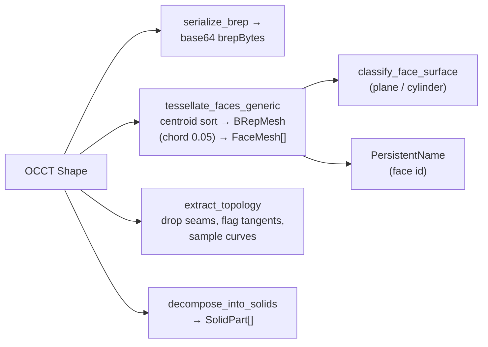

# Shape I/O & Tessellation

> **System** ▸ [Overview](../00-overview.md) ▸ [Kernel](../20-kernel.md) ▸ **Shape I/O & tessellation**
> Related: [Kernel subsystem map](./00-overview.md) · [Operations](./operations.md) · [Surface classification](./surface-classification.md) · [Persistent naming](./persistent-naming.md)

---

## Requirements

| REQ | Status | Summary |
|-----|--------|---------|
| 517 | unapproved | Stable per-face identifiers for the life of the solid |
| 562 | unapproved | Chord-height tessellation of curved geometry to polylines |

### REQ 517 — Stable face identifiers

- **Description:** The CAD module shall assign each face of a rendered solid a unique identifier that remains constant for the lifetime of that solid in the active editor session.
- **Rationale:** Stable face identity is the foundation for selection, feature targeting, and topological naming across regenerations.
- **Verification:** Face IDs are stable within a session (`frontend/src/app/cad/lib/featureTree.spec.ts` covers feature-tree id stability; face-id stability is verified manually).
- **Validation:** A face referenced by ID at session start can be re-located by that ID later in the session without ambiguity.

### REQ 562 — Chord-height tessellation

- **Description:** The CAD module shall convert curved sketch entities into polyline approximations using a chord-height tessellator with a configurable tolerance, producing input suitable for the extrude kernel.
- **Rationale:** The extrude kernel operates on edges; curves must be tessellated to participate, and the tessellation must adapt to entity scale so small features get adequate facets and large features do not waste vertices.
- **Verification:** `frontend/src/app/cad/lib/tessellator.spec.ts` — `segmentsForCircle` matches the analytical chord-height formula within ±1; vertices stay within radius + 1e-6; midpoint chord-error ≤ tolerance; arc count scales with sweep.
- **Validation:** An extruded cylinder renders faceted with no visible flat sides at default zoom.

> Note on REQ 562: the frontend tessellator (`frontend/src/app/cad/lib/tessellator.ts`) is the named home of the chord-height *sketch* tessellation; the kernel's mesh tessellation here uses the **same** chord tolerance (`0.05`) so the server-side solid mesh agrees with the sketch-side preview. This doc covers the kernel side.

---

## Succinct description

`shape_io.rs` is the kernel's output stage. It serializes/deserializes BReps for transport, triangulates each face into a `FaceMesh` with positions/normals/indices at a fixed chord tolerance, extracts a vertex+edge `Topology` (dropping parametric seams), and decomposes multi-solid results into independent bodies.

## How it works — for everyone (non-technical)

A solid shape inside the kernel is an exact mathematical description — perfect curves and surfaces. A screen can only draw triangles, so the kernel chops each surface into a fine mesh of triangles, fine enough that a rounded surface still *looks* round. It also builds a tidy list of the shape's corners and edges so the viewer can draw crisp outlines, and it hides the invisible "seam" lines that wrapping a cylinder or torus leaves behind in the math but that aren't real edges. Finally, it can save a shape to a compact text form so it can be sent over the wire, stored, or reloaded later — and split a shape that a cut has broken into separate pieces into one entry per piece.

## How it works — in detail (technical)

All of this lives in `cad-kernel/src/ops/shape_io.rs`, shared by every op.

### BRep serialize / deserialize

OCCT BReps round-trip through temp files because the vendored `opencascade-rs` exposes `write_brep_text` / `read_brep_text` only on `Path`:

- `serialize_brep(shape) -> Vec<u8>` writes BREP text to a temp file and reads the bytes back (empty Vec on failure).
- `deserialize_brep_from_base64(b64) -> Shape` decodes base64, writes a temp file, and `Shape::read_brep_text`.
- `brep_to_base64(bytes)` encodes for JSON-RPC transit.

A per-call atomic counter (`TEMP_FILE_COUNTER`) plus the PID names temp files so concurrent RPCs on the shared socket don't collide. (The in-memory `BinTools` upgrade is tracked as future work; the wire `brepBytes` field is base64'd BRep *text* today.)

### Tessellation → FaceMesh (REQ 517)

`tessellate_faces_generic_with_topology(shape, feature_id, topology?)` produces one `FaceMesh` per face:

1. Collect every face with its `center_of_mass`, then sort centroid-lexicographically (x, then y, then z). This is what makes IDs stable: OCCT centroids move continuously with parameters, so a small tweak doesn't reshuffle the order; only a topology change (a face appearing/disappearing) does.
2. For each face, `mesh_with_tolerance(DEFAULT_CHORD_TOLERANCE = 0.05)` triangulates via OCCT `BRepMesh`. `flatten_mesh` converts OCCT's `Mesh` into three flat arrays: `positions: Vec<f32>`, `normals: Vec<f32>`, `indices: Vec<u32>`, padding normals with zeros if OCCT's normal slice lags the vertex count.
3. Assign the face id: the generic path names every face `PersistentName::side(feature_id, i)`; the extrude path (`tessellate_and_name` in `extrude.rs`) instead classifies cap/side — see [persistent-naming](./persistent-naming.md). The same string is the `faceId` and the `persistentName`.
4. Resolve `boundary_edge_ids` by matching each face's edges against a pre-built `key → topology-edge-id` table (`edge_geom_key`), so the viewer knows which topology edges bound each face without a centroid-match approximation.
5. Attach the surface classification via `classify_face_surface` — see [surface-classification](./surface-classification.md).
6. Flag `is_flat` via `looks_flat` (all vertex normals parallel within `1e-3`).

`tessellate_faces_generic` is the no-topology convenience wrapper.

### Topology extraction

`extract_topology(shape) -> Topology` walks `shape.edges()`, deduping vertex positions on a quantized (`1e6` step) key into `TopologyVertex { id, position }`, and emits `TopologyEdge { id, is_straight, is_tangent, endpoints, polyline? }`:

- **Seam edges are dropped.** `detect_tangent_edges` classifies each edge by how many faces own it and whether their normals agree at the edge midpoint. A single face referencing an edge ≥2 times (the u/v wrap of a cylinder/torus) is a `Seam` and is skipped entirely so it never renders.
- **Tangent edges are kept but flagged.** Two faces sharing an edge with parallel normals (`|dot| > 0.9962`, i.e. within ~5°) — fillet↔flat boundaries, boolean co-domain splits — are `Tangent`; the viewer dashes them. Non-manifold (≥3 owners) edges are tangent only if every pair is tangent.
- **Curved edges carry a polyline.** `sample_edge_curve` returns `(is_straight, polyline?)`: straight edges need only endpoints; curved edges sample `approximation_segments` so the viewer draws one canonical smooth curve instead of stacking each face's independent chord approximation.

The `edge_geom_key` (rounded start/mid/end, orientation-independent) is the shared identity used both to match face boundaries and to dedupe seam edges; the midpoint sample disambiguates two edges sharing endpoints (a semicircle vs its chord).

### Multi-solid decomposition

`decompose_into_solids(shape, feature_id) -> Vec<SolidPart>` iterates `shape.solids()`, scoping each piece's faces under `{feature_id}#body{i}`, and returns per-solid BRep + `volume_centroid` + faces + topology. The backend uses centroid/volume to match split pieces to ancestor bodies across regens (largest piece keeps the original id). See [persistent-naming](./persistent-naming.md) for the body-scoping convention.

## Key files

- `cad-kernel/src/ops/shape_io.rs` — serialize/deserialize, `tessellate_faces_generic[_with_topology]`, `extract_topology`, `detect_tangent_edges`, `edge_geom_key`, `sample_edge_curve`, `decompose_into_solids`, `classify_face_surface`
- `cad-kernel/src/ops/extrude.rs` — `tessellate_and_name` (extrude-specific cap/side naming), its own `extract_topology`
- `cad-kernel/src/protocol.rs` — `FaceMesh`, `Topology`, `TopologyVertex`, `TopologyEdge`, `SolidPart`
- `frontend/src/app/cad/lib/tessellator.ts` — the frontend chord-height sketch tessellator (REQ 562)
