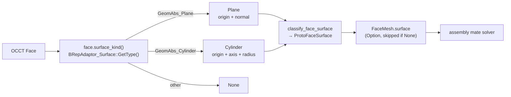

# Surface Classification

> **System** ▸ [Overview](../00-overview.md) ▸ [Kernel](../20-kernel.md) ▸ **Surface classification**
> Related: [Kernel subsystem map](./00-overview.md) · [Shape I/O & tessellation](./shape-io-tessellation.md) · [Assembly](../40-assembly.md)

---

## Requirements

| REQ | Status | Summary |
|-----|--------|---------|
| 749 | unapproved | Per-face plane/cylinder surface classification feeding the mate solver |

### REQ 749 — Surface classification

- **Description:** For each planar or cylindrical face it emits, the CAD kernel shall include a surface classification giving the surface kind (plane or cylinder), an origin point, and either the outward normal (plane) or the axis direction and radius (cylinder), expressed in the model coordinate frame. Faces whose surface is neither planar nor cylindrical may omit the classification.
- **Rationale:** The 3D mate solver consumes analytic surface geometry (plane normal/origin, cylinder axis/radius), not tessellated meshes. The kernel `FaceMesh` otherwise carries only positions, normals, indices, and a persistent name, so concentric and tangent mates cannot be resolved without this enrichment.
- **Verification:** Backend regen/kernel test asserting a cylindrical face reports a stable axis direction and radius and a planar face reports its normal and origin.
- **Validation:** Selecting a cylindrical hole face when creating a concentric mate yields a stable axis the solver uses to align two components coaxially.

---

## Succinct description

For every face it tessellates, the kernel asks OCCT whether the underlying surface is a plane or a cylinder and, if so, attaches the analytic geometry (plane origin + normal, or cylinder origin + axis + radius) as a `FaceSurface` field on the `FaceMesh`. The assembly mate solver consumes this instead of the triangle mesh.

## How it works — for everyone (non-technical)

A triangle mesh can *show* a round hole, but it can't tell you the hole's exact centerline or radius — it's just a fan of flat triangles. The mate solver, which lines parts up ("put this bolt's shaft inside that hole, perfectly centered"), needs the real numbers: where the flat faces point and where the round faces' centerlines run. So when the kernel finishes a shape, it inspects each surface and, if it's flat or cylindrical, records that exact information alongside the triangles. Surfaces that are neither (cones, spheres, free-form curves) simply skip it — the solver doesn't need them yet.

## How it works — in detail (technical)

### Where it happens

Classification is emitted inline during tessellation. Both `tessellate_faces_generic_with_topology` (the generic path) and `tessellate_and_name` (the extrude path) call `classify_face_surface(&face)` and store the result on `FaceMesh.surface`. The field is `Option<FaceSurface>` and is `skip_serializing_if = "Option::is_none"`, so non-plane/non-cylinder faces add nothing to the wire payload.

### The wire shape

`protocol.rs` defines the serialized form:

```text
FaceSurface {
  kind: "plane" | "cylinder",
  origin: [f64; 3],
  normal: Option<[f64; 3]>,   // plane only
  axis:   Option<[f64; 3]>,   // cylinder only
  radius: Option<f64>,        // cylinder only
}
```

`classify_face_surface` (in `shape_io.rs`) maps the kernel-internal enum into this wire struct:

- **Plane** → `kind: "plane"`, `origin`, `normal` (the outward normal).
- **Cylinder** → `kind: "cylinder"`, `origin` (axis location), `axis` (axis direction), `radius`.
- anything else → `None`.

### The OCCT adaptor (FFI)

The classification itself is `Face::surface_kind()` in the vendored crate (`cad-kernel/vendor/opencascade-rs/crates/opencascade/src/primitives/face.rs`). It constructs a `BRepAdaptor_Surface` over the face and switches on `GetType()`:

- `GeomAbs_Plane` → `FaceSurface::Plane { origin: center_of_mass(), normal: normal_at_center() }`. Origin and outward normal reuse the existing orientation-aware accessors (so the normal points outward); the adaptor isn't needed for the plane's analytic data.
- `GeomAbs_Cylinder` → reads the cylinder's location, axis direction, and radius from the adaptor (`BRepAdaptor_Surface_cyl_location` / `_cyl_direction` / `_cyl_radius`) into `FaceSurface::Cylinder { origin, axis, radius }`.
- every other `GeomAbs_SurfaceType` (cone, sphere, torus, B-spline, …) → `None`.

The FFI surface that makes this possible is two vendored cxx bridges:

- `cad-kernel/vendor/opencascade-rs/crates/opencascade-sys/src/b_rep_adaptor.rs` (header `include/b_rep_adaptor.hxx`) declares `BRepAdaptor_Surface_new(face)`, `GetType()`, and the three `cyl_*` accessors.
- `cad-kernel/vendor/opencascade-rs/crates/opencascade-sys/src/geom_abs.rs` (header `include/geom_abs.hxx`) declares the `GeomAbs_SurfaceType` enum (`GeomAbs_Plane`, `GeomAbs_Cylinder`, `GeomAbs_Cone`, `GeomAbs_Sphere`, `GeomAbs_Torus`, …).



### Why these two kinds, and stability

Plane and cylinder are exactly the surface types the mate solver needs for coincident-plane and concentric/coaxial mates. Because the values come from the analytic surface (not the mesh), a cylinder's axis direction and radius are stable across regenerations and zoom levels — the solver can rely on them to align components coaxially even as upstream parameters change. The `FaceSurface` Rust enum in the vendored `face.rs` is intentionally limited to "the kinds the assembly mate solver needs"; widening it (cones, spheres) is a future extension that touches only `surface_kind` + `classify_face_surface`.

## Key files

- `cad-kernel/src/ops/shape_io.rs` — `classify_face_surface` (kernel enum → wire `FaceSurface`)
- `cad-kernel/src/protocol.rs` — `FaceSurface` wire struct, `FaceMesh.surface`
- `cad-kernel/vendor/opencascade-rs/crates/opencascade/src/primitives/face.rs` — `Face::surface_kind`, `FaceSurface` enum
- `cad-kernel/vendor/opencascade-rs/crates/opencascade-sys/src/b_rep_adaptor.rs` (+ `include/b_rep_adaptor.hxx`) — `BRepAdaptor_Surface` FFI
- `cad-kernel/vendor/opencascade-rs/crates/opencascade-sys/src/geom_abs.rs` (+ `include/geom_abs.hxx`) — `GeomAbs_SurfaceType` enum
