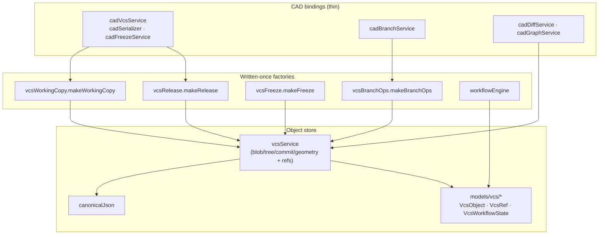

# VCS Subsystem Map

> **System** ▸ [Overview](../00-overview.md) ▸ [VCS](../30-vcs.md) ▸ **VCS subsystem map**
> Related: [Architecture: unified bindings](../architecture/unified-vcs-bindings.md) · [Content-addressed store](./content-addressed-store.md) · [Working copy](./working-copy-checkout-checkin.md) · [Release & revisions](./release-revisions.md)

---

## Requirements

| REQ | Status | Summary |
|-----|--------|---------|
| 668 | unapproved | Content-addressed version history per part CAD model (commits, branches, tags, dedup) |
| 677 | unapproved | Editor working copy bound to a checked-out branch (branch + base commit + dirty) |
| 684 | unapproved | Release freezes regenerated geometry onto the commit |
| 734 | unapproved | Protected `main` branch — all editing on draft branches |

### REQ 668 — Content-addressed version history (the spine)

- **Description:** The CAD module shall maintain the version history of each part's CAD model in a content-addressed version-control store that records immutable snapshots (commits), supports named branches and tags, and deduplicates unchanged content.
- **Rationale:** Replaces the ad-hoc revision-letter + releaseState + history-table scheme with a true version-control system (check-in/checkout, history, branches, diff) while deduplicating storage through structural sharing.
- **Verification:** Inspect VcsObject/VcsRef schema + vcsService unit tests for commit/branch/tag.
- **Validation:** A user can view the complete commit history of a CAD model and restore any prior snapshot.

### REQ 734 — Protected main

- **Description:** The CAD module shall protect the main branch from direct editing: checkout, check-in, and updates on main shall be rejected (423). main is the released history and advances only through the submit-approve-release flow.
- **Rationale:** main holds the immutable released revisions; all work happens on draft branches, keeping released history clean and auditable.
- **Verification:** Attempt checkout/edit on main → 423; release a draft → main advances.
- **Validation:** A user cannot edit main directly and is directed to a draft branch.

---

## Succinct description

A git-like, content-addressed object store keyed to a part's revision lineage, giving CAD models (and assemblies) check-out locks, check-in commits, branches, diff/compare, a declarative review workflow, geometry freeze on release, and release-to-Part-revision. The generic mechanics are written once as factory builders; CAD and assembly are thin bindings.

---

## How it works — for everyone (non-technical)

This is version control for 3D parts — the same kind of system software developers use for their code, but you never see the plumbing.

Think of it as a filing cabinet plus a time machine. Every time you finish a chunk of work you **check in**, which saves a permanent, named snapshot. You can return to any old snapshot, **compare** two of them to see exactly what changed, or start a **branch** to try an alternative without disturbing the official design. Because every snapshot is filed under a fingerprint of its own contents, the same thing is never stored twice and nothing can be quietly altered after the fact.

The official line of a part is called **main**, and it is protected — you can't scribble on it directly. You work on a draft branch and, when it's ready, you **release** it. Releasing freezes the exact geometry, stamps the part with its official revision number, and locks the design read-only.

This page is the map. Each linked page below covers one piece in depth.

---

## How it works — in detail (technical)

The subsystem is a stack: a domain-agnostic object store at the bottom, generic operation factories in the middle, and thin CAD/assembly bindings on top.

The factory pattern is the load-bearing idea: `makeWorkingCopy(binding)`, `makeBranchOps(binding)`, `makeFreeze(binding)`, `makeRelease(binding)` each return the full operation set, and a *binding* supplies only how a document is serialized, deserialized, regenerated, and frozen. CAD and assembly differ only in those bindings — every check-out/lock/branch/diff/release/workflow path exists exactly once. See [Architecture: unified VCS bindings](../architecture/unified-vcs-bindings.md).

### The pages of this subsystem

| Page | Covers | Key REQs |
|------|--------|----------|
| [Content-addressed store](./content-addressed-store.md) | blob/tree/commit/geometry objects, SHA-256 + canonical JSON, branch vs write-once tag refs, `(repoType, repoId)` = lineage root | 668–676, 688 |
| [Working copy: checkout / check-in](./working-copy-checkout-checkin.md) | checkout lock, check-in commit, undo checkout, autosave vs commit, force-unlock | 677–681, 690, 691, 725 |
| [Branches](./branches.md) | create/list/switch/archive, protected main, auto `draft/01`, per-branch workflow keying, behind-main, show/hide without checkout | 692–698, 730–736, 738–739, 742, 745 |
| [Workflow & review](./workflow-review.md) | declarative `draft → in_review → approved` engine, permission-guarded transitions, notifications | 703–707 |
| [Freeze geometry](./freeze-geometry.md) | freeze regenerated geometry to content-addressed objects on release, zero-kernel reconstruct, commit thumbnails | 684, 685, 710, 711 |
| [Release & revisions](./release-revisions.md) | release ties commit to Part revision; dev (numeric, self-service) vs production (letter, approval); STL/STEP export; lineage continuity | 686, 687, 715–724, 737, 740, 746 |
| [Diff & compare](./diff-compare.md) | structural tree diff, parameter/field diff, sketch entity diff, 3D body/face diff, Compare view + camera-lock | 699–702, 713, 714, 726 |
| [Merge & reconcile](./merge-reconcile.md) | no auto-merge; cherry-pick; feature-level merge of main into a behind-main branch | 696, 697, 741, 747 |
| [History graph](./history-graph.md) | commit ancestry walk/graph, branches tab, open-version action, revision list UI | 674, 732, 743 |

### Three distinct locks (do not confuse them)

| Lock | Meaning | HTTP guard |
|------|---------|-----------|
| `DesignCADModel.lockedByUserID` | transient edit/checkout lock (PDM checkout) | 423 |
| `DesignCADModel.releaseLocked` | CAD design read-only after release | 409 / 423 |
| `Parts.revisionLocked` | manufacturing-side revision immutability | 409 |

`main` itself is also protected for edit via `isLockedForEdit(model)` in the cad-model controller, independent of `releaseLocked`.

---

## Key files

- `backend/services/vcs/vcsService.js`, `canonicalJson.js` — content-addressed store
- `backend/services/vcs/vcsWorkingCopy.js`, `vcsBranchOps.js`, `vcsFreeze.js`, `vcsRelease.js` — written-once factories
- `backend/services/vcs/cadVcsService.js`, `cadSerializer.js`, `cadFreezeService.js`, `cadBranchService.js`, `cadDiffService.js`, `cadGraphService.js`, `workflowEngine.js`, `cadThumbnailSvg.js` — CAD bindings + engine
- `backend/models/vcs/` — `VcsObject`, `VcsRef`, `VcsWorkflowState`, `VcsChangeset`, `VcsUsage`
- `backend/api/design/cad-model/controller.js` — HTTP surface
