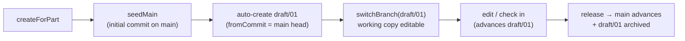

# Branches

> **System** ▸ [Overview](../00-overview.md) ▸ [VCS](../30-vcs.md) ▸ **Branches**
> Related: [VCS subsystem map](./00-overview.md) · [Working copy](./working-copy-checkout-checkin.md) · [Merge & reconcile](./merge-reconcile.md) · [Release & revisions](./release-revisions.md)

---

## Requirements

| REQ | Status | Summary |
|-----|--------|---------|
| 692 | unapproved | Create a named variant branch at a chosen commit (default: branch head) |
| 693 | unapproved | List a repository's branches |
| 694 | unapproved | Switch loads the branch's head doc; rejected while dirty |
| 695 | unapproved | Archive a branch ref; current branch + default not archivable |
| 696 | unapproved | Cherry-pick a single feature (no merge) — see Merge & reconcile |
| 697 | unapproved | No automatic merge; cherry-pick only — see Merge & reconcile |
| 698 | unapproved | Editor branch picker: create / switch / archive / cherry-pick |
| 730 | unapproved | Checking out a released revision creates the next numeric revision as a draft |
| 731 | unapproved | Creating a branch switches + checks it out; graph labels branch heads; footer shows branch |
| 732 | unapproved | Version-history Branches tab: list, create, open, archive |
| 733 | unapproved | Released read-only lock applies only on main; variant branches editable |
| 734 | unapproved | Protected `main` — checkout/check-in/update on main rejected (423) |
| 735 | unapproved | Draft branch displayed revision = highest released numeric + 1 (derived) |
| 736 | unapproved | New model seeds main + auto-creates and switches to `draft/01` |
| 738 | unapproved | Behind-main branch blocked from release until rebased |
| 739 | unapproved | Workflow state tracked per branch (lineage root + branch name) |
| 742 | unapproved | New feature/sketch ids globally unique (random), not sequential |
| 745 | unapproved | Show/hide bodies and sketches without checking out |

### REQ 734 — Protected main

- **Description:** The CAD module shall protect the main branch from direct editing: checkout, check-in, and updates on main shall be rejected (423). main is the released history and advances only through the submit-approve-release flow.
- **Rationale:** main holds the immutable released revisions; all work happens on draft branches, keeping released history clean and auditable.
- **Verification:** main is protected — checkout + edit return 423.
- **Validation:** A user cannot edit main directly and is directed to a draft branch.

### REQ 736 — Auto first draft branch

- **Description:** Creating a CAD model shall seed an initial commit on main and auto-create and switch the working copy to a first draft branch (`draft/01`), so the user always edits on a draft branch and never on protected main.
- **Rationale:** main is protected, so a brand-new part needs a draft branch to start work; auto-creating it removes a manual step.
- **Verification:** A new model lands on `draft/01`.
- **Validation:** Opening a new part CAD model lands the user on `draft/01`, editable.

### REQ 735 — Derived draft revision

- **Description:** A draft branch's displayed revision shall be derived as the highest released numeric revision in the lineage plus one. All concurrent draft branches therefore display the same draft revision number; no Part revision row is created until release.
- **Rationale:** Deriving the number avoids per-branch Part rows colliding on the unique `(name, revision)` constraint and gives every in-flight draft the same next-revision identity.
- **Verification:** All concurrent draft branches share the derived draft revision.
- **Validation:** Two draft branches both show the same next revision number.

---

## Succinct description

Variant branches are mutable refs in the object store. Create/list/switch/archive are written once in `vcsBranchOps.makeBranchOps`; `cadBranchService` binds them and adds CAD-specific reconciliation. `main` is protected; new models auto-land on `draft/01`; a draft branch's revision number is derived, never stored.

---

## How it works — for everyone (non-technical)

A branch is a parallel line of work on the same part. The official line is **main**, and it's locked — you never edit it directly. When you start a new part the system automatically makes you a working branch called **draft/01** and drops you onto it, so you're always editing a draft, never the official copy.

You can spin up extra branches to try an alternative design without disturbing your main work. The version-history view has a **Branches** tab where you can see every branch, jump into one (which checks it out for editing), or tidy up by archiving one you no longer need — archiving just removes the label; the snapshots themselves stay in history.

Every draft branch shows the *next* revision number it would become if released — and because that number is worked out on the fly, two people each on their own draft both see the same upcoming number. Whichever one releases first claims it; the other is then told its branch is "behind" and needs to catch up before it can release.

---

## How it works — in detail (technical)

### Generic branch operations (`vcsBranchOps.makeBranchOps`)

The binding supplies `repoFor`, `deserialize`, and `applyDoc`. The factory returns:

- `createBranch(model, name, { fromCommit })` — default `fromCommit` is the current branch head; errors (409) if the name is taken or (400) if there is no commit yet.
- `listBranches(model)` — all `'branch'` refs (REQ 693).
- `switchBranch(model, name)` — rejected (409) while `model.dirty`; loads the branch head's doc into the working copy and sets `branchName`, `baseCommitHash`, `dirty=false`, and `releaseLocked = (name === 'main')` — so **main is read-only but a draft branch is editable** (REQ 733/694).
- `archiveBranch(model, name)` — refuses the current branch and `main` (409); otherwise `deleteRef` removes only the pointer (the commits stay reachable from wherever else they're referenced) (REQ 695).

### Protected main (REQ 734)

The controller's `isLockedForEdit(model)` returns true whenever `(model.branchName || 'main') === 'main'`, independent of `releaseLocked`. Checkout, check-in, and updates on `main` are rejected with 423. `main` advances only through release (see [Release & revisions](./release-revisions.md)).

### Auto first branch (REQ 736)

`createForPart` (`cad-model/controller.js`): `cadVcsService.seedMain` makes the initial `main` commit, then it creates `draft/${derivedDraftRev}` from the main head and `switchBranch`es onto it. It is idempotent — if the lineage repo already holds that draft ref (e.g. a prior model was soft-deleted), it reuses it instead of erroring.

### Derived draft revision (REQ 735)

`cadVcsService.derivedDraftRev(model) = padNumeric(highestReleasedNumeric(model) + 1)`. `highestReleasedNumeric` reads the max numeric `Parts.revision` for the part name — the `Parts` table is the single source of truth, advancing only on a dev release / new revision. So every concurrent draft shows the same derived number, and it bumps as soon as a new revision exists. `withReleaseFlag` exposes `displayRevision` / `draftRevision` / `behindMain` to the editor (the footer reads those, **not** `part.revision`).

### Behind-main (REQ 738)

`cadBranchService.behindMain(model)` is true when `main`'s head is **not** in the branch's ancestry (`vcs.walk`) — i.e. main advanced (another branch released) since this branch last incorporated it. `main` itself is never behind. A behind-main branch is blocked from release until reconciled; the UI surfaces a **Merge** action (see [Merge & reconcile](./merge-reconcile.md)). `rebaseBranch` (whole-tree, last-writer-wins) also exists but is superseded in the UI by the feature-level merge.

### Per-branch workflow keying (REQ 739)

The controller composes `workflowRepo(model) = { repoType, repoId: "<lineageRoot>:<branchName>" }` for all workflow `getState`/`setState`/`canRelease`/`transition`. So multiple draft branches can each be in review at once, and `main` keeps its own production-approval cycle. (Anything calling the engine with the bare lineage-root repo would read the wrong state.)

### Globally-unique ids (REQ 742)

New feature and sketch ids are random/global (frontend `cad/lib/ids.ts`), not sequential per document. Sequential ids would collide across branches off the same point, which a feature-level merge would conflate. The origin feature (`f1`) stays a fixed shared seed.

### Show/hide without checkout (REQ 745)

Hiding bodies/sketches is a read-only viewing action. When the part is **not** checked out, body and sketch visibility toggles apply as a transient view-only change (not persisted). When the part **is** checked out, sketch visibility persists as part of the working copy. Implemented in the editor's `toggleBodyVisibility` (always transient) / `toggleSketchVisibility` (persists only when checked out).

### Editor + history surface (REQ 698, 731, 732)

- The editor footer branch picker shows the current branch + count and offers create / switch / archive / cherry-pick.
- Creating a branch immediately switches + checks it out; the version graph labels each branch on its head commit; the footer displays the current branch name.
- The version-history **Branches** tab (`cad-revision-list.component.ts`) lists every branch with its head, marks the current branch, and offers New branch / Open (switch + checkout) / Archive, plus the **Merge** action on a behind-main branch.

---

## Key files

- `backend/services/vcs/vcsBranchOps.js` — `makeBranchOps` factory (create/list/switch/archive)
- `backend/services/vcs/cadBranchService.js` — CAD binding + `behindMain`, `rebaseBranch`, cherry-pick, reconcile
- `backend/services/vcs/cadVcsService.js` — `repoForModel`, `derivedDraftRev`, `highestReleasedNumeric`, `seedMain`
- `backend/api/design/cad-model/controller.js` — `createForPart`, `isLockedForEdit`, `workflowRepo`, branch routes
- `frontend/src/app/components/cad/cad-revision-list/cad-revision-list.component.ts` — Branches tab
