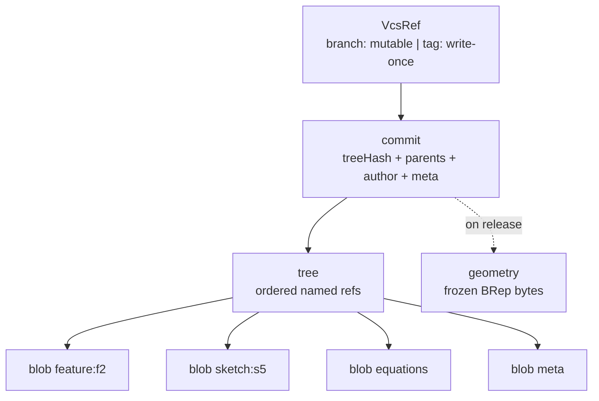

# Content-Addressed Object Store

> **System** ▸ [Overview](../00-overview.md) ▸ [VCS](../30-vcs.md) ▸ **Content-addressed store**
> Related: [VCS subsystem map](./00-overview.md) · [Working copy](./working-copy-checkout-checkin.md) · [History graph](./history-graph.md) · [Architecture: unified bindings](../architecture/unified-vcs-bindings.md)

---

## Requirements

| REQ | Status | Summary |
|-----|--------|---------|
| 668 | unapproved | Content-addressed store: immutable commits, named branches/tags, dedup of unchanged content |
| 669 | unapproved | Every object identified by SHA-256 of canonical content; stored at most once |
| 670 | unapproved | Canonical serialization — equal logical content ⇒ byte-identical ⇒ equal hash |
| 671 | unapproved | Three core kinds: blob (leaf), tree (named child refs), commit (one tree) |
| 672 | unapproved | Commit references tree + parents + author + message + timestamp + version meta; immutable DAG |
| 673 | unapproved | Named refs scoped to `(repoType, repoId)`: mutable branches, write-once tags |
| 674 | unapproved | Traverse commit ancestry (log/walk) from any branch or tag |
| 675 | unapproved | Binary objects (frozen geometry) addressed by byte-content hash, deduplicated |
| 676 | unapproved | `component` object kind referencing another repo's commit (assembly seam) |
| 688 | unapproved | One repository per part lineage; history continuous across revisions |

### REQ 669 — Content addressing & dedup

- **Description:** The version-control store shall identify every stored object by a SHA-256 hash of its canonical serialized content, and shall store at most one copy of any object whose content hash already exists (deduplication).
- **Rationale:** Content addressing gives immutable, tamper-evident identity and O(changes) storage via structural sharing of unchanged content.
- **Verification:** Unit test: identical content stores one row + same hash regardless of key order; different content yields distinct hashes.
- **Validation:** Editing one feature and re-committing a model does not duplicate the unchanged features in storage.

### REQ 670 — Canonical serialization

- **Description:** The store shall serialize object content canonically such that two objects with equal logical content produce byte-identical serializations (and therefore equal hashes), independent of key insertion order or numeric formatting.
- **Rationale:** Non-deterministic serialization would break deduplication and diff; a canonical form is the linchpin of content addressing.
- **Verification:** Unit test: reordered keys / numerically-equivalent values hash equal; re-serialization is idempotent.
- **Validation:** Two identical model states always compare as equal in history and diff views.

### REQ 673 — Scoped refs: branches vs write-once tags

- **Description:** The store shall provide named references scoped to a repository identified by `(repoType, repoId)`: branches, which are mutable pointers to a commit, and tags, which are write-once pointers to a commit.
- **Rationale:** Branches enable variant lines of development; write-once tags provide immutable release markers; per-repository scoping isolates each part's history.
- **Verification:** Unit test: branch advances; tag is write-once; refs isolated per repo.
- **Validation:** A user can create a variant branch and a permanent release tag independently of other models.

---

## Succinct description

A domain-agnostic, git-modeled object store (`vcsService.js`) where every object — blob, tree, commit, geometry, component, thumbnail — is addressed by the SHA-256 of its canonical content and stored once per repository, with mutable branch refs and write-once tag refs.

---

## How it works — for everyone (non-technical)

Imagine a warehouse where every box is labelled with a fingerprint taken from exactly what's inside it. If two boxes contain the identical thing, they get the identical label — so you only ever keep one of them. Change anything inside and the fingerprint changes, so you can never quietly swap the contents of a box without it getting a new label.

There are a few kinds of box. A **blob** holds one small thing (one feature, one sketch). A **tree** is a box that just lists other boxes by their labels — it's the table of contents for a whole model. A **commit** is a dated, signed snapshot that points to one table-of-contents box and to the snapshot(s) that came before it, forming an unbroken chain back through history.

Finally there are sticky notes — **branches** (which you can move to point at a newer snapshot) and **tags** (which, once placed, can never be moved). Every part has its own warehouse, so one part's history never gets tangled with another's.

---

## How it works — in detail (technical)

### Object kinds and hashing

`vcsService.js` stores six object kinds in the `VcsObjects` table (`backend/models/vcs/vcsObject.js`), validated to `['blob','tree','commit','geometry','component','thumbnail']`. The hash preimage folds the kind in (`kind + ' ' + canonicalJson(content)` for JSON, `kind + ' ' + bytes` for binary) so a blob and a tree with otherwise-identical payloads never collide:

- `writeBlob(repo, content)` — a leaf content unit (`kind: 'blob'`).
- `writeTree(repo, entries)` — an **ordered** list `[{ name, kind, hash }]`; order is preserved exactly (the feature tree is order-significant).
- `createCommit(repo, { treeHash, parents, authorUserID, message, timestamp, meta })` — the commit's hash covers `parents`, so a parent-only change yields a different hash → tamper-evident DAG (REQ 672). The caller supplies `timestamp` (never `Date.now()` inside), so the hash is reproducible.
- `putBinary(repo, kind, bytes)` — binary objects (frozen geometry) addressed by byte hash (REQ 675).

All writes go through `findOrCreate` keyed on `(repoType, repoId, hash)`, so identical content is a no-op insert — that is the deduplication (REQ 669).

### Canonical JSON (`canonicalJson.js`)

This is the linchpin (REQ 670). It differs from `JSON.stringify` in two ways that matter for content addressing:

1. **Object keys are emitted in sorted order** — insertion order is erased, so `{a:1,b:2}` and `{b:2,a:1}` hash equal.
2. **Non-finite numbers (`NaN`/`±Infinity`) and `bigint` throw** instead of silently collapsing to `null`, so two distinct values can never collide on one hash.

Arrays stay ordered (order is semantic). `-0` collapses to `0`; `undefined`-valued keys are omitted like `JSON.stringify`. The stored `size` is `Buffer.byteLength(canonicalJson(content))`.

### Refs: branches and tags (`VcsRef`)

`VcsRefs` are unique on `(repoType, repoId, name)`, kind `'branch'` or `'tag'`:

- `createBranch` / `updateBranch` — branches are mutable; `updateBranch` advances the target hash.
- `createTag` — **write-once**: it throws if a ref of that name already exists. Release tags are named for the Part revision (`01`, `02`, …, `A`, `B`, …).
- `deleteRef` — removes a ref pointer only; the objects it reached stay in the store (this is how a branch is archived without losing its commits).

### History traversal

- `walk(repo, commitHash)` — breadth-first over `parents`, de-duping shared ancestors, newest→oldest, returning `[{ hash, ...commitContent }]` (REQ 674).
- `log(repo, refName)` — resolves a branch/tag to its target then `walk`s from there.

### Repo scoping = part lineage root

A repo is `{ repoType, repoId }`. `repoId` is the **part-revision lineage root**: `cadVcsService.repoForModel` walks `Part.previousRevisionID` back to the root part id and uses that. So when manufacturing cuts a new Part revision (a new `Parts` row), the CAD history stays one continuous repository rather than forking a fresh history per revision (REQ 688). `repoType` is `'cad'` for parts and `'assembly'` for assemblies.

### Reserved seams

- **`component` kind** (REQ 676): an object kind whose content references another repository's commit (a pinned hash or a symbolic rule), so an assembly snapshot can record exactly which version of each child part it composed. The kind is reserved in the model's validator today.
- **`VcsChangeset`** and **`VcsUsage`** models exist as cross-repo seams (atomic multi-repo check-ins; a where-used reverse index for impact analysis). They are wired when the assembly editor lands; trivially empty for single-part repos.

---

## Key files

- `backend/services/vcs/vcsService.js` — the object store kernel (objects, refs, history)
- `backend/services/vcs/canonicalJson.js` — deterministic serialization
- `backend/models/vcs/vcsObject.js` — `VcsObjects` (content/bytes, per `(repoType, repoId, hash)`)
- `backend/models/vcs/vcsRef.js` — `VcsRefs` (branch/tag, unique per repo+name)
- `backend/models/vcs/vcsChangeset.js` — cross-repo changeset seam (reserved)
- `backend/models/vcs/vcsUsage.js` — where-used reverse index (assembly seam, reserved)
