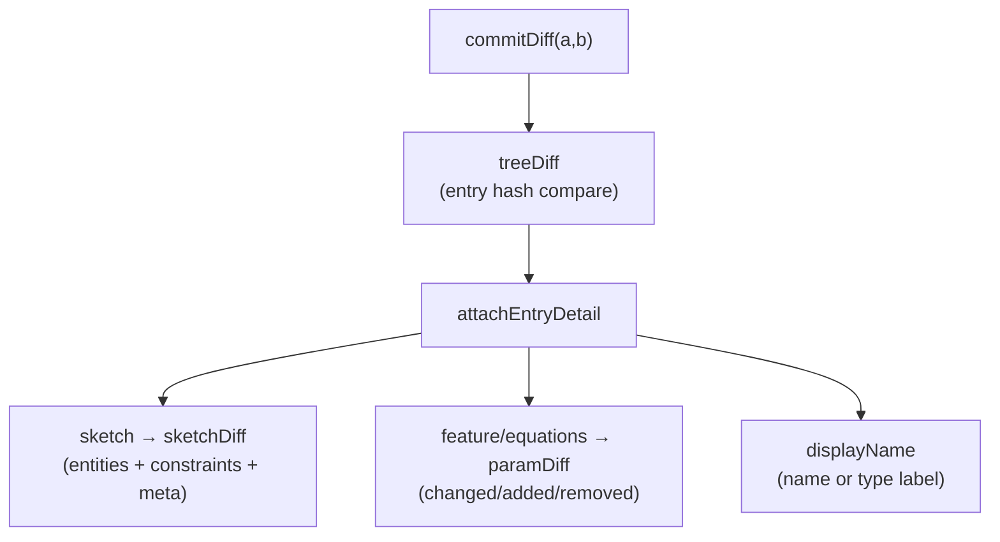

# Diff & Compare

> **System** ▸ [Overview](../00-overview.md) ▸ [VCS](../30-vcs.md) ▸ **Diff & compare**
> Related: [VCS subsystem map](./00-overview.md) · [Content-addressed store](./content-addressed-store.md) · [Merge & reconcile](./merge-reconcile.md) · [History graph](./history-graph.md)

---

## Requirements

| REQ | Status | Summary |
|-----|--------|---------|
| 699 | unapproved | Structural diff classifying each feature/sketch/equations added/removed/modified/unchanged by hash |
| 700 | unapproved | Modified feature/equations reports which fields changed, old → new |
| 701 | unapproved | Body-level 3D diff by regenerating each commit (frozen → no kernel) |
| 702 | unapproved | Editor Compare view: structural diff + cherry-pick a changed feature |
| 713 | unapproved | Compare colours faces by persistent-name diff (added green / removed red) |
| 714 | unapproved | Modified-sketch diff lists entity/constraint/dimension changes |
| 726 | unapproved | Compare view camera-lock toggle synchronizing the two previews |

### REQ 699 — Structural diff (hash-based)

- **Description:** The system shall compute a structural diff between two commits, classifying each feature, sketch, and the equations set as added, removed, modified, or unchanged by comparing content hashes, so unchanged items are detected in constant time.
- **Rationale:** Content-hash comparison makes diff O(number of changes): identical subtrees compare equal by hash without inspecting their contents.
- **Verification:** Unit/route test: commit diff classifies added/removed/modified/unchanged per feature/sketch/equations by hash.
- **Validation:** A user can see exactly which features/sketches changed between two versions.

### REQ 700 — Field-level detail

- **Description:** For a modified feature or equations set, the diff shall report which parameters or fields changed, with their old and new values.
- **Rationale:** Knowing a feature changed is not enough; the user needs to see what changed (e.g. distance 10 → 25).
- **Verification:** Unit test: a modified feature reports the changed field with old/new values.
- **Validation:** A user can see the specific parameter changes within a modified feature.

### REQ 714 — Sketch entity/constraint diff

- **Description:** For a modified sketch, the CAD diff shall list the specific entity and constraint changes — which sketch entities were added, removed or changed, and the old→new value of any changed dimension — rather than reporting only that the sketch changed.
- **Rationale:** A reviewer needs to see exactly which line, constraint or dimension a revision altered.
- **Verification:** `cad-diff.test.js (sketchDiff)`.
- **Validation:** Open the diff for two commits that changed a dimension and confirm it shows e.g. "distance d1: 10 → 25".

---

## Succinct description

`cadDiffService.js` computes a structural diff between two commits by comparing tree-entry hashes (O(changes)), attaches field-level detail to modified blobs (a sketch entity/constraint sub-diff, a one-level paramDiff for features/equations), and a 3D diff that classifies each body and colours faces by persistent name. The frontend `diffFormat.ts` renders the structural diff into readable lines.

---

## How it works — for everyone (non-technical)

To compare two versions of a part, the system lines up their tables of contents and checks the fingerprints. Anything with the same fingerprint on both sides is unchanged and skipped instantly — no need to look inside. What's left is the real change list: features that were **added**, **removed**, or **modified**, the same for sketches, plus the equations.

For anything modified, it digs in and tells you *what* changed: a feature's "distance 10 → 25", or, inside a sketch, exactly which lines were added and which dimension was edited. There's also a picture-level comparison: the two 3D models are placed side by side, and the geometry that's new is tinted green while geometry that's gone is tinted red, so a reviewer can see the change at a glance. A camera-lock keeps both 3D views pointed the same way, so when you rotate one the other follows.

---

## How it works — in detail (technical)

### Structural diff (`treeDiff` → `commitDiff`)

`treeDiff(repo, treeHashA, treeHashB)` reads both trees and compares entries by name. The `meta` bookkeeping entry is skipped. For each name: present only in A = `removed`, only in B = `added`, present in both with **different hashes** = `modified`, same hash = `unchanged`. Identical subtrees compare equal by hash with no content inspection — that's the O(changes) property (REQ 699).

`commitDiff(repo, a, b)` runs `treeDiff` then `attachEntryDetail`, which for each modified entry:

- gives it a `displayName` (the feature/sketch's own `name`, else a friendly type label from `FEATURE_TYPE_LABEL`, e.g. `Extrude`, `Cut-Extrude`, `Fillet`);
- on a **feature/equations** modify, attaches `paramDiff` — a one-level field diff `{ changed: [{key,a,b}], added, removed }` (REQ 700);
- on a **sketch** modify, attaches `sketchDiff` (REQ 714).

`workingDiff(model)` runs the same diff between the live working copy (serialized to a tree, deduped — same work as check-in minus the commit) and its base commit — the uncommitted changes that power the check-in dialog.

### Sketch sub-diff (`sketchDiff`)

Indexes entities and constraints by id and classifies each added/removed/modified by JSON equality. Constraints carry their value (`a`/`b`) so a dimension edit reads "distance 10 → 25". `meta` captures `name` and `visible` changes.

### 3D diffs

- `bodyDiff3D(model, a, b)` — regenerates each commit's geometry and classifies each body `added`/`removed`/`modified`/`unchanged`. `modified` is decided by `bodySignature` (a sha256 over the body's face positions/indices). Frozen commits skip the kernel (REQ 701).
- `faceNameDiff(model, a, b)` — returns each commit's set of `persistentName`s so the viewer can colour faces present only in B as **added (green)** and faces present only in A as **removed (red)** (REQ 713). A resized face keeps its name → unchanged.
- `regenCommitGeometry` is the shared helper: `meta.frozen` → `loadFrozenGeometry` (no kernel), else deserialize + `cadRegenService.regenerateModel`. It loads the `part` so sketch-text placeholders (`#{partName}` etc.) expand to the same glyph/region set the frontend stored its `regionIndices` against — otherwise cut/extrude region selection drifts.

### Frontend formatting (`diffFormat.ts`)

`formatDiffEntry(e)` produces a top line (sign `+`/`−`/`~`, display name, and up to three `paramDiff` field deltas) plus indented sub-lines from `sketchSublines`. Sketch sub-lines list constraint/dimension edits first (the user's real change), then summarise geometry edits by kind/count (so a re-solve nudging every point reads as one line, not noise). Shared by the Compare view and the check-in dialog.

### Compare view + camera-lock (REQ 702, 726)

The version-history Compare view (`cad-revision-list.component.ts`) picks two commits, renders the structural diff with status colours, and offers cherry-pick of a changed feature into the working copy. A camera-lock toggle (default enabled) synchronizes rotation/pan/zoom across the two side-by-side previews; disabling it decouples them for independent inspection.

---

## Key files

- `backend/services/vcs/cadDiffService.js` — `treeDiff`, `commitDiff`, `workingDiff`, `sketchDiff`, `paramDiff`, `bodyDiff3D`, `faceNameDiff`, `regenCommitGeometry`
- `frontend/src/app/cad/lib/diffFormat.ts` — structural-diff line formatting
- `frontend/src/app/components/cad/cad-revision-list/cad-revision-list.component.ts` — Compare view + camera-lock
- `backend/services/vcs/cadFreezeService.js` — frozen geometry reuse for 3D diff
