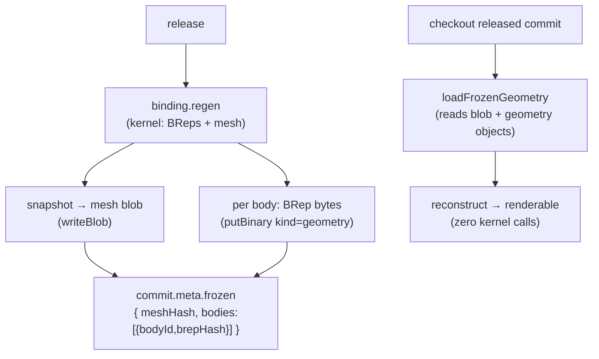

# Freeze Geometry

> **System** ▸ [Overview](../00-overview.md) ▸ [VCS](../30-vcs.md) ▸ **Freeze geometry**
> Related: [VCS subsystem map](./00-overview.md) · [Release & revisions](./release-revisions.md) · [Content-addressed store](./content-addressed-store.md) · [Architecture: unified bindings](../architecture/unified-vcs-bindings.md)

---

## Requirements

| REQ | Status | Summary |
|-----|--------|---------|
| 684 | unapproved | On release, store each body's BRep + mesh as content-addressed objects on the commit |
| 685 | unapproved | Checking out a released commit loads frozen geometry (no kernel); a draft regenerates |
| 710 | unapproved | On check-in, capture a low-res thumbnail from the default view, store it with the commit |
| 711 | unapproved | Version-history 3D preview shows the stored image immediately while the mesh loads |

### REQ 684 — Freeze on release

- **Description:** On release, the system shall regenerate the model and store each resulting body's geometry (boundary representation and tessellated mesh) as immutable, content-addressed objects referenced by the released commit, such that the released geometry can be reproduced exactly without invoking the geometry kernel.
- **Rationale:** The BRep cache is evictable and the kernel changes between versions, so a released revision is not otherwise reproducible. Freezing makes released revisions immutable and byte-stable, which a regulated QMS requires.
- **Verification:** Integration test (kernel stubbed): on freeze, per-body BReps are stored as content-addressed geometry objects + a mesh snapshot blob, referenced by the release commit meta.
- **Validation:** A released revision's 3D geometry never changes, even after the kernel is upgraded.

### REQ 685 — Frozen checkout vs draft regen

- **Description:** Checking out a released commit shall load its frozen geometry directly without a kernel regeneration; checking out a draft commit shall regenerate the geometry from the model recipe.
- **Rationale:** Released revisions are frozen (fast, immutable); drafts are live and must reflect the current recipe and kernel.
- **Verification:** Integration test: loading a frozen commit reconstructs geometry from stored objects with zero kernel calls; a draft commit regenerates.
- **Validation:** Opening a released revision is fast and identical to what was released; opening a draft shows current geometry.

### REQ 710 — Commit thumbnail

- **Description:** On check-in, the CAD module shall capture a low-resolution raster image of the model rendered from its default view and store that image associated with the resulting commit.
- **Rationale:** A cached thumbnail lets the version-history view show each commit instantly without a kernel regeneration.
- **Verification:** `backend/tests/__tests__/vcs/cad-commit-thumbnail.test.js`.
- **Validation:** Check in a change and confirm the commit shows a thumbnail in the version-history view.

---

## Succinct description

On release, the model is regenerated once and each body's BRep plus a renderable mesh snapshot are stored as immutable content-addressed objects, referenced from the release commit's `meta.frozen`. Checking out a frozen commit reconstructs geometry from those objects with zero kernel calls. A low-res thumbnail captured at check-in lets history render instantly. `vcsFreeze.makeFreeze` is the written-once factory; `cadFreezeService` binds it.

---

## How it works — for everyone (non-technical)

While you're designing, the 3D shape you see is computed fresh from your recipe of steps every time — so it always reflects your latest edits. That's perfect for a draft, but it's a problem for a *released* part: the program that does the computing changes over time, so the very same recipe might one day produce a slightly different shape. For a controlled, shipped revision that's unacceptable.

So at the moment of release, the system computes the shape once and **freezes** it: it photographs the finished geometry and files those photos permanently alongside the snapshot. From then on, opening that released revision just unwraps the frozen photos — instant, and guaranteed identical to what was released, no matter how the design program changes later. Opening a *draft* still recomputes live.

Separately, every time you check in, the system grabs a small thumbnail picture of your model so the history list can show each version at a glance immediately, before the full interactive 3D has finished loading.

---

## How it works — in detail (technical)

### The freeze factory (`vcsFreeze.makeFreeze`)

The binding supplies three functions:

- `regen(model, { kernelClient, db })` → geometry `{ bodies: [{ id, brep, ... }], ... }`;
- `snapshot(geometry)` → a content-addressable mesh snapshot **without** the BReps;
- `reconstruct(snapshot, brepByBody)` → renderable geometry with BReps merged back.

The factory returns:

- `freezeGeometry(repo, model, { kernelClient })` — regenerates, stores the mesh snapshot as a `blob`, and stores each body's BRep as a binary `geometry` object (`putBinary`). Returns `{ meshHash, bodies: [{ bodyId, brepHash }] }`.
- `loadFrozenGeometry(repo, frozen)` — reads the mesh `blob` + each body's BRep bytes back, then `reconstruct`s — **stored objects only, zero kernel calls** (REQ 685).
- `geometryForCommit(repo, model, commitHash)` — if the commit's `meta.frozen` is set, `loadFrozenGeometry`; otherwise a live `regen` (a draft).

### CAD binding (`cadFreezeService.js`)

- `regen` → `cadRegenService.regenerateModel(model, { includeBodyBreps: true })`.
- `snapshot` → `meshSnapshot(regen)`: keeps `features` (`featureId`, `bodyId`, `faces`, `topology`, `error`), `bodies` (`id`, `name`), and `errors` — and drops the evictable BReps and per-feature cache flags so it is stable and content-addressable.
- `reconstruct` → re-attaches `brep` to each body from `brepByBody` and marks `frozen: true`.

The release commit's `meta` carries `{ ...commitMeta(), frozen }` (set in `vcsRelease.makeRelease`); the diff and history paths read `meta.frozen` to decide whether to reuse stored geometry or regenerate (see [Diff & compare](./diff-compare.md)).

### Commit thumbnails (REQ 710, 711)

Two thumbnail paths exist:

1. **Client-captured PNG at check-in.** `cadVcsService.storeThumbnail/loadThumbnail` store a low-res PNG (captured from the model's default view) as a binary `thumbnail` object. Because `VcsObject.hash` is `varchar(64)`, the key is `sha256("thumb:" + commitHash)` (a literal `thumb-<hash>` would overflow 64 chars) — deterministic per commit, not content-addressed.
2. **Server-rendered SVG (backfill only).** `cadThumbnailSvg.renderGeometrySvg(geo)` produces a static isometric, flat-shaded SVG via a painter's algorithm (no canvas/raster lib), mirroring the client `cad-mini-preview` look. This is used by `backend/scripts/backfill-cad-thumbnails.js` to generate thumbnails for commits created before client-capture was introduced — not as a runtime fallback. When no thumbnail exists the controller returns 404.

The version-history 3D preview shows the stored image immediately as a placeholder, then swaps in the interactive tessellated mesh once loaded (REQ 711).

---

## Key files

- `backend/services/vcs/vcsFreeze.js` — `makeFreeze` factory (freeze / load / geometryForCommit)
- `backend/services/vcs/cadFreezeService.js` — CAD binding (`meshSnapshot`, regen with body BReps)
- `backend/services/vcs/cadVcsService.js` — `storeThumbnail` / `loadThumbnail` (PNG at check-in)
- `backend/services/vcs/cadThumbnailSvg.js` — server-side SVG thumbnail renderer
- `backend/services/cadRegenService.js` — `regenerateModel` (the regen the freeze binding calls)
