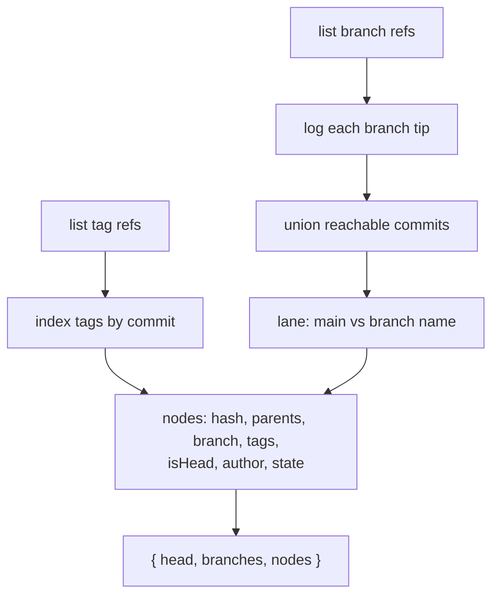

# History Graph

> **System** ▸ [Overview](../00-overview.md) ▸ [VCS](../30-vcs.md) ▸ **History graph**
> Related: [VCS subsystem map](./00-overview.md) · [Content-addressed store](./content-addressed-store.md) · [Diff & compare](./diff-compare.md) · [Branches](./branches.md)

---

## Requirements

| REQ | Status | Summary |
|-----|--------|---------|
| 674 | unapproved | Traverse commit ancestry (log/walk) from any branch or tag to an ordered history |
| 732 | unapproved | Version-history Branches tab: list/create/open/archive branches |
| 743 | unapproved | "Open version" action opens a commit read-only in the editor |

### REQ 674 — Ancestry traversal

- **Description:** The version-control store shall traverse commit ancestry (log/walk) starting from any branch or tag to produce the ordered commit history.
- **Rationale:** History viewing, diff, and cherry-pick all depend on walking the commit DAG from a reference.
- **Verification:** Unit test: log walks ancestry from a ref newest-to-oldest.
- **Validation:** A user can view the full ordered commit history of a model branch.

### REQ 743 — Open version (read-only)

- **Description:** The version-history view shall provide an "Open version" action on a selected commit that opens that commit in the CAD editor in read-only mode — loading the commit's feature tree and geometry — without modifying the working copy or current branch.
- **Rationale:** Engineers reviewing change history need to inspect a past revision full-screen with the feature tree and full 3D navigation, beyond the small inline preview, without risking accidental edits to the live working copy.
- **Verification:** Open-version button (revision list); read-only `?commit=` view (editor); `getCommitDoc` endpoint (controller + routes).
- **Validation:** An engineer opens a past commit read-only (editing tools disabled, a banner identifies the historical version), and the working copy / current branch is unchanged afterward.

### REQ 732 — Branches management tab

- **Description:** The version-history view shall provide a Branches management tab listing every branch with its head commit (hash, message, author, date), marking the current branch, with create / open (switch + check out) / archive actions.
- **Rationale:** Consolidating branch listing and lifecycle in the history view gives one place to see and manage all variant branches.
- **Verification:** Branch list/create/switch/archive backend; the Branches tab UI in the revision list.
- **Validation:** A user opens CAD history, selects the Branches tab, sees all branches, and can create, open, or archive a branch.

---

## Succinct description

`cadGraphService.buildGraph` walks every branch ref, collects all reachable commits, assigns each a lane (main vs experiment), attaches release tags / HEAD / resolved author, and returns a newest-first node list. The frontend `cad-revision-list` renders it as a Graph / Diff / Log / Branches view set, with an "Open version" read-only action.

---

## How it works — for everyone (non-technical)

The version history is a family tree of your part's snapshots. The system starts from the tip of every branch and walks backward through each snapshot's parents, collecting them all and ordering them newest-first. Snapshots on the official line sit in one column; snapshots that only exist on an experimental branch sit in another, so you can see at a glance which work belongs where. Release stamps show up as badges, and the snapshot you're currently sitting on is marked HEAD.

The history screen has a few views: a **Graph** (the visual tree), a **Diff** (compare any two snapshots), a **Log** (a plain table), and a **Branches** tab (manage your branches). From any snapshot you can hit **Open version** to load that exact past revision full-screen in the editor — but read-only, with the editing tools switched off and a banner reminding you it's a historical view, so you can look without any risk of changing your live work.

---

## How it works — in detail (technical)

### Walk + log (the primitives, REQ 674)

The graph is built on `vcsService.walk` / `log` (see [Content-addressed store](./content-addressed-store.md)): `walk` is a breadth-first traversal over each commit's `parents`, de-duping shared ancestors and returning newest→oldest; `log` resolves a branch/tag to its target hash and walks from there.

### Graph builder (`cadGraphService.buildGraphForRepo`)

`buildGraph(model)` → `buildGraphForRepo(repo, model.baseCommitHash)` (repo-keyed, so it works for CAD or assembly):

1. List `branch` and `tag` refs; index tags by their target commit.
2. `log` every branch tip and union all reachable commits into a map.
3. **Lane assignment:** everything reachable from `main` is on the `main` lane; any commit reachable only from another branch takes that branch's name as its lane (`lane: 'main' | 'exp'`).
4. The HEAD node is `headHash` (the working copy's `baseCommitHash`), falling back to main's tip.
5. Resolve authors in one `User.findAll`; attach `{ id, name, initials }`.
6. Emit nodes (newest first by `timestamp`) carrying `hash`, `shortHash`, `parents`, `message`, `branch`, `lane`, `tags`, `isHead`, `author`, and `state` (`'released'` if tagged, else `'draft'`).

Returns `{ head, branches: [{name, head}], nodes }`. The per-node "what changed" diff is computed on demand by `cadDiffService.commitDiff` — not bundled here (see [Diff & compare](./diff-compare.md)).

### Frontend (`cad-revision-list.component.ts`)

Selector `app-cad-revision-list`. Four views toggled in the header: **Graph** (branch timeline with branch-head chips and per-commit `app-cad-mini-preview` thumbnails), **Diff** (pick two commits → `commitDiff` with face-colour status and camera-synced previews), **Log** (commit table), **Branches** (`branchList()` with current-branch marker + New branch / Open / Merge / Archive).

- **Open version** (REQ 743) → `openVersion(v)` opens the editor at `?commit=<hash>` read-only. The controller's `getCommitDoc(:id/:hash)` returns `{ featureTree, sketchDoc, equations, hash, message }` deserialized from the commit's tree — it never touches the working copy or current branch.
- **Open** (Branches tab) → `switchToBranch(name)` switches + checks out the branch in the editor.

### Inline previews

`app-cad-mini-preview` and `app-cad-preview-3d` (used in Graph/Diff/Compare) render per-commit geometry; they first show the stored commit thumbnail as a placeholder, then the interactive mesh (see [Freeze geometry](./freeze-geometry.md), REQ 711).

---

## Key files

- `backend/services/vcs/cadGraphService.js` — `buildGraph`, `buildGraphForRepo`, `initialsOf`
- `backend/services/vcs/vcsService.js` — `walk` / `log` ancestry traversal
- `backend/api/design/cad-model/controller.js` — `getCommitDoc` (Open version), graph + branch routes
- `frontend/src/app/components/cad/cad-revision-list/cad-revision-list.component.ts` — Graph / Diff / Log / Branches views, Open version
