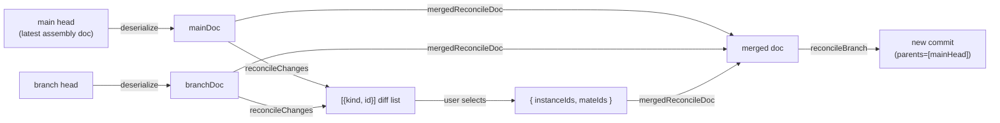

# assemblyBranchService — Assembly Branch Operations

> **System** ▸ [Overview](../../00-overview.md) ▸ [VCS](../00-overview.md) ▸ [Branches](../branches.md) ▸ **assemblyBranchService**
> Related: [vcsBranchOps](./vcsBranchOps.md) · [assemblyVcsService](./assemblyVcsService.md) · [cadBranchService](./cadBranchService.md)

---

## Requirements

Requirements governed by [Branches](../branches.md) — the same REQs 692–697 that apply to CAD branches.

---

## Succinct description

Assembly-specific branch operations: wires `vcsBranchOps` for the four shared operations (create/list/switch/archive), then adds an instance/mate-level merge (`reconcileBranch`) and a diff utility (`reconcileChanges`) that are the assembly analogues of `cadBranchService`'s feature-level reconciliation.

## How it works — for everyone (non-technical)

Assemblies support the same branching as individual parts: you can create alternative versions, switch between them, and merge main's latest changes into your draft. Instead of merging features, assembly reconciliation merges component placements and connection rules.

## How it works — in detail (technical)

`backend/services/vcs/assemblyBranchService.js` wraps `makeBranchOps` with the assembly binding and adds three functions.

### Shared operations (from `vcsBranchOps`)

`createBranch`, `listBranches`, `switchBranch`, `archiveBranch` — identical logic to the CAD binding; re-exported directly.

### `mergedReconcileDoc(assembly, branchName, sel, db)`

Assembly analogue of `cadBranchService.mergedReconcileDoc`. `sel` is `{ instanceIds, mateIds }` or a bare array (treated as `instanceIds`):

1. Deserialize `main` and `branch` docs.
2. Clone main's doc.
3. For each selected `instanceId`: apply the branch version (add/replace) or delete if the branch removed it.
4. For each selected `mateId`: same logic (mate key resolved via `mateKey(m) = m.mateId || m.id`).
5. Return `{ doc, repo, branchName, mainHead }`.

### `reconcileBranch(assembly, sel, userId, {at}, db)`

Calls `mergedReconcileDoc`, serializes via `assemblySerialize`, commits with `parents = [mainHead]`, advances the branch ref, and updates `assembly.assemblyDoc`.

### `reconcileChanges(assembly, db)`

Computes the diff between main and the branch at the instance/mate level (not the full structural tree diff of `cadDiffService`). Returns `[{ kind: 'instance' | 'mate', id }]` for entries whose JSON representation differs. Used by the merge picker to populate the selection list.

## Key files

- `backend/services/vcs/assemblyBranchService.js` — all exports
- `backend/services/vcs/vcsBranchOps.js` — `makeBranchOps`
- `backend/services/vcs/assemblyVcsService.js` — `repoForAssembly`
- `backend/services/vcs/assemblySerializer.js` — `assemblyDeserialize`, `assemblySerialize`
