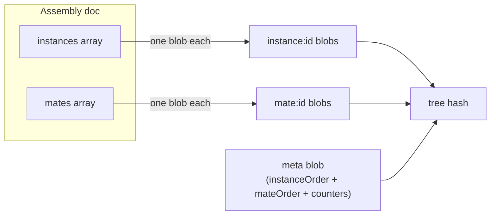

# assemblySerializer — Assembly Document Tree Serializer

> **System** ▸ [Overview](../../00-overview.md) ▸ [VCS](../00-overview.md) ▸ [Content-Addressed Store](../content-addressed-store.md) ▸ **assemblySerializer**
> Related: [cadSerializer](./cadSerializer.md) · [assemblyVcsService](./assemblyVcsService.md) · [assemblyBranchService](./assemblyBranchService.md)

---

## Requirements

Requirements governed by [Content-Addressed Store](../content-addressed-store.md) — the per-item granularity principle (REQ 682) applies equally to assemblies.

| REQ | Status | Summary |
|-----|--------|---------|
| 676 | unapproved | Component object kind — references another repo's commit |

### REQ 676 — Component references

- **Description:** The version-control store shall support a component object kind whose content references another repository's commit — enabling an assembly snapshot to record exactly which version of each child part it was composed from.
- **Rationale:** Assemblies compose versioned child parts; modelling the component reference in the store lets history track the exact part version used in each assembly revision.
- **Verification:** Unit test: a tree containing a component entry round-trips and records the child repo and pinned/symbolic commit.
- **Validation:** An assembly snapshot records exactly which version of each child part it was composed from.

---

## Succinct description

The assembly analogue of `cadSerializer` — serializes an assembly document (`{ instances, mates, nextInstanceSeq, nextMateSeq }`) as a per-item VCS tree, giving the same structural sharing and per-instance diff granularity as the CAD serializer.

## How it works — for everyone (non-technical)

An assembly is a list of parts plus their connection rules. This module saves each part placement and each connection separately, just like `cadSerializer` saves each feature separately. Only the things that change are re-stored when a new version is committed.

## How it works — in detail (technical)

`backend/services/vcs/assemblySerializer.js` exports `assemblySerialize` and `assemblyDeserialize`.

### Document shape

```
{
  nextInstanceSeq: number,
  nextMateSeq: number,
  instances: [{ instanceId, partID, placement, ... }],
  mates: [{ mateId, type, references, ... }]
}
```

### `assemblySerialize(repo, assemblyDoc, db) → treeHash`

1. For each instance (declaration order): `writeBlob(repo, inst)` → entry named `instance:<instanceId>`.
2. For each mate: `writeBlob(repo, mate)` → entry named `mate:<mateId>` (key resolved via `mateKey(m) = m.mateId || m.id`).
3. A `meta` blob stores `{ instanceOrder, mateOrder, docMeta: { nextInstanceSeq, nextMateSeq } }`.
4. Calls `writeTree` with all entries.

### `assemblyDeserialize(repo, treeHash, db) → assemblyDoc`

Reads meta → reconstructs instances in `instanceOrder` sequence → reconstructs mates in `mateOrder` sequence → reads `docMeta` counters. Falls back gracefully (`nextInstanceSeq = instances.length + 1`) if a stored doc predates the counter fields.



The module is the direct parallel of `cadSerializer` — same structural pattern, different document shape.

## Key files

- `backend/services/vcs/assemblySerializer.js` — `assemblySerialize`, `assemblyDeserialize`
- `backend/services/vcs/vcsService.js` — `writeBlob`, `writeTree`, `readTree`, `getObject` (called by this module)
