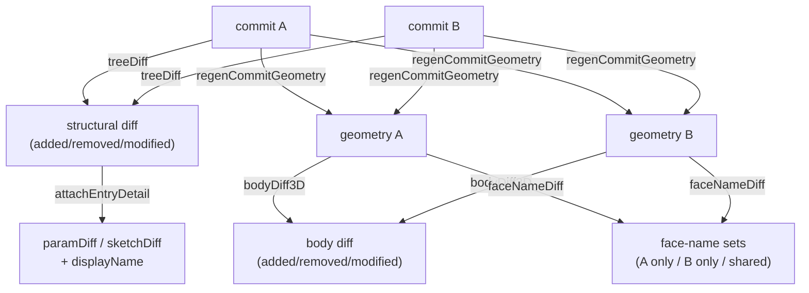

# cadDiffService — CAD Structural and 3D Diff

> **System** ▸ [Overview](../../00-overview.md) ▸ [VCS](../00-overview.md) ▸ [Diff and Compare](../diff-compare.md) ▸ **cadDiffService**
> Related: [cadGraphService](./cadGraphService.md) · [cadFreezeService](./cadFreezeService.md) · [cadVcsService](./cadVcsService.md)

---

## Requirements

| REQ | Status | Summary |
|-----|--------|---------|
| 699 | unapproved | Structural diff between two commits: added/removed/modified/unchanged per feature/sketch/equations |
| 700 | unapproved | Modified feature/equations: report which parameters changed with old and new values |
| 701 | unapproved | Body-level 3D diff between two commits |
| 713 | unapproved | Face-name diff: colour faces by persistent topological name across commits |
| 714 | unapproved | Modified sketch: list specific entity and constraint changes |

### REQ 699 — Structural diff

- **Description:** The system shall compute a structural diff between two commits, classifying each feature, sketch, and the equations set as added, removed, modified, or unchanged, by comparing tree entry hashes — O(changes) because identical subtrees compare equal by hash without inspecting their content.
- **Rationale:** Content-hash comparison makes diff O(number of changes): identical subtrees compare equal by hash without walking their contents, giving fast diffs even on large models.
- **Verification:** Unit/route test: commit diff classifies added/removed/modified/unchanged per feature/sketch/equations; modified blobs get a field-level `paramDiff`.
- **Validation:** A user can see exactly which features/sketches changed between two versions.

### REQ 700 — Field-level parameter diff

- **Description:** For a modified feature or equations set, the diff shall report which parameters or fields changed, with their old and new values.
- **Rationale:** Knowing a feature changed is not enough; the user needs to see what changed (e.g. distance 10 → 25).
- **Verification:** Unit test: a modified feature reports the changed field with old/new values.
- **Validation:** A user can see the specific parameter changes within a modified feature.

---

## Succinct description

Computes structural (tree-level) and 3D (body/face-level) diffs between two CAD commits; provides field-level parameter and sketch entity/constraint detail for modified items.

## How it works — for everyone (non-technical)

Comparing two saved snapshots works like comparing two filing systems: first check whether any drawer (feature or sketch) has changed by its fingerprint, then open only the changed drawers to see exactly what moved inside them. Because unchanged drawers are identified by their fingerprint alone, the comparison is fast even on large models.

## How it works — in detail (technical)

`backend/services/vcs/cadDiffService.js` exports the following functions.

### Structural diff

#### `treeDiff(repo, treeHashA, treeHashB, db)`

Reads both trees, compares entries by name and hash. The `meta` bookkeeping blob is excluded. Returns `[{ name, kind, status: 'added'|'removed'|'modified'|'unchanged', aHash, bHash }]` sorted by name.

#### `paramDiff(objA, objB)`

One-level field diff: `{ changed: [{key, a, b}], added: [key], removed: [key] }`. Used for features and equations.

#### `sketchDiff(a, b)`

Entity- and constraint-level diff of two sketch blobs. Reads `a.state.entities` and `a.state.constraints`, indexed by `id`. Returns `{ entities:[{id, kind, status}], constraints:[{id, type, status, a, b}], meta:[{key, a, b}] }`. The `a`/`b` on constraints carry the dimension values, giving users the numeric delta (REQ 714).

#### `attachEntryDetail(repo, entries, db)`

Enriches each non-unchanged entry in a `treeDiff` result:
- Resolves a `displayName` (feature/sketch `name` field, or a friendly type label from `FEATURE_TYPE_LABEL`).
- For modified sketches: attaches `e.sketchDiff`.
- For modified features/equations: attaches `e.paramDiff`.
- Also handles `instance:` and `mate:` entries (assembly doc stored in the same repo).

#### `commitDiff(repo, commitHashA, commitHashB, db)`

Top-level: fetches both commits, calls `treeDiff`, calls `attachEntryDetail`, returns `{ commitA, commitB, entries }`.

#### `workingDiff(model, db)`

Diffs the live working copy against its `baseCommitHash`. Serializes the working doc to a tree (same work as check-in minus the commit) and calls `treeDiff` against the base. Returns `{ baseCommitHash, entries }`.

### 3D diff

#### `regenCommitGeometry(repo, model, commitHash, {kernelClient}, db)`

If the commit has `meta.frozen` → `loadFrozenGeometry` (no kernel); otherwise deserialize the doc and call `cadRegenService.regenerateModel`. Includes the `Part` row so text placeholders resolve correctly.

#### `bodyDiff3D(model, commitHashA, commitHashB, opts, db)`

Regenerates both commits' geometry, compares body ids, and classifies each body as added/removed/modified/unchanged. `bodySignature` hashes each body's face mesh data for the unchanged/modified distinction.

#### `faceNameDiff(model, commitHashA, commitHashB, opts, db)`

Returns `{ namesA, namesB }` — the sets of persistent face names from each commit's geometry. The viewer colours faces present only in B as "added" and faces present only in A as "removed" (REQ 713).

## Key files

- `backend/services/vcs/cadDiffService.js` — all exports
- `backend/services/vcs/cadFreezeService.js` — `loadFrozenGeometry` (frozen commit path)
- `backend/services/cadRegenService.js` — `regenerateModel` (draft commit path)
- `backend/services/vcs/cadVcsService.js` — `repoForModel`
