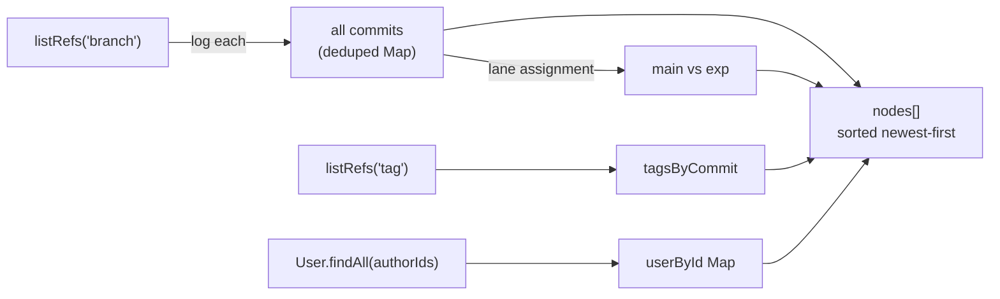

# cadGraphService — Version-History Graph Builder

> **System** ▸ [Overview](../../00-overview.md) ▸ [VCS](../00-overview.md) ▸ [History Graph](../history-graph.md) ▸ **cadGraphService**
> Related: [cadDiffService](./cadDiffService.md) · [cadVcsService](./cadVcsService.md) · [vcsService](./vcsService.md)

---

## Requirements

Requirements governed by [History Graph](../history-graph.md).

| REQ | Status | Summary |
|-----|--------|---------|
| 674 | unapproved | Walk commit ancestry newest-to-oldest |
| 732 | unapproved | Branches management tab listing every branch with actions |

---

## Succinct description

Builds the full version-history graph for a part's CAD repository: walks every branch, collects all reachable commits, assigns each to a main or experiment lane, attaches release tags, resolves author names, and marks the current HEAD.

## How it works — for everyone (non-technical)

The version-history timeline you see in the editor is assembled here. Every saved snapshot from every branch is collected, sorted newest-to-oldest, and annotated with who made it, whether it was an official release (has a tag), and which line of work it belongs to (main vs. an alternative branch). The result is ready to display without any further database queries.

## How it works — in detail (technical)

`backend/services/vcs/cadGraphService.js` exports `buildGraph`, `buildGraphForRepo`, and `initialsOf`.

### `buildGraph(model, db)`

Thin wrapper: resolves the repo via `repoForModel`, then delegates to `buildGraphForRepo`.

### `buildGraphForRepo(repo, headHash, db)`

The main algorithm:

1. **Collect commits** — `vcs.listRefs(repo, 'branch')` + loop calling `vcs.log` per branch. All commits are deduplicated into a `Map<hash, commit>`.
2. **Lane assignment** — commits reachable from `main` are assigned lane `'main'`; commits reachable only from another branch take that branch's name as their lane. The distinction drives the timeline rendering (`lane === 'main'` → `'main'`; anything else → `'exp'`).
3. **Tags** — `vcs.listRefs(repo, 'tag')` → `tagsByCommit` map. Tags mark released commits.
4. **Author resolution** — all distinct `authorUserID` values are batch-fetched from `User` in a single query. `initialsOf` generates "AL"-style initials from `displayName`.
5. **Node assembly** — each commit becomes a node:

```js
{
  hash, shortHash,        // full + 4-char prefix
  parents,                // parent hashes (for DAG edges)
  message, timestamp,
  branch,                 // branch name the commit lives on
  lane,                   // 'main' | 'exp'
  tags,                   // release tags on this commit
  isHead,                 // true if hash === headHash
  author,                 // { id, name, initials } or null
  state,                  // 'released' (has tags) | 'draft'
}
```

6. Sorted newest-first by `timestamp`.

### `buildGraphForRepo` vs `buildGraph`

`buildGraphForRepo` is intentionally repo-keyed (not model-keyed) so it can be called for any document repo — both CAD (`repoType:'cad'`) and assembly (`repoType:'assembly'`) routes use it.

### Return shape

```js
{
  head: string | null,          // current working-copy commit hash
  branches: [{ name, head }],   // all branch refs
  nodes: [...],                 // sorted commit nodes
}
```



## Key files

- `backend/services/vcs/cadGraphService.js` — `buildGraph`, `buildGraphForRepo`, `initialsOf`
- `backend/services/vcs/vcsService.js` — `listRefs`, `log`, `walk`
- `backend/services/vcs/cadVcsService.js` — `repoForModel`
