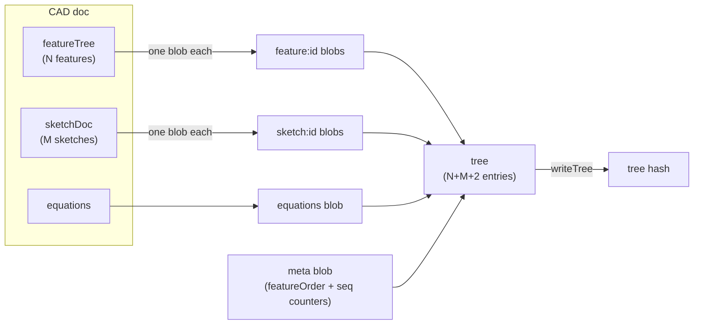

# cadSerializer — CAD Document Tree Serializer

> **System** ▸ [Overview](../../00-overview.md) ▸ [VCS](../00-overview.md) ▸ [Content-Addressed Store](../content-addressed-store.md) ▸ **cadSerializer**
> Related: [vcsService](./vcsService.md) · [cadVcsService](./cadVcsService.md) · [cadBranchService](./cadBranchService.md) · [cadDiffService](./cadDiffService.md)

---

## Requirements

| REQ | Status | Summary |
|-----|--------|---------|
| 682 | unapproved | Serialize a CAD doc as one blob per feature, one per sketch, equations blob, and meta blob |

### REQ 682 — Per-feature/per-sketch serialization

- **Description:** The system shall serialize a CAD model document into the object store as a tree composed of one blob per feature (keyed `feature:<id>`), one blob per sketch (keyed `sketch:<id>`), one equations blob (keyed `equations`), and one meta blob (keyed `meta`) that records feature order and doc-level metadata — so that editing one feature changes only that feature's blob and the tree, not the unchanged features.
- **Rationale:** Per-feature/per-sketch granularity is what makes feature-level diff and cherry-pick clean, and yields efficient structural sharing — only the edited parts change their hash.
- **Verification:** Unit test: `cadDeserialize(cadSerialize(doc))` deep-equals the original doc; deterministic tree hash; editing one feature changes only that feature's blob and the containing tree.
- **Validation:** A committed model restores exactly, and editing one feature changes only that feature's stored blob.

---

## Succinct description

Serializes and deserializes a CAD model document (`{ featureTree, sketchDoc, equations }`) as a per-item VCS tree, and is the only CAD-specific code in the object-store layer.

## How it works — for everyone (non-technical)

When a snapshot is saved, each feature and each sketch is stored separately — like filing each page of a book individually. If you later change one page, only that page's copy changes; all the other pages stay exactly as they were, and are shared rather than duplicated. This makes comparisons fast and storage efficient.

## How it works — in detail (technical)

`backend/services/vcs/cadSerializer.js` exports two functions: `cadSerialize` and `cadDeserialize`.

### `cadSerialize(repo, doc, db) → treeHash`

Builds a VCS tree from `{ featureTree, sketchDoc, equations }`:

1. For each feature in `featureTree.features` (order preserved): `writeBlob(repo, feature)` → entry named `feature:<id>`.
2. For each sketch in `sketchDoc.sketches` (keys sorted for a deterministic tree): `writeBlob(repo, sketch)` → entry named `sketch:<id>`.
3. Equations object → entry named `equations`.
4. A `meta` blob carries `{ featureOrder, featureTreeMeta, sketchDocMeta }` — the list of feature IDs (reconstruction order) plus any non-`features`/non-`sketches` keys from the top-level objects (e.g. sequence counters), so deserialization is lossless.
5. Calls `writeTree(repo, entries)` with all entries in the above order.

### `cadDeserialize(repo, treeHash, db) → doc`

Reverses the process:

1. Read the tree entries → build a `Map<name, hash>`.
2. Read the `meta` blob to recover `featureOrder`.
3. Reconstruct `features` array by fetching `feature:<id>` blobs in `featureOrder` sequence.
4. Reconstruct `sketches` map from all `sketch:*` entries.
5. Read the `equations` blob.
6. Spread `featureTreeMeta` / `sketchDocMeta` back into the top-level objects.

Only `cadVcsService` and `cadBranchService` call these functions; the rest of the VCS layer uses generic `vcsService` primitives.

## Key files

- `backend/services/vcs/cadSerializer.js` — `cadSerialize`, `cadDeserialize`
- `backend/services/vcs/vcsService.js` — `writeBlob`, `writeTree`, `readTree`, `getObject` (called by this module)
