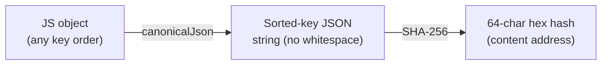

# canonicalJson — Deterministic JSON Serialization

> **System** ▸ [Overview](../../00-overview.md) ▸ [VCS](../00-overview.md) ▸ [Content-Addressed Store](../content-addressed-store.md) ▸ **canonicalJson**
> Related: [vcsService](./vcsService.md) · [cadSerializer](./cadSerializer.md)

---

## Requirements

Governed by [Content-Addressed Store](../content-addressed-store.md).

| REQ | Status | Summary |
|-----|--------|---------|
| 670 | unapproved | Equal logical content must serialize to byte-identical strings |

### REQ 670 — Canonical serialization

- **Description:** The version-control store shall serialize object content canonically such that two objects with equal logical content produce the same byte sequence, regardless of the order in which their properties were created or assigned.
- **Rationale:** Non-deterministic serialization breaks deduplication and diff; a canonical form is the linchpin that makes content addressing reliable.
- **Verification:** Unit test: reordered keys and numerically-equivalent values hash equal; re-serialization is idempotent.
- **Validation:** Two identical model states always compare as equal in history and diff views.

---

## Succinct description

A single-function module that converts any JSON-compatible value to a deterministic byte string by emitting object keys in sorted order, rejecting non-finite numbers, and collapsing `-0` to `0`.

## How it works — for everyone (non-technical)

Normally, if you write the same object in two different orders, the computer may produce two different text representations — and they would look like different things even though they mean the same thing. This module always writes the same object in exactly the same way, no matter what order the properties were added. That makes every fingerprint reliable: equal objects → equal fingerprints.

## How it works — in detail (technical)

`backend/services/vcs/canonicalJson.js` exports one function: `canonicalJson(value) → string`.

Differences from `JSON.stringify`:

1. **Sorted keys** — object keys are emitted alphabetically (insertion order is erased). Arrays remain ordered, because sequence is semantically meaningful.
2. **Non-finite guard** — `NaN`, `+Infinity`, and `-Infinity` throw `Error` instead of silently becoming `null` (which would let two distinct values map to the same hash).
3. **`-0` collapse** — negative zero is rendered as `0` for consistency.
4. `undefined`-valued keys are omitted (matching `JSON.stringify`). Functions and symbols are also omitted in objects; in arrays they become `null` (also matching `JSON.stringify`).
5. `bigint` throws — not representable without loss.

The function is used exclusively inside `vcsService.js`'s `hashJson` and `putObject`; callers never invoke it directly.

The implementation is a recursive `serialize(v)` that dispatches on `typeof v`. Objects iterate `Object.keys(v).sort()`.

## Key files

- `backend/services/vcs/canonicalJson.js` — the full implementation (62 lines)
